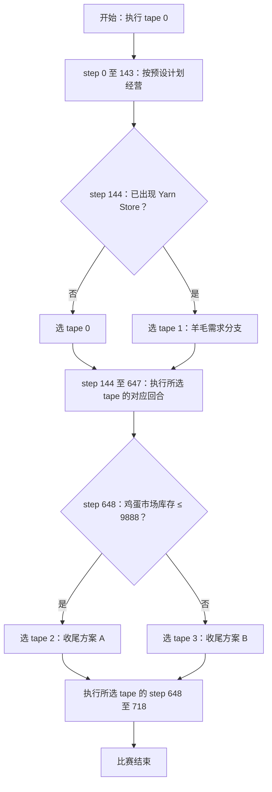
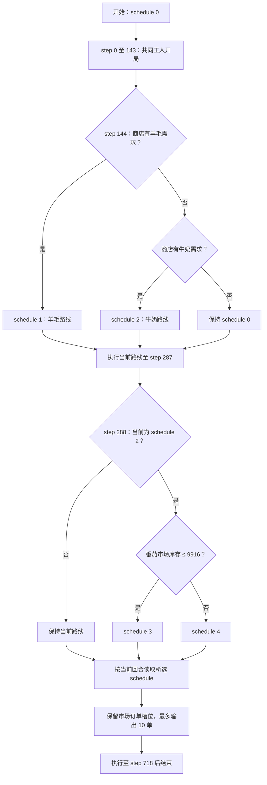

# Shop Router 0908 与 95.5% Replay Routing 源码解读

分析对象为 2026-09-08 保存的公开 Notebook 及其提交代码，不是 Player A H3 的改进版。2026-09-09 核对源码 SHA 与原始来源清单一致，见 inspection.json。原链接：[Shop Router 0908](https://www.kaggle.com/code/yhay81/shop-router-0908)、[95.5% Replay Routing](https://www.kaggle.com/code/thomastschinkel/kaggriculture-95-5-win-rate-via-replay-routing)。

## 模型本质

两者都是 **离线准备的动作序列库 + 浅层决策树路由 + 按当前回合执行序列**。公开提交实现没有神经网络推理、价值函数、策略梯度更新或在线搜索。树输出的是序列编号，具体动作从 tape 读取。这个判断限于已公开代码，不能据此反推所有历史动作序列的原作者如何训练或搜索。[VERIFY: public_router/main.py:65-79] [VERIFY: public_router/main.py:109-128] [VERIFY: public_955/main.py:614-627] [VERIFY: public_955/main.py:649-666]

| 项目 | Shop Router 0908 | 95.5% Replay Routing |
|---|---|---|
| 动作库 | 4 条完整 tape | 5 条完整 schedule，每条 719 个动作 |
| 实际路由时点 | step 144、648 | 框架每 72 步调用，当前策略只有 step 144、288 有条件分支 |
| 有效公开特征 | 已出现的 YARN 商店数、鸡蛋市场库存 | 羊毛需求、牛奶需求、番茄市场库存 |
| 状态记忆 | 当前 tape 编号 | 当前 schedule 编号、上次 block |
| 低层控制 | 直接返回当前 tape 的第 step 项 | 复制当前 schedule 的第 turn 项，并规范市场空槽 |

表格证据：[VERIFY: inspection.json:4-46] [VERIFY: public_router/model.json:3-29] [VERIFY: public_router/main.py:95-105] [VERIFY: public_955/main.py:649-666]

“浅决策树”描述路由层，“tape”描述动作层，二者同时成立。不能仅因代码有 POLICY、model.json 或作者使用 learned 一词，就认定它是强化学习或由 CART/XGBoost 训练；当前公开材料不足以确认树的完整训练算法。

## Shop Router 0908

默认执行 tape 0。step 144 检查 feature 23，即 YARN_STORE 数量：大于 0.5 选 tape 1，否则保持 tape 0。step 648 检查 feature 71，即 EGG 公共市场库存：不超过 9888 选 tape 2，否则选 tape 3。第二次分支不依赖此前选了 0 还是 1。切换从新 tape 的当前回合继续，而不是回到其开头。[VERIFY: public_router/model.json:3-29] [VERIFY: public_router/main.py:10-21] [VERIFY: public_router/observation.py:10-20] [VERIFY: public_router/main.py:116-127]

图中分支和回合均直接对应 model.json；动作执行对应 main.py 的 tape 索引。[VERIFY: public_router/model.json:3-29] [VERIFY: public_router/main.py:126-128]

作者描述的离线构造方式是：公开历史对局转为动作序列，取一天/三天的片段组合、模拟筛选，加入早期羊毛需求分支，再优化销售数量与时间。这是作者的方法说明；这份提交包本身没有完整搜索训练流水线，不能把其报告的搜索量视为本次独立复核结果。[VERIFY: public_router/author_notes.md:19-30]

## 95.5% Replay Routing

内嵌压缩数据同时包含 SCHEDULES 与 POLICY；本次使用 AST 提取字符串后解码，得到 5 条 719 步动作序列和 10 个时间块。默认 schedule 0；每块 72 步，只有 block 2、4 有非平凡分支。[VERIFY: public_955/main.py:6] [VERIFY: public_955/main.py:576] [VERIFY: public_955/main.py:654-663] [VERIFY: inspection.json:4-20]

step 144：若仍为 schedule 0，先看商店羊毛需求，存在则选 schedule 1；否则看牛奶需求，存在则选 schedule 2；都不存在保持 schedule 0。羊毛优先于牛奶。这些需求来自当前已揭示商店，不是未来需求预测。[VERIFY: public_955/decoded_policy.json:20-69] [VERIFY: public_955/main.py:578-596]

step 288：只有当前 schedule 2 才再分支。feature 2 是番茄市场库存减 10000；阈值 -84 对应实际库存 9916。库存 ≤9916 选 schedule 3，否则选 schedule 4；其余路线保持。[VERIFY: public_955/decoded_policy.json:80-115] [VERIFY: public_955/main.py:578-588] [VERIFY: public_955/main.py:624-627]

图中的默认开局保证在 step 144 到来时正常路径仍为 schedule 0；源码另有“若已不是 0 则保持”的防护。其他时间块只是保持路线。[VERIFY: public_955/decoded_policy.json:1-19] [VERIFY: public_955/decoded_policy.json:63-79] [VERIFY: public_955/decoded_policy.json:117-161]

市场层会把不合法或空订单规范为零数量的小麦 SELL，保留订单原槽位，避免工具删除空槽后改变双方市场竞价顺序；它不是重新计算完整市场策略。[VERIFY: public_955/main.py:630-646] [VERIFY: public_955/main.py:663-666]

## 两个需要区分的地方

**开局兼容不等于全部资产一致。** 本次解码确认 95.5% 版本的 5 条路线前 144 步工人动作一致，但完整动作（包含市场）并不全部一致。共同开局减少换路线后的田地/工人错配，不能证明实际现金、库存和动物状态在对手干扰下仍与历史一致。[VERIFY: inspection.json:27-40]。两套提交的动作输出均没有通用逐回合重新规划器，偏离 tape 后的恢复能力不能从路由树本身推出。[VERIFY: public_router/main.py:126-128] [VERIFY: public_955/main.py:663-666]

**95.5% 是作者报告的固定回放评测。** 原文口径为 689 条未用于训练的 Replay × 32 seeds × 双席位，共 44,096 局；不是当前真实在线对手的 95.5% 胜率，本次没有重跑这项实验。[VERIFY: public_955/author_notes.md:11-17]

作者文案还提到“9 个决策节点”，但本次解码当前附带 POLICY 得到 5 个条件节点（2 个路线状态检查、3 个公开特征判断）。本文按实际内嵌策略解释，不用文案数字代替代码。[VERIFY: public_955/author_notes.md:43-44] [VERIFY: inspection.json:26] [VERIFY: public_955/decoded_policy.json:20-115]

本次只做源码阅读、数据解码和静态核对；没有训练、对战、提交或修改已有候选。
