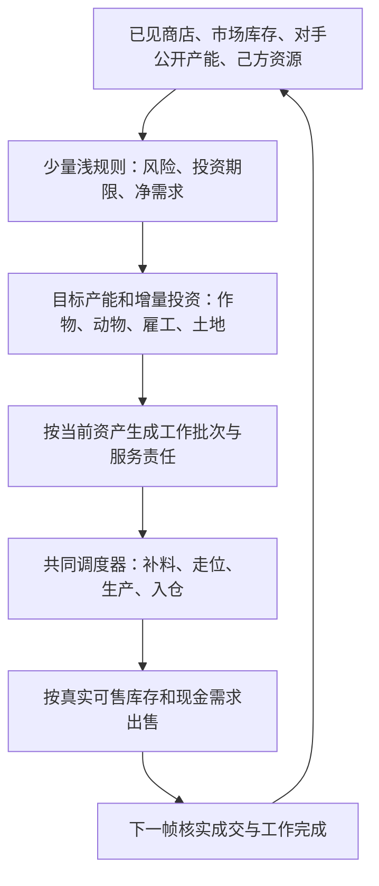

# Crop 目标下的浅规则树框架修订

目标：单个冻结策略在不同商店、对手供给、库存和执行结果下形成不同经营轨迹，真实线上尽快越过2500，再争取持续到2900。评级和所需时间不能由架构预先保证；不以随机动作制造差异，不以不断更换提交替代单模型自适应。

用户已明确采用 Crop 提供的浅规则树方向。本次尚未获得 Crop 原帖全文，因此以下具体树深、变量和调度合同是我们的设计建议，不冒充 Crop 私有实现。

## 架构选择

浅规则树是少量条件分支构成的决策函数；HMoE 是分层路由与多个专家组成的模型架构。HMoE 可以用树做路由，但两者不等同。树也可以直接输出经营配额而不调用任何专家。

本轮采用：**浅规则树 → 经营目标 → 同一套状态驱动任务调度 → 实际观测确认**。不要求多专家、可训练 Router、五个独立 HMoE 或 PPO。旧项目的 HMoE 原创性数量目标不作为本次架构验收。工程完整性、独立胜率及线上验证要求继续适用。

## 树应当输出什么

建议先将每个生产决策的条件路径限制为2–3层，并限制总规则数；这是预注册的复杂度约束，不是已经调出的最优值。叶节点输出参数化经营目标，而不是 episode、母带编号、完整 agent 或固定719步动作。

输出至少包括：目标动物数、目标作物面积、可追加投资量、保留饲料/运营现金、工作容量和停止新增投资的时点。当前已投入资产及已接受任务始终带入后续决策。

| 层次 | 输入 | 输出 |
|---|---|---|
| 经营安全与期限 | 现金、缺料、当前服务积压、剩余回本时间 | 维持、恢复或退出模式 |
| 需求与竞争 | 已解锁商店、市场库存趋势、对手公开动物/作物及成熟阶段 | 哪些品类应增产、维持或减少新增投入 |
| 可执行数量 | 可用地块、在途资产、种子、工时、仓容、保守现金前缀 | 本次真正允许新增多少 |

对手私有库存不能当作已知；公开产能只能形成供给估计与区间。未揭示商店不进入真实特征。对手身份、episode和seed不用于选择动作。

## 从商店配额升级为剩余需求

按商品、按同一时间单位估算：

`需求余量 = 城镇消费 + 目标库存恢复量 - 对手预计净供给 - 己方已承诺净供给`

其中净供给应包含相关市场买卖，目标库存恢复量只是可解释的库存控制项。需求余量并非单独的投资价值：还须比较边际售价、完整生产成本、工时机会成本和截止日。

两个玩家都按全额城镇需求扩产，会重复计算同一需求。简单的“羊数=YARN数×系数”可作最小基线，不能作为最终容量模型。日末/回合消费先统一单位，再换算批量。

不采用“卖得越慢越好”。出售同时考虑真实仓容、下一笔投入所需现金、库存价格冲击、对手供给风险和终局清仓；批量上限保留为可消融参数。

## 调度器最小闭环

借鉴强动作带的空间布局与服务节奏，但把它们改写为从当前资产生成的工作批次：

- 采购：目标缺口 → 发出订单 → 下一观测核实 → 成功才减少缺口。
- 动物：可用建筑 → 领取 → 投放 → 有期限的喂养/护理/收获责任。
- 作物：可用地块 → 播种 → 当日首水 → 后续浇水/施肥/收获 → 搬运出售。
- 日内保持任务承诺，避免每步重新排序导致往返；新商店、任务完成、失败或重要风险触发更新。
- 缺料或受阻时缩减/修复当前任务；新规则不得凭空假设目标资产已经存在。

减少MOVE或PASS只作诊断。主指标是完整工作批次的兑现、每单位工时的实际可售产出、现金与胜负；不奖励为了降低MOVE而停工。

## 与现有成果的关系

| 现有部分 | 新框架处置 |
|---|---|
| V41简洁入口和清晰层次 | 保留设计方式，避免多重agent覆盖与全局动作表被重置 |
| 强母带的布局、工作节奏 | 作为调度器的设计参考与固定基线，不能继续以动作带索引主导生产 |
| V17动物护栏 | 保留确认和补缺目的；修正字符串animal字段计数，逐笔核实采购，不能照搬当前函数 |
| V24就地补动作 | 作为空闲任务候选；要确认不会破坏到期工作、携带物资及仓容 |
| LEAD/价格回升追加卖单 | 保留可验证的战术候选；基于真实库存和成交结果重写，不宣称普遍提高胜率 |
| MM虚构持仓 | 改成明确的价格状态记忆；内部信号不计作资产或已成交订单 |
| V34商店配额 | 优先研究起点；增加对手供给、己方承诺和执行容量，修正“速率”单位 |
| V26/V32嵌套完整旧agent | 保留冻结对照，不能作为新结构实现底座 |
| 固定母带换代、提交轮换 | 不再作为达成局内自适应的主研发路线 |

## 三个受控实验，而非同时改一切

### A：任务调度是否能兑现一个强经营配置

先固定生产目标与比较条件，仅替换主动作生成方式。测试完整工作批次，不要求所有时刻产出指纹与母带相同；否则适应能力被定义上禁止。微场景检验首水、饲料、投放、回仓与日切换；自然规则动态对局检验整体效果。保留首次偏离证据。

### B：浅规则是否比固定配置更好

保持执行器不变，对照固定配额与商店条件配额。预注册规则数、阈值搜索范围和预算，用开发数据选择一次后锁定；用新场景、双席位、多个非等价动态对手确认。叶节点必须在有差异的条件下产生不同的实际生产组合。

### C：对手与库存信号是否有额外价值

保持B不变，加入一个新的供给/库存机制。对照B检验强对手和同品类供给拥挤场景，不以在一组动作带上的胜率认定对动态对手有效。

每代一个主要假设、一份候选SHA、一份新确认块。失败保留完整结果；只在新假设能够解释首次偏离并给出可证伪预测时进入下一代。源代码修复不自动等于胜率改善。

## 验证如何服务2500→2900目标

1. 工程：使用实际提交入口，绑定包SHA、配置、引擎、命令；候选异常不得吞成PASS后仍记为完整通过。
2. 适应：保留完整动作多样性，但主看实际投放/播种/服务分配/销售节奏对可见条件的响应，以及相对固定配置的收益。
3. 本地：动作带池只作旧生态和压力诊断；正式实力用动态对手、按家族和双席分报。仍以既定纯胜率门为下限；不足50%的家族失败不能用总均值覆盖。
4. 独立性：开发后新确认；自然RNG主门保持官方语义。同seed并不保证全局后续商店完全相同，固定需求的干预只能作因果诊断。
5. 线上：冻结具体版本，记录首达2500的对局数和经过时间；再记录2500以上各段胜负、对手强度、评分轨迹和回撤，验证能否持续到2900。高开局胜率不等于高段位实力。
6. 主面板与官方每日确认分开统计、按episode及SHA去重，不打开既有封存Blind。没有足够高段位样本时明确未证明，不以本地80%胜率换算为2900。

本文件为框架修订与后续实验设计，不代表已实现新模型或已证明目标分数。此次未修改Claude工作树或执行提交。
