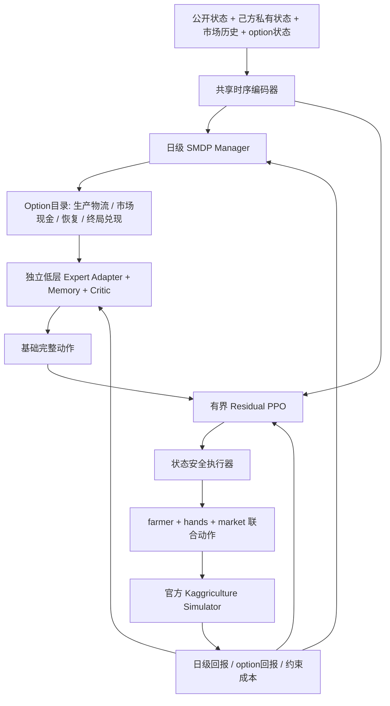

# V114 PPO v4：日级 SMDP Manager + 稳定专家 + 有界 Residual PPO

> **2026-08-30 Replay 最终准入口径（覆盖全文）**
>
> - 只允许实际对局日期 `>=2026-08-20` 且与当前线上规则配置一致的 Replay。
> - 高置信度主面板为本账号提交模型的线上 Replay：既包括 CLI 增量数据，也包括本地已保存的历史
>   提交对局；完成 submission/model/episode/date/seat/Replay SHA/agent(package) SHA 登记后保留使用。
> - 次高置信度确认面板为 `kaggriculture_episodes_index/date>=2026-08-20` 的官方按日 Replay，只用于
>   扩大商店、需求和对手轨迹覆盖，并作独立确认。
> - 两个面板必须分开统计和报告。高置信度主面板是门控与晋级主裁决；官方面板不得凭更多局数、
>   合并指标或样本权重覆盖主面板失败。
> - 全局按 `episode_id + replay_sha256` 去重；每个面板内部按日期切 Train/Dev/Blind，最新日期保留
>   Blind。规则配置不明、身份/SHA 不完整或早于 8/20 的数据 fail closed。
> - 当前训练和数据重建已按用户命令停止；没有新的明确重启命令时不得启动训练、评测、下载或后台
>   任务。旧文件保留审计，未经用户授权不得提交 Kaggle。

状态：`STOPPED_BY_USER / AWAITING_EXPLICIT_RESTART / NOT_GOLD`  
日期：2026-08-30  
证据来源：本账号 8/20+ 线上 Replay 为主面板；官方 8/20+ 按日 Replay 为独立确认面板；策略谱系独立，`strategy_parent=null`  
当前训练 incumbent：无；Stage20 与旧 V12 checkpoint 均已降级为不可晋级审计材料  
Kaggle：未经用户再次授权不得提交

## 1. 目标与裁决边界

PPO v4 的目标不是修补 Stage37，而是重新建立与 Kaggriculture 时间结构一致的强化学习
系统：高层按天或少量关键事件选择完整 option，低层专家稳定执行，Residual PPO 只在
受限动作空间中修正基础专家。最终模型必须自行生成全部动作，不调用任何历史金牌 Agent
作为在线动作源或故障回退。

成功标准：

1. 至少两个职责不同的低层专家分别通过 fresh-seed 多对手门控；
2. 高层 Manager 在同一组 expert 上显著优于最佳固定单 expert，不能形成假 MoE；
3. 随机采样策略保持完整经济闭环，不再出现 Stage37 的探索坍塌；
4. 在 Gold-Dev 与一次性 Gold-Blind Confirmation 中稳定优于本地金牌代表；
5. 所有结论可由固定 SHA、seed ledger、逐局数据和 same-seed/seat 配对结果复现。

不计作成功：

- 只战胜 V76；
- 只提高金币差但压低双方经济；
- 只通过 Starter、PASS、运行 QA 或 KL 门；
- 只修改学习率、temperature、阈值或部署 step；
- Router 与最佳固定 expert 表现相同；
- 依赖历史 Agent 的动作回退或把规则父代包装成 Residual PPO。

## 2. 第一性原理

官方环境为 24 turn/日、约 30 日、719 次动作决策。作物成熟、动物产出、商店解锁、现金
周转和终局兑现都跨越多日。Stage37 的逐 turn GAE 使用 `gamma*lambda=0.94525`，有效信用
长度只有约 18.3 turn，且每个 turn 对几十个 action token 独立采样，导致经济轨迹在 PPO
更新前已经崩溃。

v4 固定三个时间尺度：

1. **日级/事件级 Manager**：选择完整 option、预算档和风险档；
2. **turn 级稳定专家**：执行 option 内的生产、物流和市场动作；
3. **关键动作 Residual PPO**：对专家动作做小范围、可审计、可回退为 `KEEP` 的修正。



## 3. 信息边界

允许输入：

- 己方公开农场和己方 private inventory；
- 对手公开农场、公开现金和公开位置；
- 共享市场库存、价格和 town shop；
- `day/hour/step`、历史己方动作、上一观测的市场变化；
- 当前 option、option 已持续 turn 数、预算消耗和安全状态。

禁止输入：

- 环境 seed；
- 对手 private inventory、未公开动作或未来商店；
- Gold-Dev/Blind 的身份标签或结果；
- 教师 ID、Replay episode ID 等可形成路线记忆的标识；
- 任何历史 Agent 内部变量。

Replay 只用于真实环境分布、表征/critic 预训练和教师自身闭环动作监督。候选在模拟器中
必须独立闭环运行。

## 4. 三层策略结构

### 4.1 日级 SMDP Manager

正常决策边界固定为 `hour=0`。以下事件只产生“提前终止申请”，不直接无条件重选：

- 新 shop 解锁；
- 现金低于安全预算；
- 生产链无法继续；
- 进入最后 48 turn；
- 当前 option 已完成或违反 option contract。

防抖合同：

- 普通 option 默认承诺 24 turn；
- 非紧急 option 不允许日内切换；
- 紧急恢复 option 最短持续 6 turn，切换后冷却 6 turn；
- 现金和库存阈值使用进入/退出双阈值；
- 终局 option 每局最多进入一次，禁止退出后再次进入；
- 变长 option 的 SMDP 折扣为 `gamma_day ** (duration_turns/24)`。

Manager 不直接输出几十个原子参数，只选择：

`option_id + budget_tier + risk_tier`

首版 option catalog：

| option | 职责 | 正常持续时间 | 结束条件 |
|---|---|---:|---|
| `PRODUCTION_LOGISTICS` | 种植、维护、运输和产能利用 | 24 turn | 日切或生产 contract 失败 |
| `MARKET_CASH` | 采购、出售、现金缓冲和共享市场响应 | 24 turn | 日切或现金危机 |
| `RECOVERY` | 从低现金、断粮、路线阻塞中恢复 | 6–24 turn | 安全状态恢复并过冷却期 |
| `TERMINAL_LIQUIDATION` | 返仓、DROP、SELL 和停止无效扩张 | 至终局 | 比赛结束 |

商品选择属于通过资格门的 option/expert 配置，不允许 Manager 临时拼接不兼容的生产后缀。

### 4.2 稳定低层专家

专家共享 observation encoder，但必须各自拥有：

- 独立 adapter；
- 独立循环状态；
- 独立 option critic；
- 显式预算和目标状态；
- option 输入/输出/终止 contract。

基础专家由我们自己的神经策略生成动作。状态安全执行器只负责合法 mask、预算可行性、
数量封顶、库存容量和异常 `PASS` 闭包，不提供历史父代的战略动作。

首轮只训练两个互补专家：

1. `PRODUCTION_LOGISTICS`；
2. `MARKET_CASH`。

两者都通过独立多对手门后，才能训练 `TERMINAL_LIQUIDATION`，随后才允许训练 Manager。

### 4.3 有界 Residual PPO

Residual 动作空间固定为：

| residual | 含义 | 单日上限 |
|---|---|---:|
| `KEEP` | 保持专家动作 | 不限 |
| `MARKET_QTY_UP/DOWN_1` | 一个订单数量移动一个离散档 | 2 |
| `DEFER_ONE_MARKET_ORDER` | 一条非紧急订单延后一 turn | 1 |
| `ADVANCE_ONE_SELL` | 合法且库存充足时提前一条 SELL | 1 |
| `CASH_TIER_UP/DOWN_1` | 调整预算档，不直接生成采购路线 | 1 |
| `REASSIGN_ONE_IDLE_UNIT` | 仅在合法候选中调整一个空闲单位 | 1 |
| `TERMINAL_RETURN_OR_SELL` | 终局候选集中调整返仓/兑现顺序 | 2 |

Residual 每天最多修改 4 个非 `KEEP` 决策。若修改导致预算、库存、合法性或 option contract
失败，执行器回退到同一神经专家的基础动作，而不是历史规则 Agent。

Residual PPO 使用 unit/market 分离的 ratio 和 KL budget，禁止把所有 action token 的概率
乘成一个 joint ratio。

## 5. Critic 与回报

### 5.1 三个 critic

- `V_manager`：在 option 边界预测终局自身金币、金币差和灾难概率；
- `V_option`：预测当前 option 结束时的职责完成度与经济状态；
- `V_residual`：预测一次有界修正相对 `KEEP` 的局部增益。

critic 先于 PPO 训练。Stage37 的 `value_coef=0` 合同永久废止。

### 5.2 回报分解

Manager 主回报：

- 官方终局胜负与金币差；
- 自身终局金币；
- 日级 mark-to-market 企业价值变化；
- 独立的灾难 constraint cost。

Option 回报：

- 生产/物流：有效产出、任务完成、运输兑现、空转与断链成本；
- 市场/现金：采购可持续性、出售兑现、现金缓冲、无效订单成本；
- 恢复：脱离灾难状态所需时间和恢复后的经济能力；
- 终局：返仓、库存兑现和停止无效长期投资。

Residual 回报以 `KEEP` 为 control variate，主要学习 option 结束时的配对增益。若使用
potential shaping，必须保持 `F=gamma*Phi(s')-Phi(s)`，不允许新增会改变最优策略的任意
手工奖励。

约束采用 Lagrangian 或词典序门控，至少包括：

- 终局金币低于 3,000；
- 现金断裂；
- shed overflow；
- 核心生产链中断；
- 双方经济同时被压低但自身没有增加。

### 5.3 时间折扣

- Manager：`gamma_day=0.99`，变长 option 使用 SMDP duration discount；
- Manager GAE：`lambda=0.95`，只在约 30–60 个高层 transition 上计算；
- Worker：日内 horizon 最多 24 turn，turn discount 与 `gamma_day` 一致；
- 终局 option：单独按剩余 horizon 计算，不把终局回报稀释到整场719 turn。

## 6. 数据与教师合同

### 6.1 可复用数据

- Stage35 三行为家族均衡教师轨迹；
- 官方 Replay 的真实状态和终局结果；
- Stage27–37 的多对手 simulator 轨迹；
- 本地 golden model 与 PPO history checkpoint，只作为对手或教师自身闭环来源。

### 6.2 禁止的 DAgger

Stage19/36 已证明 stateful 教师在 candidate state 上会失去内部同步。v4 只允许两类
candidate-state 标签：

1. 教师是可从当前 observation 完整重建的 Markov 策略；
2. 教师内部状态能从候选完整历史确定性重放，并通过状态 hash 审计。

其余教师只能提供自己真实执行的闭环轨迹。候选偏离教师分布后，使用 simulator on-policy
PPO、AWR/IQL 或 option-level counterfactual，不再强行做 teacher-forced DAgger。

### 6.3 数据切分

- Gold-Train：训练与 PFSP；
- Gold-Dev：只做阶段晋级；
- Gold-Blind：最终一次性确认；
- Replay 按日期、source、行为谱系和 seed group 切分；
- 同一行为家族近克隆不得跨 split；
- 所有 manifest 在训练前写 SHA，并登记 exposure ledger。

## 7. 动态对手联赛

固定 `40/30/15/10/5` 保留为最终联赛分布，不再作为脆弱 BC 的启动分布。

V4-2 基础专家阶段不使用本表作为硬门。该阶段改用第 8 节定义的“基础生存门 →
基础能力门 → 高分影子压力测试”三级协议；高分 Gold 只提供诊断压力，不因胜率低而单独淘汰
尚未装配 Residual 和 Manager 的基础专家。

| 阶段 | Gold-Train | PPO History/近邻 | Self-play | Exploiter | Anchor |
|---|---:|---:|---:|---:|---:|
| 生存期 | 15% | 35% | 10% | 5% | 35% |
| 提升期 | 30% | 35% | 15% | 10% | 10% |
| 最终联赛 | 40% | 30% | 15% | 10% | 5% |

采样规则：

- 主体对手的平滑胜率保持在 30%–70%；
- 使用 Beta-Binomial 平滑和最近 32 个 fresh seed block 估计强度；
- PFSP 同时考虑接近 50% 的胜率、学习进度和行为新颖度；
- 困难 Gold-Train 保留最低 10% 总曝光；
- V76 始终不超过总训练局数 10%；
- 单一对手不超过 12.5%；
- PPO History 最多 12 个里程碑，近克隆只保留一个；
- 同 seed 两个座位面对同一对手；
- Gold-Dev/Blind 永远不进入动态池。

固定历史进度面板独立于训练采样，只展示 Stage17→20→31→35→v4 checkpoints 的
胜/平/负、score rate、自身金币、金币差、灾难率和辅助 Elo。

## 8. 训练阶段

### V4-0：合同和基础设施

交付：

- `ppo_v4/` 独立代码目录；
- option catalog、事件聚合器、duration-aware rollout schema；
- residual action codec；
- 三 critic schema；
- 动态 opponent registry 和 seed exposure ledger；
- 完整单元测试、引擎 parity 和动作 closure。

此阶段不训练模型。

### V4-1：Critic 预训练

用 Replay 与 simulator 轨迹训练 `V_manager/V_option/V_residual`。验证按 seed/source/谱系
隔离。门槛：

- 终局金币预测 MAE 显著优于按对手层常数基线；
- 终局金币 Spearman `>=0.50`；
- 灾难预测 AUROC `>=0.75`，并报告 Brier/ECE；
- 对每个主要 opponent layer 不允许明显失效；
- 价值方向在同 seed/seat 的好坏轨迹对上准确率 `>=65%`。

未通过不得进入 PPO。

### V4-2：稳定低层专家

流程：

1. 从真实教师闭环轨迹做多教师 BC；
2. 对自己的低熵 simulator rollout 做 outcome-weighted AWR/IQL；
3. 不使用无状态合同不成立的 DAgger；
4. 每个 expert 独立完成 deterministic 与 stochastic survival gate。

V4-2 的目标是尽快建立 **4–6 个职责、生产链或市场行为不同的第二层基础专家候选池**，
最低可进入下一阶段的数量为 2。不得因为一个未装配 Residual/Manager 的基础专家无法战胜
完整高分模型，就提前淘汰其原创谱系。

门控固定分为三级：

#### L0 基础生存门（硬门）

16 fresh seed × 双座位面对 Starter 和基础锚点：

- Starter score rate `>=75%`；
- 32 场 Starter 中灾难局 `<=1`；
- 自身终局金币 P10 `>=3,000`；
- stochastic 与 deterministic 的灾难率差 `<=5pp`；
- 完整执行 719 个 action step；
- 零运行错误、零 contract violation、终局零采购。

#### L1 基础能力门（硬门）

从本地 V1–V10 中按动作 SHA、谱系和行为特征去重，固定 4 个左右代表。至少覆盖基础种植、
动物/多商品生产、市场出售和相对完整单模型四种能力；近克隆不得重复加权。代表及其固定 SHA
必须在测试前写入 opponent registry，之后不得根据结果更换。

使用 32 fresh seed × 双座位，共 64 局，按同 seed 双座位面对同一代表。晋级要求：

- 行为去重基础池 pooled score rate `>=60%`；
- 最差单个基础对手 score rate `>=45%`；
- pooled 灾难率 `<=5%`，每个对手自身金币 P10 `>=3,000`；
- 零运行错误、零 contract violation；
- 至少一个预注册职责指标显著优于基础代表，例如有效产量、出售兑现、现金周转或终局清仓；
- 不允许仅靠压低双方经济提高金币差。

通过 L0+L1 后立即冻结 SHA，登记为 `FOUNDATION_EXPERT_CANDIDATE`，允许进入 V4-3；不需要先
战胜完整 Gold。一次最多保留 6 个行为不同的候选，避免无限堆积弱专家。

#### L2 高分影子压力测试（非硬门）

每个基础专家使用 8 fresh seed × 双座位，对 2 个行为不同的高分模型（例如 V20/V32/V37
谱系代表）测试，只记录逐对手胜/平/负、自身金币、金币差、灾难率和失败阶段：

- 胜率低或全负本身不淘汰基础专家；
- 只有零生产闭环、持续现金崩溃、非法动作或终局系统性失败等与 Gold 身份无关的结构性缺陷，
  才退回 V4-2；
- 已经运行的 Stage20/V32/V37 测试统一降级为 L2 诊断证据，不追溯改变 L0/L1 结论；
- L2 seed 不进入 L0/L1，也不得被用于修改特例。

L0/L1/L2 必须使用互不重叠的 seed block。基础候选优先按职责并行构造和筛选；同一专家仍然
保持单分支、单变量更新。

### V4-3：职责专家 Residual PPO

每次只训练一个职责 expert；基础专家、其他 expert 和 Manager 全部冻结。初始参数：

- 64 fresh seed × 双座位；
- 1 epoch；
- residual actor `lr=3e-6`；
- critic `lr=1e-5`、`value_coef=0.5`；
- clip `0.10`；
- adaptive KL target：unit `0.005`、market `0.005`；
- residual entropy `0.001`；
- 每日非 `KEEP` 上限 4；
- 不使用 joint ratio。

更新前必须先过 stochastic survival gate；更新后用新的 16 seed screen。晋级要求：

- 职责目标配对增益的 seed-block CI 下界 `>0`；
- pooled score 相对基础 expert 不下降超过 2pp；
- 自身金币不退化，灾难率不升；
- Gold-Train 与 Exploiter 层均不出现灾难性退化；
- 实际 residual 修改率在 1%–15%；
- 修改动作有正向反事实 uplift，不是安全执行器全部 mask 后的假激活。

Gold-Train 在 V4-3 仍只承担灾难性退化护栏，不要求单个职责专家达到金牌胜率。通过 V4-3 的
专家登记为 `RESIDUAL_QUALIFIED_EXPERT`；至少两个不同职责专家达到该状态后，必须停止继续
扩充基础池，优先进入 V4-4 Manager 组装。

### V4-4：Option Manager 初始化

至少两个 expert 通过 V4-3 后，冻结 experts，用 simulator 在真实 option 边界做分叉：对同一
状态分别执行所有合格 option 到下一边界，生成 duration-aware counterfactual。先训练
Fitted-Q/IQL Manager，再做 SMDP PPO 微调。

Manager PPO 初始参数：

- 每轮 64 fresh seed × 双座位，约 3,840–7,680 个 option transition；
- `gamma_day=0.99`、`lambda=0.95`；
- actor `lr=1e-5`、critic `lr=3e-5`；
- clip `0.10`、target KL `0.01`；
- entropy `0.01`，只作用于 option/budget/risk；
- experts 和 Residual actor 保持冻结。

Manager 门必须同时满足：

- 相对最佳固定 expert 的 BEU 配对 score gain CI 下界 `>0`；
- 每个非紧急 option 激活率 `>=5%`，或有预注册的稀有条件豁免；
- 最差 option 不是被 Router 隐式完全废弃；
- 自身金币、灾难率和最差 Gold-Train 不退化；
- 不出现每 turn 重路由或事件抖动。

### V4-5：动态混合联赛

只有 Manager 门通过后才逐步从生存期切到提升期，再切到最终 `40/30/15/10/5`。阶段切换
依据过去 32 fresh seed block 的平滑胜率，不能按单轮结果切换。

每个 iteration 固定：

- 64 fresh seed × 双座位=128局；
- 同 seed/seat 与 incumbent 配对评测；
- 至多一个预注册更新分支；
- 每次只更新 Manager、一个 expert 或一个 Residual 模块，禁止同时解冻全部参数；
- checkpoint 必须带参数作用域审计和行为新颖度报告。

### V4-6：Development 与 Blind Confirmation

Screen：16 fresh seed × 双座位，检查基础生存和明显退化。  
Mixed Development：64 fresh seed × 双座位，对动态池和固定池各一次。  
Gold-Dev：128 fresh seed × 双座位，对行为去重代表逐一评测。  
Gold-Blind：先 256 fresh seed × 双座位；通过后再用 512 个再次全新 seed 做最终确认。

金牌登记要求：

- Gold-Blind pooled score rate 的 95% CI 下界 `>50%`；
- 每个行为去重金牌代表的 point estimate `>50%`；
- worst-gold 95% CI 下界不低于 `47.5%`；
- pooled 和逐金牌自身金币均不低于 incumbent；
- 灾难率不高于 incumbent，且不存在靠压低双方经济取得的分差；
- 零运行错误；
- Manager 显著优于最佳固定 expert；
- 不依赖任何历史 Agent 动作或 Gold-Blind 调参。

Blind 失败后，该确认集永久加入 exposure ledger，不允许继续用它调参。

## 9. Checkpoint 与模型谱系

checkpoint 角色：

- `bc_init`：只证明动作闭环；
- `critic_qualified`：critic 门通过；
- `expert_candidate`：职责 expert screen 通过前；
- `expert_qualified`：同时通过职责门和多对手门；
- `manager_candidate`：尚未通过 BEU；
- `incumbent`：通过 Development；
- `gold_candidate`：通过 Gold-Dev；
- `gold`：通过一次性 Gold-Blind Confirmation。

失败但行为不同的 checkpoint 可进入 PPO History/Exploiter，但不得继承冠军、expert 或 gold
身份。任何阶段只战胜 V76，登记为 `v76_specialist_only`。

## 10. 目录和产物

所有 v4 源码必须位于：

```text
kaggle_Kaggriculture/model/v114_day_smdp_hmoe_ppo/
├── option_catalog.py
├── event_aggregator.py
├── model_manager.py
├── model_experts.py
├── model_residual.py
├── critics.py
├── residual_action_space.py
├── safety_executor.py
├── collect_smdp_rollouts.py
├── collect_option_counterfactuals.py
├── train_critics.py
├── train_expert_ppo.py
├── train_manager_iql.py
├── train_manager_ppo.py
├── evaluate_v4.py
└── tests/
```

所有数据、checkpoint、逐局结果和 dashboard 必须位于：

```text
kaggle_Kaggriculture/model_data/v114_day_smdp_hmoe_ppo/
├── manifests/
├── critic_pretrain/
├── experts/
├── residual/
├── manager/
├── league/
├── development/
└── blind_confirmation/
```

禁止把 v4 训练脚本、临时 checkpoint、日志或报告散落到 `model/` 根目录。历史 v2/v3 文件
保留在各自版本目录，不作为 v4 代码依赖。

## 11. 可复现性与停止条件

每个阶段必须保存：

- git/worktree 状态与源码 SHA；
- 数据、registry、checkpoint 和 seed manifest SHA；
- 完整命令、环境版本、CPU/GPU/并行数和耗时；
- 每局 seed、seat、opponent、option、residual、金币和状态；
- 参数作用域差分；
- fresh/exposed/Dev/Blind 使用记录；
- 预注册门控结果和唯一决策。

立即停止当前分支的条件：

- stochastic survival gate 失败；
- critic 不优于常数/分层基线；
- rollout 超过 5% contract violation 或灾难率显著上升；
- 所有轨迹在某层均灾难，却仍依赖层内中心化制造正 advantage；
- Manager 不优于最佳固定 expert；
- 连续两个 iteration 没有行为变化或 fresh-seed 增益；
- 发现 teacher state desync、seed 泄漏、Blind 暴露或对手私有信息；
- 需要通过追加学习率/阈值分支解释失败结果。

## 12. 当前决策

用户已于 2026-08-30 授权把本方案独立为 V114 并持续执行。当前从 V4-0 基础设施与硬门
开始，随后依次进入 critic、稳定专家、Residual PPO、Manager 和动态联赛循环；每小时
执行一次计划偏离审计。Gold-Dev/Blind 仍只按预注册阶段访问，Kaggle 提交仍未授权。
