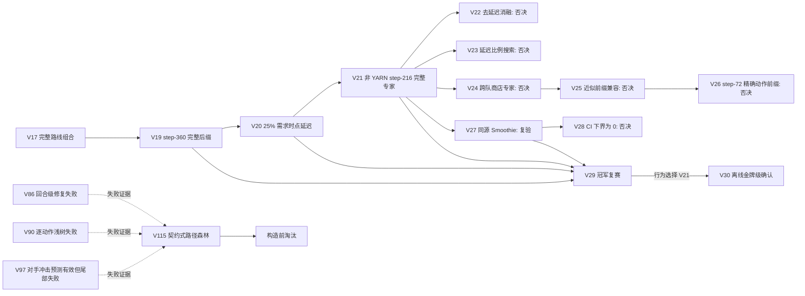

# Hierarchical MoE V19–V30 谱系与 V115 演变报告

## 结论先行

V19→V20→V21/V29→V30 的有效主线不是“专家越多越好”，而是四个逐层成立的约束：完整生产路线、需求发生时点、内部状态兼容、提交级安全闭环。V22–V28 的消融和失败进一步证明：只看动作前缀、商店标签或少量正翻转，不能证明专家可切换。[VERIFY: kaggle_Kaggriculture/model/v22_lucaskna_no_delay_ablation/README.md:3-5] [VERIFY: kaggle_Kaggriculture/model/v26_step72_milan_router/README.md:3] [VERIFY: kaggle_Kaggriculture/model/v28_broad_smoothie_router/README.md:3]

V115 按“商店需求路由 + 多生产专家 + 状态安全执行器 + 商品出售控制 + 对方路径预测”实现了独立可提交候选，但 672 局构造前矩阵中被最佳固定专家严格支配，判定淘汰，不进入 official Replay Development，也不登记金牌。[VERIFY: kaggle_Kaggriculture/model/v115_contractual_path_forest_moe/decision.json:6-36]

## 谱系图

V29 不是一套新行为：它在 V19/V20/V21/V27 之间做冻结冠军选择，V27 与 V21 胜负完全相同，最终按简化原则选择 V21 进入 V30。[VERIFY: kaggle_Kaggriculture/model/v29_champion_selection/README.md:3-5]

## 主线版本的核心策略

| 版本 | 核心新增 | 真实执行边界 | 证据与定位 |
|---|---|---|---|
| V19 | 首店 Router 后保留 YARN/default；default 在 step 360 切完整 bakery/brunch 后缀 | 切换后仍走固定支出上限和单位 fail-closed | 源码在 step 72 记路线、step 360 改完整动作流，再调用安全闭环。[VERIFY: kaggle_Kaggriculture/model/v19_hierarchical_moe/main.py:1455-1480] |
| V20 | 商品级需求时点控制 | step 360–671、全为 SELL、库存与下一回合槽位安全时，延迟受需求商品约 25%，下一回合偿还 | 生产、购买、总出售量和单位动作不变；确认相对 V19 `+6.53pp`。[VERIFY: kaggle_Kaggriculture/model/v20_demand_timing_moe/README.md:3-9] [VERIFY: kaggle_Kaggriculture/model/v20_demand_timing_moe/main.py:1483-1569] |
| V21 | 非 YARN 分支增加 lucaskna 完整生产专家 | step 72 确认 YARN/default；非 YARN 到 step 216 才切完整路线；随后仍经过 V20 出售控制、购买上限和 fail-closed | 独立确认相对 V20 `+14.21pp`、`293/1755/0`。[VERIFY: kaggle_Kaggriculture/model/v21_top_meta_moe/main.py:1574-1603] [VERIFY: kaggle_Kaggriculture/model/v21_top_meta_moe/README.md:8-16] |
| V29 | 冠军选择与行为去重 | 12 模型族×64 seed×双座位，对 V19/V20/V21/V27 同期比较 | V21 相对 V19 `+14.06pp`、相对 V20 `+9.57pp`；V27 无新增胜负，最终选 V21。[VERIFY: kaggle_Kaggriculture/model/v29_champion_selection/README.md:3-5] |
| V30 | 对 V21/V29 行为做独立冻结金牌级确认 | 128 新 seed、8 对手、双座位，三模式共 6,144 局 | V21 得分率 83.45%；相对 V19 `+19.19pp`、相对 V20 `+14.40pp`，两个 CI 下界均大于 0；包、官方 parity、动作安全均通过。[VERIFY: kaggle_Kaggriculture/model/v30_gold_hierarchical_moe/README.md:3-22] |

## V22–V28 为什么失败

| 版本 | 检验问题 | 量化结论 | 第一性原理解释 |
|---|---|---|---|
| V22 | 需求延迟是否多余 | 相对 V21 `−1.43pp`，`0/751/17` | 出售时点是有效机制，不是装饰层。[VERIFY: kaggle_Kaggriculture/model/v22_lucaskna_no_delay_ablation/README.md:3-5] |
| V23 | 延迟比例能否继续加大 | 37.5% 相对 25% 没有新增胜局 | 只抬金币、不改胜负，不能晋级。[VERIFY: kaggle_Kaggriculture/model/v23_demand_fraction_search/README.md:3] |
| V24 | 商店标签能否直接选跨队专家 | 8 条路线目标子集全部下降 67–100pp | 后缀所需土地、动物、库存未由当前前缀建立，安全 PASS 也补不回来。[VERIFY: kaggle_Kaggriculture/model/v24_shop_expert_router/README.md:3] |
| V25 | 高动作前缀相似度是否足够 | 7 条路线全部退化 | 208/216 动作相似仍不是状态兼容证明。[VERIFY: kaggle_Kaggriculture/model/v25_prefix_compatible_experts/README.md:3] |
| V26 | 精确 72 步动作前缀是否足够 | 7 个目标分支仍下降 30–59.09% | 相同请求动作不等于相同内部状态演化。[VERIFY: kaggle_Kaggriculture/model/v26_step72_milan_router/README.md:3] |
| V27 | 同一团队路线能否降低漂移 | `+0.3125pp`，仅 2 个正翻转 | 可复验，但证据量不足以称金牌。[VERIFY: kaggle_Kaggriculture/model/v27_lucaskna_shop_router/README.md:3] |
| V28 | V27 能否广谱复现 | `+0.1302pp`，CI `[0,+0.3255]` | 下界等于 0，增益集中于单一对手族，否决。[VERIFY: kaggle_Kaggriculture/model/v28_broad_smoothie_router/README.md:3] |

## V115 构造

### 核心状态

V115 每个座位独立维护首店、已承诺专家、待偿还出售、上一回合市场快照和触发统计；step 回退或新局时完整清空。[VERIFY: kaggle_Kaggriculture/model/v115_contractual_path_forest_moe/main_template.py:52-87]

### 数据流

1. `ShopDemandRouter` 在 step 72 处理 YARN，在 step 216 按已公开商店需求选择 dairy/smoothie；一旦承诺不再切换。[VERIFY: kaggle_Kaggriculture/model/v115_contractual_path_forest_moe/main_template.py:111-148]
2. `OpponentPathTree` 用相邻回合公开库存/价格变化、己方上一回合订单、商品、座位、时间相位和已公开商店预测逐商品买/卖/中性路径，不访问对手私有状态。[VERIFY: kaggle_Kaggriculture/model/v115_contractual_path_forest_moe/main_template.py:160-210]
3. 商品出售控制器在预测对手卖出时延迟 25%，预测对手买入时前置出售，并在下一回合偿还待售量；有购买融资链时禁止等待。[VERIFY: kaggle_Kaggriculture/model/v115_contractual_path_forest_moe/main_template.py:226-257]
4. 安全执行器对 hands 数量、market 操作、数量范围和十槽上限做确定性封口；异常只回退到候选自有 PASS。[VERIFY: kaggle_Kaggriculture/model/v115_contractual_path_forest_moe/main_template.py:260-301]
5. 单一 `agent()` 串起 Route→预测→完整蓝图→出售控制→安全执行→记忆，不调用历史 agent。[VERIFY: kaggle_Kaggriculture/model/v115_contractual_path_forest_moe/main_template.py:304-332]

## 测评与淘汰

预注册主晋级 KPI 是 Confirmation POU；构造前先用 BEU 判断 Router 是否优于最佳固定专家、用 MCU 判断完整机制是否优于消融。V115 没有资格进入 POU 阶段，因为 synthetic 构造前门已经失败。[VERIFY: kaggle_Kaggriculture/model/v115_contractual_path_forest_moe/hypothesis.md:62-79]

- 672 局、V20/V21/V32/V54/V66/V76 六个冻结对照、双座位；未消费 official Replay。[VERIFY: kaggle_Kaggriculture/model/v115_contractual_path_forest_moe/preconstruction_audit_results.json:2-20]
- full 8.33%，消融 9.38%，最佳固定 dairy 与 smoothie 均 89.58%。[VERIFY: kaggle_Kaggriculture/model/v115_contractual_path_forest_moe/preconstruction_audit_results.json:22-29]
- `BEU=−81.25pp`、`0/18/78`；`MCU=−1.04pp`、`0/95/1`；相对 V76 的 synthetic paired uplift `−78.125pp`、`1/14/81`。[VERIFY: kaggle_Kaggriculture/model/v115_contractual_path_forest_moe/preconstruction_audit_results.json:89-116]
- 直接对 V76 6.25%；full 零 fallback、全部 719 calls、零安全违规，延迟也通过。[VERIFY: kaggle_Kaggriculture/model/v115_contractual_path_forest_moe/preconstruction_audit_results.json:117-137]
- 可提交包仍有效：包内只有 `main.py`，包内外 SHA 相同，4 组 QA 逐动作一致、719 calls、零违规。[VERIFY: kaggle_Kaggriculture/model/v115_contractual_path_forest_moe/package_qa_results.json:2-11] [VERIFY: kaggle_Kaggriculture/model/v115_contractual_path_forest_moe/package_qa_results.json:82]

最终标签是 `REJECT_PRECONSTRUCTION_BEST_EXPERT_DOMINANCE_AND_STATE_DRIFT`，金牌增量 0，不写入 `golden_model.md`。[VERIFY: kaggle_Kaggriculture/model/v115_contractual_path_forest_moe/decision.json:32-36]

## 设计决策与仍存疑点

- 已确认：动作序列层面的公共开局不构成可执行状态契约；V115 再次复现了 V24–V26 的核心失败，只是这次由 BEU 更直接地暴露。
- 已确认：工程安全与低延迟不能补偿生产状态错位；两组门必须分开判断。
- 未确认：dairy 与 smoothie 在该小面板得分相同，不足以证明两者行为等价；由于 Router 已大幅失败，按预注册规则不能追加 seed 做同版本选择。
- 下一条可行研究不应继续调整 step、商店阈值或专家数量；必须先获得至少两个在独立闭环中互补、且拥有可证明共同内部状态的完整专家，再谈 Router。

## 验证清单

- V19 Router/完整后缀/安全闭环：`v19_hierarchical_moe/main.py:1455-1480`
- V20 需求时点控制：`v20_demand_timing_moe/main.py:1483-1569`
- V21 完整专家切换：`v21_top_meta_moe/main.py:1574-1603`
- V22–V28 失败：各版本 `README.md:3-5`
- V29 冠军选择：`v29_champion_selection/README.md:3-5`
- V30 独立确认：`v30_gold_hierarchical_moe/README.md:3-22`
- V115 Route/预测/出售/执行：`main_template.py:52-332`
- V115 逐局矩阵与决策：`preconstruction_audit_results.json:2-137`、`decision.json:2-36`
- V115 包 QA：`package_qa_results.json:2-82`

