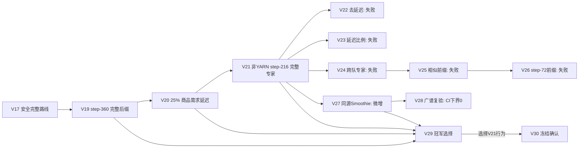

# Hierarchical MoE 谱系、社区证据与 V116 研究判断

## 结论

V19→V20→V21/V29 的有效演变不是简单增加专家数量，而是依次解决三个独立问题：

1. V19 用首店 Router 和固定时点，把一条完整生产后缀接到已有安全开局；
2. V20 不改生产，只利用“市场先于城镇需求”的引擎顺序，把受需求商品约 25% 的出售量延后
   一回合，并在下一回合偿还；
3. V21 对非 YARN 分支提前到 step 216 切换一条完整生产专家，同时保留 V20 的需求时点控制和
   状态安全执行；V29 只是同期冠军选择，最终行为等同 V21，不是新策略。

[VERIFY: kaggle_Kaggriculture/model/v19_hierarchical_moe/main.py:1455-1480]
[VERIFY: kaggle_Kaggriculture/model/v20_demand_timing_moe/main.py:1483-1569]
[VERIFY: kaggle_Kaggriculture/model/v21_top_meta_moe/main.py:1572-1603]
[VERIFY: kaggle_Kaggriculture/model/v29_champion_selection/main.py:1605]

## 谱系结构

## 主线版本的真实执行逻辑

### V19：完整路线切换

- 每个座位维护独立 `last/route` 状态；新局或 step 回退时清空。
- step 72 读取首个公开商店：YARN 走 `yarn`，其余走 `default`。
- 非 YARN 在 step 360 改为 `bakery_brunch` 完整动作流。
- 路由后仍执行固定采购上限和单位 fail-closed。

[VERIFY: kaggle_Kaggriculture/model/v19_hierarchical_moe/main.py:1455-1480]

冻结确认中，V19 相对 V17 提升 `+1.79pp`，seed-cluster bootstrap 95% CI
`[+0.61,+3.18]pp`，32 个正翻转、0 个负翻转。[VERIFY:
kaggle_Kaggriculture/model/v19_hierarchical_moe/README.md:17-22]

### V20：需求时点延迟

V20 的第一性原理是：商品供给会压价，而城镇/商店消费发生在市场处理之后。因此当前需求
不能抬高本回合卖价，但可能改善下一回合价格。

- 只在 step 360–671、当前 market 非空且全为 SELL、没有旧欠单时考虑延迟。
- 逐商品计算当前城镇/商店需求；shed 总量小于 80、下一回合有订单槽时，移动约 25%。
- 延迟量写入座位私有 `due_step/due`，下一回合合并到同商品 SELL；槽位不足则继续顺延。
- 最后重新排序 SELL 槽位；生产、采购和单位动作不变。

[VERIFY: kaggle_Kaggriculture/model/v20_demand_timing_moe/main.py:1483-1569]

独立确认相对 V19 `+6.53pp`，`220/1556/16`；16 个负翻转的父代结果原本都是平局。
[VERIFY: kaggle_Kaggriculture/model/v20_demand_timing_moe/README.md:5-9]

### V21/V29：完整生产专家路由

- step 72 仍只决定 YARN/default。
- YARN 全季保留旧 YARN 专家；非 YARN 到 step 216 才切入 `lucaskna::100485613` 完整路线。
- 动作先经过 V20 商品延迟，再经过采购上限和单位 fail-closed。

[VERIFY: kaggle_Kaggriculture/model/v21_top_meta_moe/main.py:1572-1603]

V21 的 128 fresh seed × 8 对手 × 双座位确认中，得分率从 V20 的 71.46% 提升到
85.67%，增量 `+14.21pp`，`293/1755/0`。[VERIFY:
kaggle_Kaggriculture/model/v21_top_meta_moe/README.md:8-16]

V29 对 V19/V20/V21/V27 做同期冠军赛；V21 相对 V19 `+14.06pp`、相对 V20
`+9.57pp`，V27 相对 V21 没有新增胜负，最终选择更简单的 V21 行为。[VERIFY:
kaggle_Kaggriculture/model/v29_champion_selection/README.md:3-5]

统一复赛进一步确认 V29 对 V21 为 `48/160/48`、平均金币差 0，源码只多版本字符串；因此
V21/V29 必须按同一行为簇计权。[VERIFY:
kaggle_Kaggriculture/model/v29_champion_selection/v22_v29_rematch_20260828/REPORT.md:45-54]

## V22–V28 的反例

| 版本 | 证据 | 结论 |
|---|---|---|
| V22 | 相对 V21 `−1.43pp`，`0/751/17` | 需求延迟是有效机制，不是装饰层。[VERIFY: kaggle_Kaggriculture/model/v22_lucaskna_no_delay_ablation/README.md:3-5] |
| V23 | 37.5% 没有新增胜局 | 只提高金币而不改变胜负，不能晋级。[VERIFY: kaggle_Kaggriculture/model/v23_demand_fraction_search/README.md:3] |
| V24 | 8 个跨队专家全部严重退化 | 商店标签不能证明状态兼容。[VERIFY: kaggle_Kaggriculture/model/v24_shop_expert_router/README.md:3] |
| V25 | 7 个 step-216 专家全部退化 | 动作前缀相似不等于内部状态相同。[VERIFY: kaggle_Kaggriculture/model/v25_prefix_compatible_experts/README.md:3] |
| V26 | step-72 切换仍全部退化 | 精确请求动作前缀也不能保证资源/市场状态兼容。[VERIFY: kaggle_Kaggriculture/model/v26_step72_milan_router/README.md:3] |
| V27 | `+0.3125pp`，只有 2 个有效翻转 | 只够进入复验。[VERIFY: kaggle_Kaggriculture/model/v27_lucaskna_shop_router/README.md:3] |
| V28 | `+0.1302pp`，CI `[0,+0.3255]` | 下界为 0，否决。[VERIFY: kaggle_Kaggriculture/model/v28_broad_smoothie_router/README.md:3] |

共同教训：完整专家不能靠“商店标签 + 固定 step”随意拼接；切换成立的必要条件是共同开局、
内部资产/库存/单位位置兼容，并在闭环对战里产生稳定正翻转。

## 社区调研

### 多路线/多专家

- [boatlee V20 Multi-Route](https://www.kaggle.com/code/boatlee/v20-adaptive-r1-multi-route-agent)
  和 [Multi-Route Farming Agent](https://www.kaggle.com/code/flexonafft/kaggriculture-multi-route-farming-agent)
  说明社区主流已从单路线走向完整路线组合，但公开结果本身不能证明任意中途切换安全。
- 公开仓库中的强路线通常采用“完整底盘 + 很薄的公共状态修复/市场层”，例如
  [Seyamalam/Kaggriculture](https://github.com/Seyamalam/Kaggriculture)；其文档也明确把 recorded
  replay benchmark 定位为回归压力测试，而不是 live 胜率估计。
- 对本项目最重要的建议：宏观 Router 只选择长期承诺的生产专家；微观动作必须由同一个状态
  安全执行器生成。Router 的成立标准是 `FULL > best fixed expert`，不是“专家被调用过”。

### 启发式任务执行

- [lonespear/kaggriculture](https://github.com/lonespear/kaggriculture) 的公开实验显示：先处理
  “单位脚下的任务”，再做 Hungarian 全局匹配，移动占比从约 60% 降至 46%，并取得 40–0；
  作者仍认为下一步需要任务捆绑/小型 VRP 和设施选址。
- 同一仓库的失败日志说明“更多资产”常常更差：劳动槽和 shed 容量是硬约束；畜牧必须先保证
  feed、放置、回仓闭环，不能只按静态利润扩张。
- [GzmCR 前排轨迹研究](https://github.com/GzmCR/Kaggriculture/blob/main/research/2026-08-04-top-strategy-research.md)
  观察到顶级路线长期高 shed 利用率，差异更多集中在市场回合，而不只是 field route。
- [Island GA](https://github.com/destbreso/kaggriculture-island-ga) 的可复用价值是声明式 genome、
  common-random-number screen、disjoint confirm、岛模型多样性和可替换 executor；其文档也明确
  指出 bank-vs-idle 与共享市场 head-to-head 可能不一致。

### 强化学习

- Kaggle 讨论 [Is Pure Self-Play PPO viable?](https://www.kaggle.com/competitions/kaggriculture/discussion/734952)
  的公开经验高度一致：720 步长时域、巨大组合动作空间和稀疏终局奖励使端到端 PPO 很难；多名
  参赛者报告 PPO 约 5k–22k，明显落后规则策略。也有个别参与者报告规则+PPO 混合达到 100k，
  但没有公开可复核对战矩阵，因此只能作为方向信号。
- 社区更一致的建议是混合式：确定性生产/移动/安全约束作为底盘，学习器只做低维高层选择，
  如对手产能、出售时点或市场 policy；这与本研究的 Hierarchical MoE 边界一致。
- 在原创启发式底盘尚未达到 75% 前，不启动 PPO。弱底盘上的 RL 只会学习补救低产状态，不能
  替代可执行生产链。

## V116 当前实验事实

### R0：逐步目标——淘汰

719 个逐步位置目标既是等价开环蓝图，又在 1 seed × 6 锚点 × 双座位中 `0/12`。因此同时
未过原创门和强度门。[VERIFY:
kaggle_Kaggriculture/model/v116_heuristic_gold_search/research_revision.md:9-17]

### R1：日级聚合目标——淘汰

R1 只保留 30 个日级聚合目标，四生产专家均触发，719 调用完整、零 schema violation、零
fallback；但 8 seed × 6 金牌锚点 × 双座位为 `0/96`，候选均值 `16,747.99`，对手均值
`129,927.84`。[VERIFY:
kaggle_Kaggriculture/model/v116_heuristic_gold_search/target_state_prototype/research_result.md:3-22]

移动 304,369 次、idle 188,914 次，说明失败主因在劳工/物流执行和小时级资本闭环，不在商店
Router。因此下一版先做低移动布局、跨回合任务链和滚动拍卖；底盘未过健康门前，需求延迟和
对手预测保持关闭。[VERIFY:
kaggle_Kaggriculture/model/v116_heuristic_gold_search/target_state_prototype/pre_screen_results.json:1-75]

## 验证清单

- V19 路由/后缀/安全闭环：`v19_hierarchical_moe/main.py:1455-1480`
- V20 商品需求延迟：`v20_demand_timing_moe/main.py:1483-1569`
- V21 完整专家切换：`v21_top_meta_moe/main.py:1572-1603`
- V29 行为别名：`v29_champion_selection/main.py:1605`
- V22–V28 反例：对应版本 `README.md:3-5`
- V116 R1 结果：`target_state_prototype/research_result.md:3-22`
