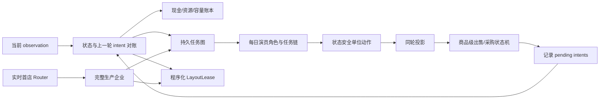

# R10 Enterprise Queue Hierarchical MoE 研究方案

## 决策

`DESIGN_APPROVED_FOR_IMPLEMENTATION_NOT_GOLD_EVIDENCE`

R8 五固定生产专家各 72 局全败；R9 七模式 504 局仍无一胜，且生产 overlay 退化、市场
overlay 行为惰性。问题不再归因于 Router，而是逐 step 重建全图 jobs 的弱执行内核。R10 从零
建立程序化企业执行器，不继承 RC8/历史 agent。

## 原创性和 Replay 边界

- `strategy_parent=null`；运行时不得导入、调用或包装任何历史完整 agent；
- 不保存 Replay/历史动作、逐步位置、成交、市场库存轨迹或等价开环路线；
- 坐标只能由当前 grid、距离、服务频率和布局约束即时生成；
- Replay 只按 V116 协议提供 2026-08-20+、版本和完整配置一致的固定条件场景：实际公开商店
  顺序/时点与派生需求；候选在线不能读取未来商店；
- frozen Replay 场景在候选和阈值锁定前禁止提取或运行。

## 第一性原理

高收益不是“目标资产数量”的函数，而是以下闭环的乘积：

```text
可兑现收益
= 有效产量 × 实际边际售价
− 种子/动物/饲料/土地/hands 成本
− 服务和运输机会成本
− 终局未回收资本与未入 shed 库存
```

单位每天重置，长期任务不能永久绑定某个 hand；正确状态是“任务跨日持久、演员每日重绑定”。
本轮市场采购只能在下一 observation 对账后供单位使用；同作物超库存批量 PLANT 会原子失败，
所以资源必须按 ticket 预留，不能只看总库存。

## 分层架构



长期任务只在任务完成、目标失效、新土地到账或生产阶段切换时重排，禁止每 step 全场竞拍。

## 状态契约

```python
TaskTicket(
    id, kind, target, payload, prerequisites, required_resources,
    earliest_step, deadline, state, owner, lease_until, retries,
    expected_cash_value,
)

ActorState(
    unit_index, day, zone, role, active_chain, interrupted_chain,
    carried_reservations,
)
```

任务状态：

```text
WAIT_RESOURCE
→ WAIT_MARKET_RECEIPT
→ ACQUIRE_AT_SHED
→ TRAVEL
→ EXECUTE
→ DELIVER
→ COMPLETE
```

安全规则：一个 tile、动物、种子或 carried item 同时最多一个 ticket 预留；WATER/FEED 以
deadline slack 抢占；安全任务结束后恢复原链；日末 hand 消失但 ticket 保留；有 runnable ticket
时禁止无理由 PASS。

## 程序化布局

布局器只在土地到账、专家提交或 tile 失效时运行小型确定性 min-cost matching。成本包含：

- 最近 shed gate 距离；
- 服务频率与预计 WATER/FEED/CARE/HARVEST 次数；
- 同类资产巡回的增量距离；
- 所属象限/演员 zone；
- 运输小麦、动物和商品的路径成本；
- 终局前能否回收资本。

动物、草莓、番茄等高频资产靠近 shed；低频长周期作物置于外圈。已落地有效资产持有
`LayoutLease`，不为短期信号搬迁。

## 三个完整生产专家

### RootExchangeEnterprise

适配 PET/FARMERS。经营 CARROT、TOMATO、WHEAT，核心链为快速轮作
`HARVEST → DROP → seed receipt → replant`，少用不可逆动物资本。

### DairyBerryEnterprise

适配 SMOOTHIE/ICE_CREAM/PIZZA。经营 COW、STRAWBERRY、WHEAT；PASTURE、运输、饲料、
FEED/CARE、收获和出售必须形成单一完整链。WHEAT 先计生产投入，超饲料预留才可卖。

### FiberGrainEnterprise

适配 YARN/BAKERY/BRUNCH。经营 SHEEP、GOOSE、WHEAT；羊毛和蛋按不同周期排队，动物区靠近
shed，WHEAT 分成饲料账户和出售账户。未知商店时作为稳健兜底。

三个 fixed mode 从 step 0 都必须独立完成经营，不允许 Router 给它们补动作。

## Router

- step 0 到首店可见：执行由规则求解的可选择性小开局，不复用 `W8+M7+SHEEP4`；
- 首店首次实际公开时：按需求价值、现有资产复用、转换成本、公开对手产能碰撞与劳工负荷，
  一次性提交三个完整企业之一；
- 后续商店只调整商品出售优先级，不切换企业；
- Router 必须严格胜过最佳 fixed expert，且三个专家在正式面板有独占胜局贡献。

## 资本与商品控制

三账本分别记录现金承诺、资源/在途采购/任务预留、土地/结构/shed/劳工容量。HIRE、LAND、
SEED、ANIMAL、WHEAT 只有在终局前净现值为正、下游 ticket 和维护容量都存在时才能采购；订单
进入 pending receipts，下一 observation 对账后才释放。

每个商品使用独立出售状态：

```text
OPERATING_RESERVE
HOLD_FOR_KNOWN_DEMAND
FINANCE_CAPEX
SCARCITY_RELEASE
CAPACITY_RELIEF
TERMINAL_LIQUIDATION
```

已知 town demand 在本轮 market 后发生，因此需求当步 hold，下一步价格反映稀缺后再分批释放。
payback cutoff 后禁止无未来产出的 HIRE/LAND/SEED/ANIMAL/FEED；终局只执行来得及完成
`HARVEST → DROP → SELL` 的链。

## 递进门槛

### P0 原创性/打包

- 自包含 `main.py`；无历史导入、动作表、Replay 玩家字段或逐步蓝图；
- 当前状态扰动会改变布局、队列或资本决策；
- 四个 mode 可实例化，三个 fixed 专家行为不同。

### P1 状态机

- 719 calls、候选 schema/ERROR 为 0；
- 原子 PLANT 失败、重复资源预留、有效链途中无故换目标均为 0；
- runnable PASS `<=1%`，非进展移动 `<=5%`；
- 漏 WATER 变 weed、漏 FEED 逃逸、payback cutoff 后负价值采购均为 0；
- queue completion `>=95%`，终局可出售 shed/carried 库存为 0。

### P2 已暴露经济健康门

只使用已暴露 7100–7103 与 R3 两 seed、双座位：

- 三个 fixed expert 各自 mean bank `>=90k`；
- Router mean bank `>=100k`、CVaR25 `>=80k`；
- 最低末局生产资产 `>=58`；
- 未通过则只改执行器/企业，不训练 Router，不提取 Replay frozen。

### P3 已暴露金牌机制门

R3 两 seed × 18 金牌 × 双座位，每模式 72 局：

- 每个 fixed expert至少贡献 2 个其他专家没有的独占胜局；
- best fixed 纯胜率 `>=35%`，三专家 outcome-oracle `>=80%`；
- Router 纯胜率 `>=70%`、mean bank `>=110k`、至少 12/18 对手中位分差为正；
- Router 严格优于 best fixed 且有正胜负翻转；
- 若专家 oracle 不过门，继续重构专家；oracle 通过但 Router 失败，才研究 Router。

### P4 Replay Development 与冻结测试

P0–P3 全过后才进入两个独立 Replay 来源。账号线上主面板与官方按日确认面板分别运行 18 金牌、
双座位；最终冻结测试各自纯胜率都必须 `>=75%`，并满足单对手、座位、Router、719、零错误
护栏。两面板禁止合并；任一不足即淘汰，不登记 `golden_model.md`。
