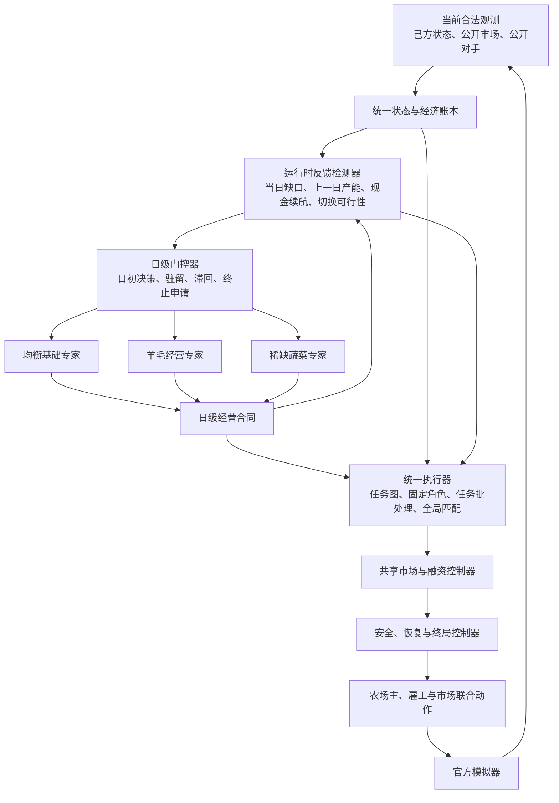

# V117 R2.1 系列：严格状态—合同—日级 Option HMoE

当前结论：**核心架构图的所有在线节点均已实现并接通，但 V117 仍不是合格 HMoE，更不是金牌候选。**
原因不是缺少类或接口，而是当前只有 `BALANCED_BASE` 允许进入线上 Router；两个 specialist 虽已实现
独立合同，但尚未通过条件专家 uplift 与 Oracle 门，必须继续隔离。

R2.1 是统一迭代系列，而不是一次性小补丁。只有同时满足以下三个最低退出目标，才允许升级到 R2.2：

1. 默认模式真实激活 HMoE，两个 specialist 都在合格场景中被实际选择，且切换 invariant 零违规；
2. 三个固定专家分别对冻结 V1、在合规 Replay-derived 双座位面板上的纯胜率均 `>=20%`；
3. 完整组合模型在相同面板对 V1 的纯胜率 `>=50%`，且至少两个专家产生真实正胜负翻转。

这三项只是 R2.1 退出门，不替代金牌门。详细口径与 `R2.1-A` 至 `R2.1-G` 顺序见 `rs_plan.md` 第 0.1 节。

## 1. 当前架构



## 2. 每个节点的实现含义

| 节点 | R1 已实现内容 | 当前资格边界 | 下一迭代 |
|---|---|---|---|
| 当前合法观测 | 解析己方私有状态、公开市场、公开商店和公开对手农场/现金 | 不含 seed、未来商店、Replay ID、对手私有状态 | 只补官方 schema/parity 发现的缺字段 |
| 统一状态与经济账本 | 逐 turn 对账现金、资产、库存、市场滞后、任务、角色、订单、合同和终局返仓距离 | 真实 observation 永远覆盖内部预测 | 补资产/订单守恒的异常样例 |
| 运行时反馈检测器 | 目标缺口、任务积压、劳动压力、现金续航、仓容、饲料、市场冲击、切换可行性；B105 已把上一日兑现率、生产/空转占比、逾期和连续失配回流到次日合同 | 仅使用已发生事实，不预测胜率；反馈增员未过双来源门，默认关闭 | 先提高单位资产产出，再决定是否启用反馈控制 |
| 日级门控器 | 正常仅 `hour=0` 评估；日内缓存合同；实现 eligibility、驻留、滞回、切换成本和终止申请 | 默认只有 Balanced 可路由 | Oracle 过门后再开放 Q1/Q2 |
| 均衡基础专家 | 独立给出土地、作物、动物、劳力、现金、采购、出售和劳动合同 | 工程回退；未过 Foundation/Gold shadow | 优先提升绝对强度 |
| 羊毛经营专家 | 独立羊毛资产、饲料、劳动、预算与退出条件 | 已实现、隔离，未过 R3 | 用准入场景验证 eligible uplift |
| 稀缺蔬菜专家 | 独立短缺识别、CARROT/TOMATO 暴露、劳动和预算 | 已实现、隔离，未过 R3 | 用准入场景验证 eligible uplift |
| 日级经营合同 | 完整实现身份、有效期、准入/退出、资产/生产/库存、现金/采购、出售、劳动、风险、切换成本和兑现账本 | 合同不含 719 步动作 | 补同状态切换守恒测试 |
| 统一执行器 | E1/E2：任务图、Hungarian、精确地块链、多饲料工、阶段劳力/浇水、终局任务准入和逾期审计；B111 固化奶牛 22 点 CARE 软保障，B113 固化第 12 天后的草莓优先施肥 | 动物会话、滚动路线、二次派工、责任区、截止松弛和肥料回收截止均未通过，默认关闭 | 继续按已确认的产能周期缺口迭代 |
| 共享市场与融资 | M0–M2：仓容/现金预演、变现—采购闭环、商店/价格滞后；B40/B42 接入收据日历和首日牛批次，B51 启用日内返仓，B56 固化 `value>=1500/hour<=18`，B86 固化并行交付工上限 `2` | B86 在账号/官方完整面板均优于 B75；B88–B96 的额外交付窗、资产时钟和市场冲击排序未通过双来源门 | 冻结 B86 市场参数 |
| 安全、恢复与终局 | 正常、现金、饲料、仓容、终局五模式；返仓、DROP、SELL、停止扩张和语义预演；B75 在最后一天保留最多 8 名雇工完成收获兑现 | 共享服务，不计作专家 | 冻结 B75，继续监控尾部兑现与现金成本 |
| 联合动作 | 统一生成 farmer、hands、market；检查位置、库存、现金、仓容和十订单上限 | 不调用历史完整 agent | 保持确定性和低延迟 |
| 官方模拟器反馈 | 719-call 双座位 smoke、包内外动作/收益 parity、日级结果反馈 | 本地随机仅作工程/早停，不是正式强度证据 | 使用准入 Replay 外生场景做正式比较 |

对应源码入口：`schema.py`、`state_ledger.py`、`contracts.py`、`experts/`、`router/`、`executor/`、
`market/`、`safety/`、`diagnostics/`；`main.py` 只负责连接这些节点。

## 3. 10 次偏离检查结果

| 进度 | 检查结论 |
|---:|---|
| 10% | 识别 R0 缺少完整合同、公开对手/市场历史、日级缓存、specialist、恢复/终局和研究反馈 |
| 20% | 状态与事实反馈补齐，合法信息边界未扩大 |
| 30% | 完整合同和 fail-closed 不变量完成，仍是增量目标而非动作路线 |
| 40% | 三专家独立实现；未过门 specialist 保持隔离 |
| 50% | Router 改为真正日级；不再每 turn 重签合同 |
| 60% | E1/E2 执行器完成；E3/E4 保持证据门 |
| 70% | M0–M3 节点实现；学习型 M4 保持关闭 |
| 80% | 恢复/终局是共享控制器，不伪装成 expert |
| 90% | 双反馈、五层报告、Oracle 接口和唯一主失败码接通，不伪造指标 |
| 100% | 发现并修复 Balanced 自终止重签及未授权对手条件两处偏离；完成全局验证 |

详细差距见 `architecture_audit.md`。

## 4. 当前证据（R2.1-B113）

| 检查 | 当前结果 | 结论边界 |
|---|---:|---|
| 全节点框架测试 | 全部通过 | 架构语义和接口通过，不代表策略强 |
| 新鲜本地 idle 健康测试 | 16 局，均值 `117,693.38`，最低 `96,641`，目标兑现率 `93.35%`，16/16 胜 idle | 工程健康门通过；本地随机不能用于正式选优 |
| 日级合同 | 每局 30 次日初签发、29 份已结算日级反馈 | 修复 R0 每 turn 重算合同的偏离 |
| 合法性与状态 | 719 calls，0 schema 错，0 safety rewrite，0 invariant event | 工程闭环通过 |
| 合规 Development：账号线上 Replay 场景 | 32 场景×双座位，`0/64`，自身均值 `77,244.70`，平均分差 `-41,116.45` | 第一证据面板；Balanced 未过 20% |
| 合规 Development：官方按日 Replay 场景 | 32 场景×双座位，`0/64`，自身均值 `73,485.25`，平均分差 `-42,849.38` | 独立泛化面板；不与账号面板混成单一来源结论 |
| 分层等权汇总 | `0/128`，自身均值 `75,364.98`，平均分差 `-41,982.91` | 较 B86 自身收益提高 `313.28`、分差改善 `450.77`，但仍非可用单专家 |
| B113 默认等价 | 显式 B113 与新默认在 128 局、8 类关键输出上 `0` 差异，games SHA 完全相同 | 固化参数没有产生隐式漂移 |
| Blind/Confirmation | 未提取、未访问 | 不允许用来调参 |

主要证据：`framework_test_results.json`、`smoke_r2_1_b86_parallel_delivery.json`、
`replay_data/panels/r2_1_v1/evaluations/r2_1_b113_default_full/summary.json`、
`replay_data/panels/r2_1_v1/evaluations/r2_1_b113_default_full/default_parity_explicit_b113.json`、
`failure_attribution.json`。

## 5. 当前到底算不算 HMoE

- 从代码结构看：**完整 HMoE 架构已经实现**，Router、三专家、合同、公共执行和公共市场均存在。
- 从可用策略看：**尚未形成合格 HMoE**，因为两个 specialist 没有资格进入默认 Router，尚无
  OracleHeadroom、BEU、MCU 或真实正胜负翻转。
- 当前准确标签：`FULL_ARCHITECTURE / SINGLE_ROUTABLE_FOUNDATION / NOT_QUALIFIED_HMOE / NOT_GOLD`。

## 6. R2.1 当前唯一允许的优化

当前最上游失败码为 `基础专家绝对强度不足`。R2.1-A 已完成，R2.1-B 尚未过门。下一轮只能在一个冻结模块内改：

1. B109 的双来源生产漏斗确认：候选库存增量少约 `575–616` 单位，入仓差仅约 `211–229`，主损失在上游生产周期；
2. B110 用地块状态变化排除了“小麦大缺口”的误判：小麦结果受同一步市场采购干扰；真实稳定缺口集中在 MILK 与 STRAWBERRY；
3. B111 只在 22 点保障奶牛 CARE，完整面板相对 B86 自身收益 `+160.66`、分差 `+302.91`，两来源同向，已固化；
4. B112 的临近收盘肥料回收优先级全部退化，说明缺口不是简单“没捡肥料”，机制保留默认关闭；
5. B113 从第 12 天起把现有肥料优先分配给草莓，完整面板相对 B111 自身收益 `+152.63`、分差 `+147.86`，两来源同向，已固化；
6. B113 后草莓施肥率差缩至账号约 `7.2pp`、官方约 `5.5pp`，但牛奶资产日和 CARE 兑现差仍大；
7. 下一唯一允许模块为 B114 只读资本配置漏斗：逐日核对土地、种子、动物、雇工、产品采购的实际现金支出与资产增量，定位候选少投入 `1.2–1.6 万` 的具体去向；
8. 参数选择只能使用按 `rs_plan` 准入的 2026-08-20 后 Replay-derived development 场景；
9. `YARN_WOOL`、`SCARCITY_VEGETABLE` 保持隔离，直到 Balanced 通过 R2；不训练 Router、不做 PPO；
10. 每轮只改一个模块，并输出 paired 结果、机制审计和唯一主失败码；三个退出目标全部达成前，版本均保持 `R2.1.x`。

## 7. Replay 与提交边界

- 继续沿用 `rs_plan.md` 第 7 节：两类来源分开、08-20 cutoff、完整配置哈希、只抽取外生商店/需求、
  episode/seed/scenario 防泄漏。
- 本轮只使用已准入、已白名单提取的 Development 外生场景；没有重新获取线上结果、下载新 Replay 或提交模型。
- 旧 submission `55892289` 对应 R0 包；当前 R2.1-B113 不能与旧线上结果混为一谈。

## 8. 复现

```bash
DIR=kaggle_Kaggriculture/model/v117_state_contract_daily_option_hmoe

python "$DIR/framework_tests.py"
python "$DIR/loss_attribution_tests.py"
python "$DIR/replay_data/test_protocol.py"
python "$DIR/smoke.py" --seed-start 117520 --seeds 8 --workers 8 --output "$DIR/smoke_r2_1_b113_care_fertilizer.json"
python "$DIR/replay_data/evaluate_development.py" --workers 8 --output-dir "$DIR/replay_data/panels/r2_1_v1/evaluations/r2_1_b113_default_full"
```
