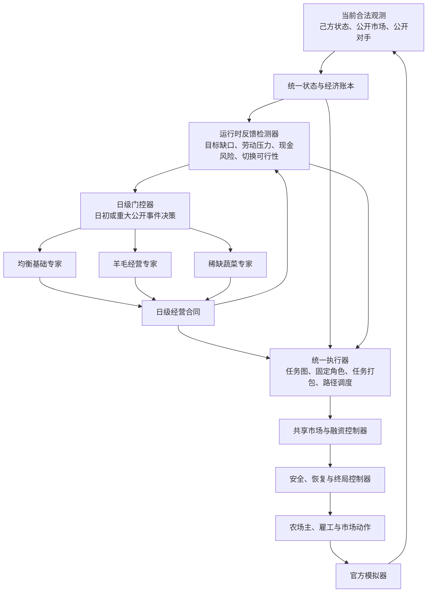
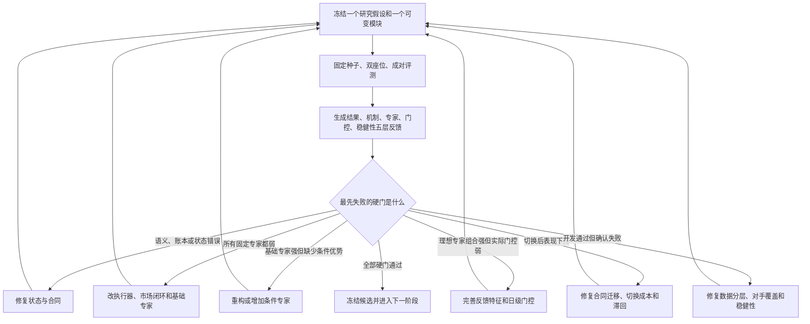
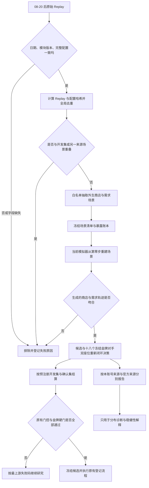

# V117 State-Contract Daily Option HMoE 研究指导方案

- 状态：`R2.1_SERIES_ACTIVE / ENGINEERING_HEALTH_PASS / SPECIALISTS_QUARANTINED / NOT_QUALIFIED_HMOE / NOT_GOLD`
- 模型：`v117_state_contract_daily_option_hmoe`
- 策略父代：`strategy_parent=null`
- 引擎基线：Kaggriculture Python `1.32.7`
- 目标：从零构造独立、闭环、可切换、最终有资格冲击金牌门的 Hierarchical MoE。

## 0. 决策摘要

V117 不再把“历史完整动作路线切换”或“逐 turn 神经投影切换”当作 HMoE。核心定义改为：

> Router 在日级边界选择一个完整经营 option；专家只提交显式日级经营合同；所有原子动作都由
> 同一套实时状态账本、任务图、物流调度器、市场控制器和安全执行器生成。

严格优先级如下：

1. **P0：状态契约、基础事实反馈与执行正确性**；
2. **P1：统一执行器的劳动、移动、物流效率**；
3. **P2：Balanced 单专家的完整经济闭环和绝对强度**；
4. **P3：构造真正有条件优势的独立专家**；
5. **P4：Oracle 证明专家互补，并建立可归因研究反馈**；
6. **P5：只有正确专家存在但选不出来时，才完善高级反馈和浅层 Router**；
7. **P6：对手条件、联赛和金牌 Development/Confirmation**；
8. **P7：只在前述全部成立后，尝试低维 Residual/SMDP PPO**；
9. **P8：打包、延迟、引擎一致性和提交准备**。

当前最重要的判断：**进展缓慢的主要原因不是 Router 算法不够复杂，而是统一执行底盘、强基础
专家、专家互补和切换状态契约尚未同时成立。** 在这些前置条件满足前，继续调门控只会更快地
选择弱专家，或者在切换时破坏已有经济状态。

正式评测数据还有一条不可妥协的边界：**本地任意随机 seed 只用于工程验证和早期机制筛查；
Development/Confirmation 必须使用 2026-08-20（含）以后、当前线上规则一致的 Replay 外生场景，
并把本账号线上 Replay 与官方按日 Replay 分开报告。** 这只改变评测输入分布，不改变后文既有的
Oracle、Router、BEU、MCU、Development/Confirmation 和金牌晋级门。

### 0.1 R2.1 系列统一退出合同（2026-08-31 冻结）

从本次决策起，均衡专家强化、条件专家资格审查、Oracle、门控激活和组合模型验证都属于
**V117-R2.1 系列**。内部可以使用 `R2.1-A` 至 `R2.1-G` 标识研究工作包，但在以下三个目标同时
满足之前，不得把研究版本升级为 `R2.2`，也不得把结果描述为“合格 HMoE”：

1. **HMoE 真实触发**：在默认生产模式而非 `allow_unqualified_for_tests` 下，三个专家都进入
   routable registry；`YARN_WOOL` 和 `SCARCITY_VEGETABLE` 都在预注册 eligible 场景中发生真实激活，
   Router 至少形成两类专家之间的合法选择或切换，且合同、账本和切换 invariant 零违规；
2. **每个固定专家对 V1 的纯胜率均不低于 20%**：`BALANCED_BASE`、`YARN_WOOL`、
   `SCARCITY_VEGETABLE` 分别关闭 Router、独立控制完整对局，对冻结 V1 基线在同一场景双座位面板上
   都达到 `wins / all_games >=20%`；平局计入分母但不计作胜，必须同时报告样本量与 seed-block 95% CI；
3. **完整组合模型对 V1 的纯胜率不低于 50%**：开放已通过资格门的 Router，在与单专家完全相同的
   场景、座位和 V1 对手上达到 `wins / all_games >=50%`，并同时满足至少两个专家真实贡献正胜负翻转、
   catastrophe `<=5%`、切换 invariant 零违规。

以上阈值是 **R2.1 最低退出门**，不是金牌门，也不覆盖后文更严格的 Foundation、Gold shadow、
OracleHeadroom、BEU、MCU、Development 和 Confirmation 条件。若 R2.1 三目标达标但更严格条件未达标，
只能升级研究版本，不能登记金牌。

“对 V1”统一解释为：冻结、哈希可追溯的 V1 完整基线作为对手；评测只使用符合第 7 节准入要求的
Replay-derived development 场景，执行双座位配对。账号线上 Replay 面板和官方按日 Replay 面板分别
报告，不用合并数量掩盖任一来源失败。本地随机与合成锚点只能做工程测试、机制诊断和明显弱候选早停，
不得用于确认 20% 或 50% 达标。

R2.1 系列的固定推进顺序如下；前项未满足时，后项只能完成接口，不能产生晋级结论：

| 工作包 | 唯一主目标 | 允许改动 | 退出证据 |
|---|---|---|---|
| `R2.1-A` | 损失归因 | 反馈与评测，不改策略 | 每局能量化融资、错售、断粮、逾期、移动、积压和终局损失，并给出前三主因 |
| `R2.1-B` | 做强 Balanced | Balanced genome、市场、融资；每轮一个模块 | Fixed Balanced 对 V1 `>=20%`，并继续冲击原 Foundation/Gold shadow 门 |
| `R2.1-C` | 资格审查 Yarn | 只改 YARN_WOOL genome 和 eligible 定义 | Fixed Yarn 对 V1 `>=20%`，且通过 R3 eligible uplift 门 |
| `R2.1-D` | 资格审查 Scarcity | 只改 SCARCITY_VEGETABLE genome 和 eligible 定义 | Fixed Scarcity 对 V1 `>=20%`，且通过 R3 eligible uplift 门 |
| `R2.1-E` | 证明专家互补 | 冻结专家，运行同状态 Oracle 分支 | OracleHeadroom、覆盖和切换可实现性通过原 R4 门 |
| `R2.1-F` | 激活真实 Router | 冻结专家，优化反馈、标签、滞回和浅层 Router | 默认模式真实激活 specialist，BEU/MCU/CaptureRate 通过原 R5 门 |
| `R2.1-G` | 组合模型退出测评 | 不再调参，只运行冻结面板 | HMoE 真实触发、三个 fixed expert 均 `>=20%`、组合模型 `>=50%` 同时成立 |

在 `R2.1-A` 至 `R2.1-B` 完成前，不调 Router、不增加第四个专家，也不开放两个 specialist；在
`R2.1-C`、`R2.1-D` 分别过门前，只允许测试其独立路径，不能用门控掩盖弱专家。
后文 `R3` 至 `R5` 继续作为“条件专家、Oracle、Router”研究门名称使用，不代表对外版本号；
`R2.1-G` 通过前，所有候选、报告和归档版本仍统一标为 `R2.1.x`。

失败后的第一决策固定为：

- **所有固定专家都弱**：修执行器、市场融资和均衡基础专家，不增加专家，不训练门控；
- **基础专家已强，但理想专家组合的增益仍不足 5pp**：用失败状态簇设计一个机制不同的新专家；
- **理想专家组合增益至少 5pp，但实际门控没有净增益**：冻结专家，优先完善反馈、标签、状态特征、
  切换成本和门控；
- **固定运行强、切换后才退化**：修状态合同和迁移，不重训全部专家；
- **开发通过、确认失败**：修数据分层和稳健性，不继续扩大架构。

## 1. 为什么前两轮 HMoE 没有形成成果

### 1.1 V113：层级定义和信用分配时间尺度都错了

- Router 每 turn 都能重选，expert 主要是共享 trunk/decoder 前的 projection slice，不是带预算、
  记忆和终止条件的完整经营策略。[VERIFY: kaggle_Kaggriculture/model/v113_simulator_hmoe_ppo/OVERNIGHT_TRAINING_SUMMARY_20260830.md:75-97]
- `gamma × lambda=0.94525`，有效 trace 约 `18.26 turn=0.76 天`；种植、动物、融资和终局兑现却是
  多日因果链。[VERIFY: kaggle_Kaggriculture/model/v113_simulator_hmoe_ppo/OVERNIGHT_TRAINING_SUMMARY_20260830.md:114-133]
- 逐 token 探索把正常经济轨迹打散；Stage37 的 128 局平均自身金币只有 `26.40`，且 `128/128`
  低于 3,000 灾难线。[VERIFY: kaggle_Kaggriculture/model/v113_simulator_hmoe_ppo/OVERNIGHT_TRAINING_SUMMARY_20260830.md:135-143]
- 没有至少两个通过资格门的 expert，因此本来就没有资格训练高层 Router。
  [VERIFY: kaggle_Kaggriculture/model/v113_simulator_hmoe_ppo/OVERNIGHT_TRAINING_SUMMARY_20260830.md:66-73]

结论：V113 证明了 PPO 工程可以运行，但没有证明 expert、Router 或完整策略强度。

### 1.2 V114：时间尺度改对了，但没有合格的基础策略

- V114 已转向日级 SMDP，但最新数据口径切换后，旧 V2/V8 数据、旧 V12 checkpoint 和旧
  foundation 证据全部不可晋级；`foundation_candidates_registered=0`、`incumbent=null`。
  [VERIFY: kaggle_Kaggriculture/model/v114_day_smdp_hmoe_ppo/run_state.json:17-45]
- 三个 scratch rule foundation 在 64 局中都是 0 胜，经济规模约比 V1–V10 基线低一个数量级。
  [VERIFY: kaggle_Kaggriculture/model/v114_day_smdp_hmoe_ppo/run_state.json:438-460]
- V10A 有高均值但 4 局尾部坍塌；V10B 为 `0/64`，不能当强单专家。
  [VERIFY: kaggle_Kaggriculture/model/v114_day_smdp_hmoe_ppo/run_state.json:462-489]
- V11 的逐 step 市场 BC 错误会在 719 步复合，固定阶段规则也修不好动作抽象。
  [VERIFY: kaggle_Kaggriculture/model/v114_day_smdp_hmoe_ppo/run_state.json:491-511]

结论：把 Router 改成按天仍不够；如果底层没有能独立完成整局经营的强策略，Manager 没有可选项。

### 1.3 V115/V116 给出的直接约束

- V115 固定 dairy/smoothie expert 在构造面板得分率约 `89.58%`，但完整 Router 只有 `8.33%`，
  `BEU=-81.25pp`。[VERIFY: kaggle_Kaggriculture/model/v115_contractual_path_forest_moe/preconstruction_audit_results.json:22-29]
  从 default 路线中途切入专家破坏了土地、动物、库存、融资和劳动力的共同状态。
  [VERIFY: kaggle_Kaggriculture/model/v115_contractual_path_forest_moe/decision.json:32-35]
- V116 的四个生产专家都能激活，工程也合规，但 R1 对 6 个锚点为 `0/96`；累计 move `304,369`
  次、idle `188,914` 次，说明“日目标”没有被高效编译成劳动、物流和融资闭环。
  [VERIFY: kaggle_Kaggriculture/model/v116_heuristic_gold_search/research_revision.md:46-65]
- V116 R3–R7 的手工补丁只是在 bank、目标兑现和劳动机会成本之间搬运损失，因此 R8 已明确转向
  参数化 genome、公共随机数和 derivative-free 搜索。
  [VERIFY: kaggle_Kaggriculture/model/v116_heuristic_gold_search/research_revision.md:191-201]

结论：V117 首先要解决的是**统一状态 + 统一执行 + 可兑现经营合同**，不是继续增加专家数量。

## 2. V1–V116 有没有可用的单专家

答案是：**有可复用的证据、教师和部件，但没有一组可以直接拿来组成 V117 的合格专家。**
本工作区当前可核查的研究目录到 V116；以下判断只使用已落盘证据，不把未落盘编号当作模型成果。

| 来源 | 可用价值 | 不能直接晋级的原因 | V117 用法 |
|---|---|---|---|
| V1 low/high | 完整经济路线、低高需求对照 | 运行时切换 `_ACTIONS`，本质仍是固定动作流 | 只作基线、教师统计和行为诊断，不作动作源 |
| V8 五路线 | 多商品组合、历史强路线 | 仍按 step 索引完整动作序列，状态修复只是外围保护 | 只作强度比较器、日级聚合目标研究 |
| V21/V30/V76/V88 | 金牌强度和行为上界 | 属于历史完整 agent 或其谱系，不能成为原创候选的在线动作源 | 只作冻结对手和 shadow benchmark |
| V113/V114 unit/market | codec、critic、任务或市场部件 | 没有形成完整、当前数据有效的单专家 | 可重用接口思想，重新训练/实现 |
| V115 dairy/smoothie | 固定起点下有强度信号 | 未证明互补，且切换状态不兼容 | 提炼合同假设，不移植完整路线 |
| V116 compact genomes | 独立、状态驱动、结构方向正确 | 对锚点 0 胜，执行与经济闭环弱 | 作为 genome 参数化的起点，不作为 incumbent |

V1 在路由后直接把 `_ACTIONS` 指向 high/low 固定路线；V8 也是按 `step` 从选定完整动作数组取动作。
这说明它们能做教师或比较器，但不能满足 V117 的“当前状态生成原子动作”边界。
[VERIFY: kaggle_Kaggriculture/model/v1_adaptive_market/main.py:1266-1315]
[VERIFY: kaggle_Kaggriculture/model/v8_kawa_lead2_slot/main.py:83-146]
[VERIFY: kaggle_Kaggriculture/model/v8_kawa_lead2_slot/main.py:1034-1049]

### 2.1 V117 的“合格单专家”定义

一个 expert 只有同时满足以下条件才可进入 Router 候选池：

1. 从 step 0 独立运行整局，不依赖任何历史完整 agent；
2. 只通过统一 `CanonicalState → DailyContract → CommonExecutor` 生成动作；
3. 在最新规则和冻结 fresh seed 上通过经济、尾部、双座位和对手门；
4. 与至少另一个 expert 在合法状态子域中有配对正增益，不是行为克隆；
5. 任意合法切换后，合同和账本不丢失、不重复、不产生隐含债务；
6. 固定 expert、Oracle 和 Router 都能在完全相同的执行器上评测。

### 2.2 单专家是否需要先和金牌比

需要比较，但要分层使用：

- **健康阶段**：先对 idle/Starter 检查能否经营；不拿它当强度证据。
- **Foundation 阶段**：对行为去重后的 V1–V10 代表池做晋级门。
- **Gold shadow 阶段**：较早运行小规模金牌诊断，只用于定位数量级和失败机制，不根据单局结果
  调 Router，也不消费 blind confirmation。
- **Router 准入阶段**：最佳固定 expert 必须已经不是 0 胜弱底盘，且 Oracle 必须证明组合后有足够
  headroom；否则继续改 expert/执行器。
- **最终阶段**：完整 HMoE 才承担 18 金牌池、75% 纯胜率的正式目标。

因此，“单专家不需要先成为金牌”不等于“单专家可以很弱”。它至少要接近可竞争区间，组合才有
现实上限。

## 3. 核心架构



### 3.1 核心流程节点说明

| 节点 | 作用 | 主要输入 | 主要输出 | 失败时优先改什么 |
|---|---|---|---|---|
| 当前合法观测 | 提供本回合真实可见信息，是唯一事实来源 | 官方 observation | 原始农场、市场、时间、对手公开状态 | 先修解析器和信息边界 |
| 统一状态与经济账本 | 把分散观测整理为可跨回合对账的统一状态 | 当前观测、上一回合账本 | 资产、库存、现金、任务、合同、订单状态 | 修 reset、reconcile、守恒不变量 |
| 运行时反馈检测器 | 判断合同执行偏差和当前风险，不直接生成原子动作 | 统一状态、当前合同、前后状态差 | 目标缺口、劳动压力、现金续航、仓容风险、切换可行性 | 先补事实指标；有误报再改阈值或预测 |
| 日级门控器 | 在允许的边界选择经营专家，并计入切换成本 | 统一状态、反馈信号、专家适用条件 | 专家编号、持续期、风险档 | 只有理想专家组合明显强于实际门控时才改 |
| 均衡基础专家 | 提供覆盖面最广、风险最低的完整经营计划 | 状态、反馈、历史合同 | 均衡经营合同 | 改商品组合、资产节奏和现金预算 |
| 羊毛经营专家 | 在公开羊毛需求和饲料、劳动容量允许时提高羊毛暴露 | 状态、公开需求、资源约束 | 羊毛经营合同 | 改适用域和独立经营 genome；不只调卖出阈值 |
| 稀缺蔬菜专家 | 在公开库存/价格和劳动条件支持时配置短缺蔬菜 | 状态、市场变化、土地与劳动容量 | 蔬菜经营合同 | 改作物组合、进入条件和劳动预算 |
| 日级经营合同 | 把专家意图变成可审计、可切换的增量目标 | 专家提案、上一合同、统一状态 | 资产、生产、库存、现金、劳动和退出约束 | 修合同字段、迁移成本和终止条件 |
| 统一执行器 | 把合同实时编译成单位任务和移动路径 | 实时状态、经营合同、反馈缺口 | 农场任务、单位分配、执行候选 | 优先改任务图、固定角色、打包、匹配和路径 |
| 共享市场与融资控制器 | 保证采购、生产、出售和现金周转闭环 | 库存、现金、价格、生产需求 | 合法采购/出售订单和预算更新 | 改现金闭环、储备、订单时点和数量 |
| 安全、恢复与终局控制器 | 只在硬风险或终局时覆盖普通经营意图 | 执行候选、风险信号、剩余时间 | 安全且可兑现的最终动作 | 改灾难触发、返仓、清仓和停止扩张规则 |
| 农场主、雇工与市场动作 | V117 对环境提交的完整联合动作 | 单位动作和市场订单 | 官方 action 字典 | 修合法性、数量、单位对齐和订单上限 |
| 官方模拟器 | 推进真实规则并产生下一状态和最终结果 | 联合动作 | 下一观测、奖励、终局结果 | 不调策略；先核验引擎版本和 parity |

表中“运行时反馈检测器”只使用当前和历史合法状态，不读取 seed、未来商店、对手私有状态或
评测标签。它的职责是告诉系统“计划偏离在哪里”，不是替代专家制定经营计划。

### 3.2 专家输出合同，不输出 719 步动作

接口固定为：

```text
DailyContract expert.propose(CanonicalState state, DailyContract previous)
Action CommonExecutor.act(CanonicalState live_state, DailyContract active_contract)
```

`DailyContract` 至少包含：

| 字段 | 含义 |
|---|---|
| `expert_id / contract_id / issued_at` | 版本、来源、签发时点 |
| `valid_until / min_dwell` | 正常到期和最短承诺期 |
| `eligibility / terminate_if` | 进入条件和可验证退出条件 |
| `asset_targets` | 土地、结构、动物、hands 的目标区间 |
| `production_quotas` | 作物/动物产品的日级与阶段目标 |
| `inventory_reserves` | 种子、饲料、肥料、可售库存下限 |
| `cash_reserve / purchase_budget` | 现金底线和当日采购上限 |
| `sell_priority / sell_cap` | 商品出售优先级、数量和价格约束 |
| `labor_priority / deadline` | 任务类型优先级和截止时点 |
| `risk_budget` | 允许的现金、仓容、任务超载风险 |
| `transition_cost` | 从当前资产/库存/任务状态迁移的显式成本 |
| `target_realization` | 已完成、在途、阻塞和放弃的目标账本 |

硬不变量：

- 合同是增量目标，不假设某条历史动作前缀已经发生；
- 切换不清空 actor 位置、携货、任务、库存、现金和订单承诺；
- 同一资产、采购和出售不能被两个合同重复记账；
- Router 只能选择满足 `eligibility` 且可承担 `transition_cost` 的 expert；
- 终局清仓、现金恢复、合法性保护是共享服务，不伪装成生产 expert。

### 3.3 统一状态：消灭隐藏路线状态

统一状态至少记录：

- `day/hour/step/seat`；
- 己方土地、设施、作物成熟度、动物、hands、位置与携货；
- shed 库存、容量、种子/饲料/肥料储备；
- 现金、当日预算、未兑现采购/出售、市场价格与库存变化；
- 每个 actor 的当前任务、任务链、锁定角色、预计完成时点；
- active contract、持续时间、已兑现目标、阻塞原因；
- 公开对手资产/位置/现金和滞后市场冲击特征；
- 终局剩余时间、返仓距离和可兑现库存。

每一 turn 都从真实 observation 对账。内部预测只能作为辅助字段；真实观察与预测冲突时，真实观察
覆盖预测，并写入 invariant event。

### 3.4 统一执行器：V117 的第一核心

执行器是所有 expert 的共同能力乘数，按以下顺序迭代：

1. **E0 合法贪心**：完成状态解析、任务生成、合法动作、库存/现金/订单上限；
2. **E1 sticky role + standing-on-work**：actor 跨 turn 保留任务链，优先原地/近地连续工作；
3. **E2 批处理 + Hungarian**：把同地点、同商品、同截止时点任务打包，再做单位—任务匹配；
4. **E3 24 小时滚动拍卖/小型 VRP**：纳入距离、携货、deadline、切换惩罚和回仓闭环；
5. **E4 设施/土地布局搜索**：最小化 shed—田地—动物—市场的长期加权距离；
6. **E5 受约束预测调度**：只在 E4 稳定后，引入未来 24 小时产能和任务拥塞预测。

任何一次迭代都必须同时报告：终局 bank、胜率/分差、move、idle、有效工作率、任务逾期、目标
兑现率、现金断裂和灾难率。不能单独最小化 move，也不能为了 90% 兑现率缩小生产目标。

### 3.5 共享市场与融资控制器：第二核心

市场不是独立“完整 expert”，而是所有生产计划都必须调用的共享经营服务：

1. **M0 确定性账本**：逐单位动态价格、十订单上限、仓容、现金和储备；
2. **M1 现金闭环**：`HARVEST → RETURN/DROP → SELL → PURCHASE`，采购前验证可兑现现金；
3. **M2 需求/价格响应**：按公开 shop、市场库存和滞后价格变化调整 sell timing；
4. **M3 对手公开冲击**：只影响预算、出售优先级和风险，不接管单位动作；
5. **M4 可选微策略**：若 M3 的冻结消融为正，再训练低维卖出时点/数量模型。

终局控制器统一负责停止无回报扩张、返仓、DROP、SELL 和剩余现金兑现；恢复控制器只在现金、
饲料、仓容或关键生产链触发硬风险时覆盖合同。

### 3.6 双反馈系统：运行纠偏与研究迭代分开

V117 必须同时建设两种反馈，不能混成一个黑盒预测器：

| 反馈层 | 运行位置 | 回答的问题 | 最小输出 | 何时升级 |
|---|---|---|---|---|
| 运行时事实反馈 | 每 turn | 当前合同是否正在按计划兑现？ | 目标缺口、任务积压、劳动负载、现金续航、库存/仓容、切换可行性 | P0 就实现确定性版本；只在误报有稳定证据时增加预测 |
| 日级结果反馈 | 每日边界 | 昨日经营 option 带来了什么可归因变化？ | 企业价值变化、有效产出、现金转化、任务逾期、迁移成本 | Balanced 稳定后用于 expert 与 Router 数据 |
| 离线研究反馈 | 每批评测后 | 最先失败的硬门属于哪个模块？ | 失败码、对手/状态聚类、paired delta、Oracle regret | P0 先做规则归因，P4 有反事实数据后再学习 |
| 反事实反馈 | 冻结状态分支 | 当时换另一个专家是否更好？ | 每个专家的 option 回报、灾难概率、最佳专家标签 | 至少两个合格专家后才构造 |

运行时反馈优先提供**可观测事实**，例如：

```text
目标缺口 = 合同目标 - 已完成 - 在途可完成
劳动压力 = 截止前所需动作数 / 截止前可用动作数
现金续航 = 可用现金 / 未来必要采购支出
切换净成本 = 待废弃承诺 + 重布置成本 + 延迟损失 - 新专家预期增益
```

早期不需要复杂“反馈模型”。先把这些账算准，比训练一个会复述结果、但不能定位责任模块的模型
更重要。高级反馈预测只在 Oracle 已证明存在正确专家、但 Router 识别不出来时才成为高优先级。

## 4. 首轮专家集合

### 4.1 `BALANCED_BASE`：必须先完成

目标是稳定而广覆盖的完整经营基线，不追求在某类 shop 上极致：

- 奶牛/绵羊提供持续产品；
- WHEAT 保障饲料，STRAWBERRY 提供通用现金作物；
- 资产扩张服从现金储备和 24 小时劳动容量；
- 市场控制器保持采购—生产—出售闭环；
- 不确定、低覆盖或高切换成本状态一律回到 Balanced。

Balanced 是默认 option，也是所有 specialist 的反事实对照。它未过门前，不构造 Router。

### 4.2 `YARN_WOOL`

只在公开 YARN 需求、羊毛链边际收益、劳动力和饲料容量同时满足时 eligible。它必须拥有自己的
资产目标、现金预算和劳动配置，不是 Balanced 的一个 sell 阈值。

### 4.3 `SCARCITY_VEGETABLE`

只在公开价格/库存和自身土地劳动条件支持时，增加 CARROT/TOMATO 等短缺作物的暴露。首版不
把所有新平衡商品都纳入；EGG 是否独立成专家，必须由后续 Oracle 证据决定。

### 4.4 暂不设立的“伪专家”

- `RECOVERY`、`SAFETY`、`TERMINAL_LIQUIDATION`：共享控制器；
- 单独 market expert：首版共享市场控制器；
- 对手预测 expert：预测只提供合法特征；
- 每种作物一个 expert：会放大样本稀疏和切换成本。

## 5. Router 设计

### 5.1 Router 的决策边界

- 正常只在 `hour=0` 评估；
- 新 shop 解锁、现金危机、生产链不可继续、终局窗口只允许发起提前终止申请；
- 普通 expert 最短持续 `1–3 天`，由合同声明；
- 进入/退出使用不同阈值，禁止边界抖动；
- 不确定时默认 `BALANCED_BASE`；
- 切换必须先估算资产、库存、任务和现金迁移成本。

### 5.2 Router 的合法特征

- 天数、剩余 horizon、公开 shop；
- 自有现金、资产、库存、仓容、劳动容量和任务 backlog；
- 公开市场的当前值与滞后变化；
- 公开对手农场、现金、位置和可观察资产；
- 当前 expert、持续时间、已承诺资产和显式 switch cost。

禁止 seed、未来 shop、对手私有库存/动作、teacher ID、Replay ID、Gold/Blind 结果标签。

### 5.3 目标函数与迭代阶梯

首要目标：

```text
Q_e(s) = P(win | s,e)
         - lambda_cat * P(catastrophe | s,e)
         - lambda_switch * SwitchCost(s,e)
         - lambda_uncertainty * Uncertainty(s,e)
```

Router 按以下顺序升级，禁止跳级：

1. **Q0**：eligibility + 默认 Balanced + 最短持续期；
2. **Q1**：人工浅规则，只验证合同、滞回和切换语义；
3. **Q2**：OOF 浅树/校准分类器，预测 expert 的日级胜负/灾难；
4. **Q3**：Fitted-Q 或保守离线 SMDP，使用同状态分支的 option 回报；
5. **Q4**：只有 Q3 已有稳定正 BEU 时，才尝试受限 SMDP PPO。

首版正式 Router 选择 Q2 或 Q3，不使用原子动作 PPO，不端到端同时更新 expert 和执行器。

## 6. 核心架构迭代优先级

| 优先级 | 模块 | 当前收益潜力 | 依赖 | 主要风险 | 晋级前必须回答 |
|---|---|---:|---|---|---|
| P0 | 实验契约、统一状态、基础事实反馈、引擎语义 | 极高 | 无 | 隐形状态漂移、错误归因 | 账本是否守恒，反馈是否来自真实状态？ |
| P1A | 任务图、固定角色、任务打包、匹配、路径、布局 | 极高 | P0 | 优化移动却损失产出 | 同目标下是否减少损耗并提高兑现？ |
| P1B | 市场、融资、仓容和终局兑现 | 极高 | P0–P1A | 生产有了但不能变成现金 | 是否形成稳定采购—生产—出售闭环？ |
| P2 | 均衡基础专家和经营 genome 搜索 | 极高 | P0–P1B | 用 bank 代理胜率 | 是否从 0 胜进入可竞争区间？ |
| P3 | 羊毛/蔬菜条件专家 | 高 | P2 | 专家克隆、过窄或数量膨胀 | 在预注册子域是否配对优于基础专家？ |
| P4 | 状态分支理想选择器、离线研究反馈、互补性 | 极高 | P3 | 用不可实现上界自欺 | 可实现理想选择器是否有显著增益空间？ |
| P5 | 高级反馈特征、浅树/拟合价值门控器 | 中高 | P4 | 过拟合、频繁切换 | 是否捕获理想增益且门控净增益为正？ |
| P6 | 对手公开特征、联赛和稳健性 | 中 | P5 | 针对身份、隐藏泄漏 | 合法公开特征是否有 fresh 正消融？ |
| P7 | 低维残差/日级强化学习 | 不确定 | P6 | 再次破坏经济轨迹 | 保持原动作对照下是否有稳定配对增益？ |
| P8 | 提交服务和包验证 | 必需但不增策略强度 | P0–P7 | 把工程验证当金牌 | 包内外是否精确一致、零错、低延迟？ |

### 6.1 明确不做的低优先级事项

- 在强 expert 和 Oracle 之前搜索 Router 阈值；
- 同时训练 Router、expert、执行器和 market controller；
- 逐 turn 探索 farmer/hands/market 的完整联合动作；
- 因 idle bank 或目标兑现率接近门槛而做单点补丁；
- 用对手身份、seed 或未来信息代替真实状态建模；
- 用历史完整 agent 作为动作回退；
- 包 QA 通过后直接进入金牌评测。

### 6.2 可持续迭代的固定研究模块

V117 后续不能再以“改一大段 `main.py`”作为版本单位。每次研究必须落在下表一个模块内，其他模块
冻结；这样结果不好时，才能知道下一步该改哪里。

| 模块编号 | 固定模块 | 可持续迭代方向 | 核心反馈指标 | 什么时候停止改它 |
|---|---|---|---|---|
| I0 | 实验控制器 | seed 分层、对手行为去重、哈希冻结、成对评测、失败码 | 重复运行一致性、数据泄漏、置信区间 | 实验可复现且口径冻结后，只维护不调策略 |
| I1 | 状态与合同 | observation 对账、守恒、切换迁移、合同终止 | 状态违规、重复采购、遗失任务、串局 | 全部不变量持续为零违规 |
| I2 | 运行时反馈检测 | 目标缺口、劳动压力、现金续航、库存风险、切换可行性 | 误报/漏报、提前量、风险召回、反馈稳定性 | 事实反馈准确；高级预测延后到 P5 |
| I3 | 统一执行器 | 固定角色、原地工作、任务打包、全局匹配、路径、布局 | 有效工作率、移动、空闲、任务逾期、目标兑现 | 同目标下执行损耗不再是主要败差来源 |
| I4 | 市场与融资 | 采购顺序、储备、出售时点、仓容、现金回收、终局清仓 | 现金断裂、库存损失、售价、现金转化周期 | 生产规模可稳定转成终局现金 |
| I5 | 均衡基础专家 | 商品组合、资产阶段、劳动预算、风险预算、genome 搜索 | Foundation/金牌影子胜率、分差、尾部 | 最佳固定专家进入可竞争区间 |
| I6 | 条件专家池 | 新经营链、适用域、独立目标、风险档 | 子域覆盖、配对增益、行为差异、灾难率 | 至少两个专家有稳定互补；禁止凑数量 |
| I7 | 反事实与研究反馈 | 同状态分支、理想专家标签、失败聚类、责任归因 | 理想增益空间、专家占优覆盖、可实现性 | 能稳定回答“专家不够还是门控没选对” |
| I8 | 日级门控器 | 特征、校准、切换成本、滞回、最短持续期、不确定性 | 门控净增益、理想增益捕获率、选择遗憾、切换次数 | 捕获率过门且无状态漂移 |
| I9 | 稳健性与联赛 | 对手公开特征、难度课程、最差行为族、双座位 | 最差对手、座位差、种子簇尾部、开发—确认差 | 冻结面板均达正式门槛 |
| I10 | 低维残差学习 | 风险档、预算档、卖出时点的小范围修正 | 相对保持原动作的配对增益、灾难率、KL | 没有稳定净增益就永久关闭 |
| I11 | 提交服务 | 标准库导出、确定性、延迟、包内外一致 | 719 次调用、零错、逐动作一致、p99 | 工程门全过；不参与策略选优 |

### 6.3 失败结果驱动的研究闭环



#### 研究闭环节点说明

| 节点 | 含义 | 必须产出的证据 |
|---|---|---|
| 冻结一个研究假设和一个可变模块 | 一轮只允许修改一个责任模块，避免无法归因 | hypothesis、代码哈希、唯一变化列表 |
| 固定种子、双座位、成对评测 | 候选和对照在相同随机条件下比赛 | seed/seat/opponent manifest、逐局结果 |
| 五层反馈 | 分开报告终局结果、执行机制、专家互补、门控选择和跨分布稳健性 | 分层 metrics、paired delta、失败聚类 |
| 最先失败的硬门 | 词典序裁决；上游失败时不调下游 | 单一主失败码和停止位置 |
| 修复状态与合同 | 处理串局、守恒、迁移和隐形状态问题 | invariant 回归和状态扰动测试 |
| 改执行器、市场闭环和基础专家 | 所有专家都弱时，先提高共同底盘和基础经营 | 固定目标消融、Foundation 与金牌影子结果 |
| 重构或增加条件专家 | 只补理想选择器暴露出的未覆盖高价值状态 | 子域覆盖、独立行为、配对正增益 |
| 完善反馈特征和日级门控 | 正确专家已经存在，但当前状态识别或选择有误 | 选择遗憾、校准、门控净增益、捕获率 |
| 修复合同迁移、切换成本和滞回 | 专家固定运行强、切换运行弱时修切换路径 | 同状态切换/不切换 paired 对照 |
| 修复数据分层、对手覆盖和稳健性 | 开发集成功但新种子、新座位或新对手失败 | 分层失败簇、最差组改善、无泄漏证明 |
| 冻结候选并进入下一阶段 | 只有本阶段全部硬门通过才扩大评测 | decision、完整哈希、下一阶段授权条件 |

### 6.4 什么时候增加专家，什么时候完善反馈检测

| 观测结果 | 诊断证据 | 第一优先 | 第二优先 | 明确禁止 |
|---|---|---|---|---|
| 所有固定专家都弱 | Foundation 不过门或 gold screen 仍接近 0 胜 | I3/I4 执行与经济闭环 | I5 均衡基础专家 | 增加专家、训练门控 |
| 基础专家强，但 specialist 没有子域正增益 | specialist uplift CI 不大于 0 | 重构现有 specialist 的经营链和适用域 | 删除无效 specialist | 用 Router 掩盖弱专家 |
| 最佳固定专家尚可，但理想选择器增益 `<5pp` | 专家占优状态高度重合，理想增益空间不足 | I6 增加**有机制差异**的新专家 | 用失败聚类寻找未覆盖状态 | 继续加同类阈值专家 |
| 理想选择器增益 `>=5pp`，实际门控净增益不正 | 正确专家存在，但选择遗憾高 | I2/I7 完善反馈、标签和状态特征 | I8 校准、切换成本、滞回 | 继续增加专家数量 |
| 固定专家和理想选择器都强，切换局独有退化 | 不切换强、切换后账本/表现下降 | I1 合同迁移和状态守恒 | I8 最短持续期和切换成本 | 重训所有专家 |
| 门控净增益为正但整体未到金牌 | 按对手/状态簇仍有稳定负区间 | 先判断负区间是无合适专家还是执行损耗 | 分别回 I6 或 I3/I4 | 直接上强化学习 |
| 开发通过、确认失败 | 新种子/座位/对手簇退化 | I9 稳健性和数据分层 | 收缩复杂度、提高尾部约束 | 查看并反复调确认 seed |
| 主要损失来自少量灾难局 | 平均值尚可但尾部/CVaR 失败 | I4 现金储备与 I1 风险反馈 | 安全恢复控制器 | 用更多进攻专家抬均值 |

核心规则只有两条：

1. **是否加专家，看理想选择器有没有增益空间。** 没有就不要扩容；有增益但来自未覆盖状态，才新增
   一个机制不同的专家。
2. **是否完善反馈，看正确专家是否已经存在但没被选中。** 理想选择器强、实际门控弱时，反馈检测、
   标签、特征、校准和切换成本才升为第一优先。

### 6.5 各阶段研究资源优先级

下表比例是研究精力分配建议，不是计算资源硬配额：

| 当前阶段 | 第一优先 | 第二优先 | 低优先或冻结 |
|---|---|---|---|
| 均衡基础专家未过门 | 执行器 40% + 市场融资 25% | 基础 genome 25% + 基础反馈/测试 10% | 新专家 0%，门控 0%，强化学习 0% |
| 基础专家过门、尚无互补证明 | 条件专家 45% | 理想选择器/反事实数据 25% + 底盘回归 20% + 反馈 10% | 高级门控和强化学习冻结 |
| 理想增益空间充足、门控无增益 | 反馈/标签/门控 45% | 切换合同 30% + 校准 15% + 专家维护 10% | 不增加专家数量 |
| 门控有正增益、距离金牌仍远 | 最差对手/状态簇归因 35% | 缺口专家或底盘 30% + 稳健性 25% + 安全 10% | 强化学习仍冻结 |
| 接近或通过开发门 | 稳健性与尾部 45% | 门控回归 25% + 专家回归 20% + 工程 10% | 不扩大架构，不消费确认集调参 |
| 启发式门控全部稳定后 | 低维残差试验最多 30% | 70% 保留在冻结基线、回归和正式评测 | 禁止原子动作端到端强化学习 |

## 7. Replay 场景与正式测评数据合同

### 7.1 Replay 的角色：重建场景，不复刻历史对局

本地模拟器仍是唯一动作执行与闭环对战引擎，但任意本地随机 seed 不能充分代表线上商店解锁、
商品组合和需求轨迹分布。因此 Replay 只用来提供**外生环境场景**；候选模型和冻结对手必须从
step 0 重新决策，市场库存、成交和最终胜负也必须在新对局中重新产生。

现有按日同步脚本可定位并下载官方日期分区数据；正式实现仍须在下载后执行本节的二次准入，
不能把“下载成功”视为“可评测”。
[VERIFY: kaggle_Kaggriculture/model_data/sync_kaggriculture_index.py:32-76]

### 7.2 两类数据源与证据优先级

| 来源层 | 准入来源 | 置信度与用途 | 去重主键 | 来源关系 |
|---|---|---|---|---|
| `ACCOUNT_ONLINE` | 本账号可追溯 submission 产生的线上对局 Replay | 高置信；最接近本账号真实匹配环境，作为正式评测主要数据来源 | `episode_id + replay_sha256` | 不能被官方数据替代 |
| `OFFICIAL_DAILY` | 官方按日提供的 2026-08-20（含）以后 Replay | 次高置信；扩大商店和需求轨迹覆盖，作为独立分布确认来源 | `episode_id + replay_sha256` | 数量再多也不能改变本账号来源的证据优先级 |

两类数据必须各自建立 manifest、开发暴露账本、冻结测试集和来源分层指标。正式 Development 与
Confirmation 的场景数、来源构成和聚合口径必须在运行前预注册，禁止看结果后用官方样本数量
稀释本账号来源的弱表现；但两类来源**不各自新增独立金牌阈值**，最终晋级仍按 R4–R7 原门控规则。

### 7.3 Fail-closed 准入规则

每条 Replay 按以下顺序验证，任一项缺失、含糊或不一致即排除：

1. 实际对局日期 `>=2026-08-20`；08-20 之前的数据不得用于场景建模、搜索、调参或正式评测；
2. `module_version` 与本轮冻结线上版本完全一致；V117 当前预期为 `1.32.7`，线上版本变化时必须
   新建数据批次和 manifest，旧批次不得自动继承；
3. 完整 `configuration` 经过键排序、稳定数值表示和 canonical JSON 序列化后，与冻结
   `configuration_sha256` 完全一致；只比少数字段或配置名称不算一致；
4. Replay 完整、终局可确认，并具备非空 `episode_id`、`seed`、对局日期、`module_version`、
   完整 configuration 和原始文件 SHA256；本账号数据还必须记录 submission、模型、package 和
   日志哈希；
5. 全局执行 `episode_id + replay_sha256` 去重；相同 `scenario_hash` 同时出现在两类来源时，保留
   本账号来源归属，官方来源副本标记为跨来源重复并排除；
6. 在看到结果或开始调参前完成开发集/冻结测试集分配；发生冲突时只允许排除，不允许补字段、
   猜版本、改分组或降低阈值。

早期 V114 已登记本账号 Replay 的 submission/model/episode/date/seat/原始 Replay 与 package/log
哈希，并采用全局 Replay 去重和开发/盲测隔离；V117 继承可追溯原则，但以本节的统一
`2026-08-20` 双来源 cutoff 和完整配置哈希为准。
[VERIFY: kaggle_Kaggriculture/model/v114_day_smdp_hmoe_ppo/run_state.json:23-42]

```text
configuration_sha256 = SHA256(canonical_json(完整 configuration))
scenario_hash = SHA256(
    module_version || configuration_sha256 || seed ||
    商店解锁顺序与时点 || 派生城镇需求时间表
)
```

`seed` 只供离线场景重建、分组和审计，绝不能进入 Router、expert 或运行时反馈特征。

### 7.4 外生场景提取白名单

| 类别 | 允许落入场景产物 | 用途 |
|---|---|---|
| 治理字段 | source、episode_id、对局日期、submission/model/package 标识及各类 SHA | 追溯、去重、分层，不作为策略特征 |
| 规则字段 | `module_version`、完整 configuration、configuration SHA | 确认线上规则完全一致 |
| 随机性字段 | seed | 仅供离线重建与防泄漏分组，运行时不可见 |
| 商店轨迹 | 商店解锁顺序、解锁时点和可验证的商店实例标识 | 重建线上外生商店场景 |
| 城镇需求 | 只由冻结配置和商店解锁轨迹确定性派生的需求时间表 | 重建外生需求，不读取历史成交 |

明确禁止提取或使用：

- 历史玩家的 farmer/hands/market 动作、资产路线、库存、现金、位置和任务轨迹；
- 历史成交结果、订单、市场库存或市场价格时间序列；
- 历史 reward、胜负、最终金币和对手身份作为策略标签；
- 任何对手私有状态、未来信息或从禁用轨迹反推的代理变量。

原始 Replay 可以只读保留用于哈希和审计，但 `scenario_manifest` 与训练/评测载入器只能看到上述
白名单字段。当前官方 Replay 原文件同时含 configuration、module version、seed、商店状态、动作和
市场状态，正因为原文件混有内生轨迹，必须使用白名单抽取器而不能直接传给策略。
[VERIFY: kaggle_Kaggriculture/model_data/kaggriculture_episodes_index/date=2026-08-26/data/100148657.json:1]

### 7.5 场景重建与闭环评测



#### Replay 评测流程节点说明

| 节点 | 含义 | 失败处理 |
|---|---|---|
| 08-20 后原始 Replay | 仅进入候选池，不代表已准入 | 未通过后续检查即排除 |
| 日期、模块版本、完整配置一致 | 同时核验时间与完整规则合同 | 任一不一致直接排除 |
| 计算哈希并全局去重 | 固定文件身份、配置身份和唯一 episode | 冲突记录后排除副本 |
| 检查场景重叠 | 用 episode_id、seed、scenario_hash 任一重合做联合分组 | 同一组只能属于一个 split，跨来源副本不得重复计分 |
| 白名单抽取 | 只保留外生商店、配置和派生需求 | 发现内生字段泄漏则整批无效 |
| 冻结场景清单与暴露账本 | 在实验前固定开发/冻结归属 | 冻结场景一旦暴露不得再作为盲测 |
| 当前模拟器重建 | 使用冻结规则和 seed 生成全新对局 | 轨迹对不上即认定 parity 失败 |
| 双座位重新闭环决策 | 候选和冻结对手从 step 0 生成自己的动作和市场 | 不注入历史动作、库存或成交 |
| 开发集与确认集结算 | 按 R7 预注册场景数和原有指标判定 | 不因 Replay 来源改变门控阈值 |
| 两类来源分别报告 | 展示数据分布差异和策略稳健性 | 只用于归因，不另设各来源 75% 金牌门 |
| 原有门控与金牌硬门 | 继续检查 Oracle、BEU、MCU、胜率、错误率和工程门 | 任一原有硬门失败仍是 `NOT_GOLD` |

任意本地随机场景只允许进入单元测试、invariant、719-call、性能测试、机制消融和早期停止筛查；
它不能进入正式 Development/Confirmation 分母，也不能支撑“接近金牌”结论。参数搜索只能使用
预注册的 Replay-derived development 场景；冻结面板只运行一次。

### 7.6 分组、防泄漏与生命周期

1. 先按 `episode_id`、`seed`、`scenario_hash` 的并集构造 exposure group；任一标识重合就视为同一
   场景组，整个组只能进入一个 split；
2. `ACCOUNT_ONLINE` 和 `OFFICIAL_DAILY` 各自分为 development 与 frozen test；同场景跨来源重复时
   归入本账号来源，不能在两个来源统计中重复计分；
3. 首次线上提交前，只能使用官方 development 场景和本账号历史 development 场景做研究；官方
   frozen test 始终封存；
4. 候选模型、阈值、18 个金牌对手、模拟器和评测器 SHA 冻结后，提交线上收集该候选产生的本账号
   Replay；上传和提交必须另行获得用户授权；
5. R7 的 Development/Confirmation manifest 必须预先固定两类来源的场景数和分层报告方式；任何
   frozen 场景暴露后都不能因结果不佳移回 development；
6. 合格场景覆盖不足时登记 `INSUFFICIENT_REPLAY_COVERAGE / EVALUATION_NOT_READY`，不得用旧日期、
   本地随机场景或另一来源的数量补齐。

### 7.7 数据合同与金牌规则的边界

`ACCOUNT_ONLINE` 和 `OFFICIAL_DAILY` 是**数据来源分层**，不是两个新增的金牌考试。两类来源分别
报告逐对手、行为簇、座位、日期、module/config hash、纯胜率和 scenario/seed-cluster bootstrap
95% CI，用来判断本地随机场景是否失真、失败集中在哪类线上环境。

金牌判定不在本节改写：仍由 R4 的 Oracle headroom、R5 的 BEU/MCU/CaptureRate、R7 的冻结
Development/Confirmation 胜率与对手/座位门，以及 contract invariant、尾部、延迟和 package QA
共同决定。**不要求 `ACCOUNT_ONLINE` 与 `OFFICIAL_DAILY` 各自达到 75%，也不存在两者的 AND
金牌门。** 来源分层结果发生分歧时，只触发数据分布与稳健性归因，不自动推翻或放宽原有门控。

## 8. 分阶段执行路线

### R0：语义、数据和状态契约

**实现**

1. 冻结引擎 `1.32.7`、评测器、合法信息边界和 observation schema；
2. 建立 `CanonicalState`、`DailyContract`、episode reset 和逐 turn reconcile；
3. 实现确定性的目标缺口、劳动压力、现金续航、库存风险和切换可行性反馈；
4. 为资产、库存、现金、订单、actor 任务、反馈计算和合同切换写 invariant tests；
5. 建立五层反馈报告和词典序主失败码，不允许一次报告多个并列主因；
6. 冻结 `module_version`、完整 `configuration_sha256`、Replay 白名单抽取 schema、全局去重表、
   scenario hash 和 exposure group 规则；
7. 为 `ACCOUNT_ONLINE` 与 `OFFICIAL_DAILY` 分别建立 development/frozen manifest、seed ledger、
   对手 SHA、行为指纹和不可覆盖的暴露账本；
8. 数据严格执行第 7 节：只接纳 2026-08-20（含）以后且规则完全一致的 Replay 外生场景；
   旧 Replay 与本地任意随机场景不得进入调参或正式强度证据。

**硬门**

- 719 次调用完整；
- 零 runtime/schema/非法动作；
- episode reset、双座位、重复载入无串局；
- 合同切换的现金、库存、任务、资产账本零丢失/零重复；
- 相同状态和合同产生相同反馈；反馈字段不含 seed、未来信息或评测标签；
- 每个失败样例只能被词典序规则分配一个最上游主失败码；
- engine parity 和所有输入来源可追溯；
- 准入抽取器对内生动作、成交和市场轨迹实行 fail-closed；三类防泄漏标识任一重合即不能跨 split；
- 两类来源的 manifest 和分层指标完全分离，金牌 decision 仍只有原 R4–R7 一套；冻结场景未被开发流程暴露。

失败：只修语义、契约和基础事实反馈，不写生产策略。

### R1：统一执行器基线

**单变量实验顺序**

| 实验 | 唯一变化 | 对照 | 观察指标 |
|---|---|---|---|
| E0 | 合法贪心任务执行 | PASS/idle | 719 calls、合法性、现金闭环 |
| E1 | sticky role + standing-on-work | E0 | move、idle、有效工作率、bank |
| E2 | 任务 batching + Hungarian | E1 | 单位切换、任务逾期、目标兑现 |
| E3 | 24h 拍卖/小 VRP | E2 | 返仓闭环、携货匹配、deadline |
| E4 | 布局参数搜索 | E3 | 长期移动、产能、终局 bank |

**健康门**

- 冻结 unseen idle/Starter 面板双座位；
- 平均终局 bank `>=70,000`；
- 日级目标兑现率 `>=90%`，且末局生产资产不靠缩目标下降；
- 719 calls、零错误；灾难率 `<=5%`；
- move/idle 的下降必须伴随 bank 或有效产出非退化。

这些只是灾难护栏，不是金牌证据。V116 已证明健康指标接近通过也可能远离金牌。
本阶段可以使用本地任意随机场景快速定位工程问题；一旦进入参数选择和强度比较，必须切到第 7 节
预注册的 Replay-derived development 场景。

### R2：Balanced B0 单专家

**实现**

1. 用声明式 genome 表示商品组合、资产阶段、劳动权重、布局、采购、储备和出售参数；
2. 先手写一个最小可行 B0，再用 island/derivative-free search，不逐版本手调单点阈值；
3. 使用 common random numbers 比较候选；训练、开发、确认按 Replay exposure group 严格分离；
4. 目标函数以纯胜率、金币差和自身经济为主，bank/兑现率只作灾难护栏；
5. 多目标选择同时约束 catastrophe/CVaR、双座位和最差对手。

**三级门**

1. 健康门：通过 R1 全部条件；
2. Foundation 门：对行为去重 V1–V10 代表池，pooled 纯胜率 `>=60%`，最差行为族 `>=45%`；
3. Gold shadow 门：对 6 个冻结锚点小面板至少出现非零胜、无数量级经济差、灾难率 `<=5%`；
   只使用官方/本账号 Replay-derived development 场景；shadow 失败可做机制归因，但不得消费任一
   frozen panel 或据此调 Router。

进入 R3 前，再要求最佳 B0 在扩大 gold screen 上 pooled 纯胜率至少进入 `>=50%` 区间，且没有
单一锚点持续 0 胜。达不到时，继续优化执行器、生产组合和融资，不创建 Router 数据集。

### R3：条件专家

每次只新增一个 expert；先 `YARN_WOOL`，再 `SCARCITY_VEGETABLE`。每个 expert 单独搜索 genome，
共享执行器接口但不共享自己的目标参数、适用域和价值函数。

**专家资格门**

- 预注册 eligibility 子域覆盖率 `>=10%`；
- 在 eligible paired states 中相对 Balanced 的 uplift，其 seed-block 95% CI 下界 `>0`；
- 全局 pooled 胜率相对 Balanced 退化不超过 `3pp`；
- catastrophe `<=5%`；
- 至少一个对手/状态族产生稳定正胜负翻转；
- 行为指纹、资产暴露或任务分布显著不同，不能只是阈值近似克隆。

任何 specialist 失败，先删除或重构该 expert，不用 Router 掩盖。

### R4：Oracle 和切换可实现性

冻结 expert、执行器和市场控制器。优先使用 simulator snapshot/clone：在同一日级状态分别续跑每个
expert 至 option 结束或终局，得到可实现的 counterfactual label。

**指标**

```text
OracleHeadroom = Score(Oracle expert per state) - Score(best fixed expert)
BEU            = Score(Router) - Score(best fixed expert)
CaptureRate    = BEU / OracleHeadroom
MCU            = Score(full mechanism) - Score(preregistered ablation)
```

**硬门**

- `OracleHeadroom >=5pp`，且 seed-block 95% CI 下界 `>0`；
- 至少两个 expert 各自在 `>=10%` 可路由状态中为最佳；
- 切换状态的账本 invariant 零违规；
- 反事实 rollout 只使用合法可见状态特征；
- 若 Oracle 无 headroom，停止 Router，回到 R2/R3 改专家集合。

### R5：Router

1. 首版用 OOF 浅树或 Fitted-Q；expert、执行器、market 全部冻结；
2. 训练标签来自 R4 同状态分支，不来自最终对手身份或 blind 结果；
3. 校准 win/catastrophe/uncertainty，加入 switch cost、eligibility、hysteresis 和 minimum dwell；
4. 单独评估 fixed expert、Oracle、Router、no-switch、no-opponent-feature 和 no-hysteresis 消融。

**Router 门**

- `BEU` 的 seed-block 95% CI 下界 `>0`；
- `CaptureRate >=50%`；
- `MCU>0`；
- 至少两个 expert 有真实激活和正胜负翻转；
- 无频繁切换，contract invariant 零违规；
- worst opponent、灾难率、自身金币不劣化；
- 满足 75% 但 BEU 不为正，只能登记为强单专家，不得称 HMoE。

### R6：对手条件与联赛

在 R5 过门后，才加入公开对手特征和 PFSP：

- 对手条件只能影响 expert score、预算、出售时点和风险档；
- 不用对手身份或私有状态生成单位动作；
- PFSP 把主要训练量放在约 30%–70% 胜率的学习边界，同时保留固定金牌曝光；
- 对手特征必须在 fresh seed 上有正消融，否则永久关闭；
- 任何模块一次只改一项，并重新验证 BEU/MCU/尾部。

### R7：正式金牌协议

沿用原冻结口径：平局和 ERROR 都按未胜计；版本等权和行为簇等权都必须报告。唯一变化是 seed
场景必须来自第 7 节准入并重建的 Replay 外生环境，不能再由本地模拟器任意随机生成。

1. **Development**：64 个唯一 Replay-derived 场景 × 18 金牌 × 双座位 = `2,304` 局；总体与行为簇
   纯胜率均 `>=75%`，每个对手 `>=50%`；
2. **Confirmation**：模型和阈值冻结后，128 个全新 Replay-derived 场景 × 18 × 双座位 = `4,608`
   局；总体、行为簇和两个座位分别 `>=75%`，每个对手 `>=50%`；
3. Development 与 Confirmation 内的本账号/官方来源构成必须预注册，并分别输出来源分层结果；
   来源分层只作数据诊断，不增加独立 75% 或 AND 金牌条件；
4. 按 scenario/seed cluster bootstrap 报 95% CI；ERROR 进入主指标分母；
5. 重验 BEU、MCU、expert coverage、contract invariant、尾部和延迟；
6. 运行前冻结场景、候选、18 对手、评测器和模拟器 SHA，结果文件禁止覆盖。

现有正式口径见冻结协议。[VERIFY: kaggle_Kaggriculture/model/v116_heuristic_gold_search/gold_protocol.md:3-42]

### R8：可选 PPO 与提交包

PPO 不是默认主线。只有 R7 前的启发式/监督 Router 已稳定正 BEU，才可尝试：

- 只训练 Router 的风险档、预算档或 sell timing 等低维 residual；
- `KEEP` 为显式对照，限制每天非 KEEP 次数；
- expert、执行器和合同冻结，KL tether 和 catastrophe constraint 必须开启；
- 不对 farmer/hands/market 全动作做逐 token on-policy 探索；
- 任一 fresh 门退化即回退到冻结 R5/R6，不继续靠扩大训练量补救。

最终 archive 仅含标准库可运行代码；完成包内外逐动作/收益一致、719 calls、零 schema 错、确定性、
p99 延迟和官方引擎抽样复算。工程通过仍不等于金牌。

## 9. 参数搜索与实验纪律

### 9.1 搜索空间分层

1. **Executor 参数**：任务优先级、距离权重、角色切换惩罚、batch 半径、deadline、VRP horizon；
2. **Layout 参数**：shed/田地/牧场的相对位置与扩张顺序；
3. **Genome 参数**：资产目标、商品组合、阶段节点、现金储备、采购上限、sell cap；
4. **Expert 参数**：eligibility、目标差异、风险预算；
5. **Router 参数**：最后才搜索树深、阈值、switch cost 和 dwell。

禁止跨层同时搜索。上一层冻结且过门后，下一层才开放。

### 9.2 目标函数

搜索采用词典序或显式约束，不把所有指标揉成不可解释单分数：

1. 零错误、合法性和 catastrophe 上限；
2. paired pure win / margin；
3. 最差对手、双座位和 CVaR；
4. 自身终局经济；
5. move、idle、目标兑现等机制诊断。

idle bank、目标兑现、OOF accuracy、package QA 都不能替代胜率与配对增益。

### 9.3 每个 revision 的固定产物

- `hypothesis.md`：唯一变化、因果假设、预期失败模式；
- `manifest.json`：代码、引擎、数据、seed、对手 SHA；
- `replay_registry.json`：两类来源、准入字段、排除原因、原始 Replay SHA 和全局去重结果；
- `scenario_extraction_receipt.json`：白名单字段、configuration/scenario hash、轨迹 parity 和禁用字段扫描；
- `account_scenario_manifest.json`：本账号 development/frozen 归属与 exposure group；
- `official_scenario_manifest.json`：官方按日 development/frozen 归属与 exposure group；
- `exposure_ledger.json`：episode_id、seed、scenario_hash 的首次暴露时间、用途和不可逆状态；
- `metrics.json`：逐局原始结果与聚合口径；
- `account_source_metrics.json`：本账号线上 Replay 来源的独立分层指标；
- `official_source_metrics.json`：官方按日 Replay 来源的独立分层指标；
- `data_admission_decision.json`：Replay 准入、覆盖、来源分层和防泄漏裁决，不承载金牌阈值；
- `ablation.json`：固定专家、Oracle、Router 和机制消融；
- `feedback_report.json`：运行结果、执行机制、专家、门控、稳健性五层反馈；
- `failure_attribution.json`：唯一主失败码、证据、下一允许修改模块；
- `run_state.json`：当前阶段、已消费 seed、下一合法动作；
- `decision.json`：`PASS / FAIL / STOP / NOT_GOLD` 和原因；
- 不覆盖旧结果，不因接近阈值放宽门槛。

以上是计划文件名；本次只创建 `rs_plan.md`，尚未创建实现和实验产物。

## 10. 社区启发式建议如何进入 V117

社区材料只提供待验证假设，不直接构成金牌证据：

| 社区建议 | V117 对应机制 | 验证方式 |
|---|---|---|
| standing-on-work、Hungarian 可明显降移动 | E1/E2 sticky + 匹配 | 同目标 same-seed 消融 move、bank、兑现 |
| task bundling、VRP、facility location | E2–E4 | 逐级单变量，不一次全开 |
| 土地、劳工、行走有明显机会成本 | genome/布局的 ROI 约束 | 资产边际收益和劳动容量门 |
| 声明式 genome + compiler + island GA | R2 参数化搜索 | CRN train、disjoint dev、CVaR 选择 |
| tomato/carrot/egg 仅条件性可行 | Scarcity expert eligibility | 按公开需求/价格子域做 paired uplift |
| 纯 PPO 难稳定，混合方式更现实 | PPO 延后到 P7 | 只做低维 residual，不探索全动作 |
| 评测看同场景、逐对手和胜率 | Replay-derived 冻结协议 | scenario/seed cluster bootstrap + worst opponent |

参考入口：

- [Kaggriculture balance change 1.32.7](https://www.kaggle.com/competitions/kaggriculture/discussion/735311)
- [lonespear/kaggriculture：执行器与移动优化](https://github.com/lonespear/kaggriculture)
- [第四象限 ROI 讨论](https://www.kaggle.com/competitions/kaggriculture/discussion/734308)
- [kaggriculture-island-ga：声明式 genome 与 compiler](https://github.com/destbreso/kaggriculture-island-ga)
- [PPO / Hybrid 社区讨论](https://www.kaggle.com/competitions/kaggriculture/discussion/734952)
- [评测与提交讨论](https://www.kaggle.com/competitions/kaggriculture/discussion/736219)

## 11. 首批执行清单

严格按顺序推进，前项失败时不启动后项：

- [x] `R0.1` 冻结信息边界、引擎、`2026-08-20` cutoff、完整 configuration hash 和 Replay 准入 schema；
- [x] `R0.2` 实现双来源 registry、白名单抽取器、全局去重、scenario hash 和 exposure ledger 代码与测试；实际 manifest 仍待数据批次；
- [ ] `R0.3` 在查看结果前，为两类来源分别冻结 development/frozen manifest；
- [x] `R0.4` 实现 CanonicalState、DailyContract、reconcile、reset 和基础事实反馈；
- [x] `R0.5` 完成状态扰动、切换守恒、双座位、719-call、Replay 禁用字段和运行时语义测试；Replay 场景轨迹 parity 仍随正式 manifest 验证；
- [x] `R0.6` 建立五层反馈报告、主失败码和“下一允许模块”裁决器；
- [x] `R1.0` 建立 E0 合法贪心执行器；
- [x] `R1.1` 加 sticky role/standing-on-work；机制消融结果待准入 development 场景；
- [x] `R1.2` 加 batching/Hungarian；机制消融结果待准入 development 场景；
- [ ] `R1.3` 加 24h 小 VRP；仅当 E2 仍有任务逾期/物流损失时执行；
- [ ] `R1.4` 搜索设施布局；
- [x] `R2.0` 构造手写 Balanced B0；当前只过工程健康门，Foundation/Gold shadow 未过；
- [x] `R2.1-A` 建立七类损失归因账本；已在合规 Development 双来源场景完成 128 局基线归因；
- [ ] `R2.1-B` 参数化 Balanced genome、市场和融资，运行 CRN derivative-free search；Fixed Balanced 对 V1 达到 `>=20%`，并继续通过健康、Foundation、Gold shadow 和扩大 gold screen；
- [ ] `R2.1-C` 构造并资格审查 YARN_WOOL；Fixed Yarn 对 V1 达到 `>=20%` 且通过 eligible uplift 门；
- [ ] `R2.1-D` 构造并资格审查 SCARCITY_VEGETABLE；Fixed Scarcity 对 V1 达到 `>=20%` 且通过 eligible uplift 门；
- [ ] `R2.1-E` 运行同状态分支 Oracle，证明 headroom、专家覆盖和状态切换可实现；
- [ ] `R2.1-F` 只有 Oracle 过门后才训练浅树/Fitted-Q Router，验证真实激活、BEU、MCU、CaptureRate，并输出选择遗憾、误路由状态簇、切换成本和反馈误报/漏报报告；
- [ ] `R2.1-G` 冻结运行退出面板：HMoE 真实触发、三个 Fixed Expert 对 V1 均 `>=20%`、完整组合模型对 V1 `>=50%`；三项同时成立后才允许进入 `R2.2`；
- [ ] `R6.0` 再决定是否加入公开对手特征和 PFSP；
- [ ] `R7.0` 用准入的 Replay-derived Development 执行原 64 场景金牌门；
- [ ] `R7.1` Development 通过后冻结模型、阈值、18 对手、模拟器和 Confirmation manifest；
- [ ] `R7.2` 运行唯一一次 128 个全新 Replay-derived 场景 Confirmation；
- [ ] `R7.3` 分别报告本账号与官方来源表现，但只按原 R4–R7 门控生成金牌裁决；
- [ ] `R8.0` 只有确有剩余 headroom 时，尝试低维 residual PPO；
- [ ] `R8.1` 完成标准库 archive、包 QA 和提交准备；未经单独授权不上传 Kaggle。

### 11.1 R2.1-B 当前冻结检查点（2026-08-31）

当前默认 Balanced 已冻结到 `v117-r2.1-b113-cow-care-strawberry-fertilizer`。它仍是 R2.1-B 研究候选，不是
通过门槛的单专家：合规 Development 由账号线上 Replay 32 场景和官方按日 Replay 32 场景组成，
每场景交换座位，合计 `0/128`；自身均分 `75,051.70`、冻结 V1 均分 `117,485.38`，平均分差
`-42,433.69`。账号面板为 `0/64`、自身均分 `76,896.33`、平均分差 `-41,665.78`；官方面板为
`0/64`、自身均分 `73,207.06`、平均分差 `-43,201.59`，两类来源分别报告。

相对 B75 的 `-43,631.78`，平均分差改善 `1,198.09`；相对 B56 的 `-45,120.10` 改善 `2,686.41`；
相对 R2.1-A 的 `-109,317.30` 累计改善 `66,883.61`。当前已采纳的核心机制为：

1. 48 格前期作物组合，并在第 12 天退出 MELON、转入后期 STRAWBERRY；
2. 多饲料工并行取粮，修复“总库存足够但只有一名工人喂十只动物”的执行缺口；
3. 需求迁移收敛到 `6 units × 2 products`，限制短期市场信号对长期资产计划的扰动；
4. 终局只准入能在返仓缓冲前完成的收获任务，避免末日劳动沉没。
5. 前 10 天保留完整劳力和常规浇水完成扩张，第 10 天后切换为 11 名雇工与窗口化浇水；CARE 与肥料
   回收优先级为 `3/2`，使后期减少维护劳动但不破坏早期资产形成。
6. 收据日历在终局停止无法回本的再种植，并用低现金饲料储备保护动物生产；首日增加 2 牛但不追加
   甜瓜，避免同时放大劳动峰值。
7. 现金低于 `10,000`、携货价值至少 `1,500` 且小时不晚于 `18` 时允许日内返仓，使已产出库存能在
   当日出售并再投资，同时减少 B51 的无效晚间交付。
8. 最后一天不再无条件停止雇工；先出售高价库存形成现金，再保留最多 8 名雇工完成收获、回收与兑现。
9. 日内现金交付允许最多 2 名工人并行返仓；B86 在账号与官方完整面板均同时提高自身收益与分差；
10. 第 22 小时只对仍未照料的奶牛提供 CARE 软保障；B111 在两类来源完整面板均提高自身收益与分差；
11. 第 12 天后把现有肥料优先分配给 STRAWBERRY；B113 同样通过双来源完整面板门。

同场景筛选已否决：24h 持久任务锁、动态角色、容量准入、52–60 格前期扩产、追加牛/劳工、更宽松
融资阈值、稀缺信号加权、施肥抢占/打包、更慢的后期扩产坡度、采购 tranche、静态动植物分区、
多动物搬运、提前土地/动物时钟、全季窗口化浇水、节水后增加牛、贪心单日价值/容量规划、局部路线
队列与错峰浇水。B57–B78 进一步否决动物提权/扩张、需求当回合提前出售、候选池重排/扩容、软粘性、
优先级—距离重标、开局甜瓜和饲料缓冲、低额交付融资、普通/转移感知滚动路线、终局局部路线、加牛与
动物服务协同，以及延后牧场建设。B79–B107 又否决增加开局 WHEAT/MELON、阶段交付窗、收据门控土地、
额外牛、在途任务锁、作物退役、市场冲击排序、二次派工、削减施肥、重排 WATER/HARVEST/CARE、稳定
责任区、反馈增员和“扩产+分散喂养”。这些方向在失败归因没有变化前不得重复开启。

因此 R2.1-B 不结束，三个退出目标继续全部为 false。当前每局平均生产动作 `2,331.59`，仍有
`4,161.06` 次移动和 `838.15` 次空闲；主要经济代理损失为融资 `6,810.09`、任务逾期 `3,283.01`、
库存积压 `2,432.88` 和错失高价 `2,420.34`。B104 说明给 Hungarian 增加空间责任约束会降低共享
调度效率；B105–B106 已把上一日兑现率、生产/空转占比、逾期和连续失配接入次日合同，但反馈增员只
改善账号面板、轻微损害官方面板，故反馈链保留而控制开关默认关闭。B107 再次证明直接扩产会使任务图过载。

B108 已按上述边界完成：最轻权重 `0.5` 在账号来源提高收益并降低逾期，但官方来源反向；更高权重虽
减少部分逾期，却快速降低利润，权重 4 还抵消了大部分距离成本。该模块默认保持 `0`，Hungarian 成本
微调到此停止。

B109–B110 已完成只读生产漏斗和关键产品周期审计。两类来源一致确认，MILK 的奶牛资产日更少且 CARE
完成率低约 28 个百分点，STRAWBERRY 的单位资产日产出低约 `0.16` 且施肥率低约 `8–10pp`；WHEAT
确认收获量并无双来源一致的大缺口，旧库存增量差受同一步采购干扰。B111 的 22 点奶牛 CARE 软保障和
B113 的第 12 天后草莓优先施肥均通过完整双来源门并固化；B112 的肥料回收截止全部退化，默认关闭。

下一唯一允许模块为 B114 只读资本配置漏斗：在同一准入场景逐日核对土地、种子、动物、雇工和产品采购
的动作、实际现金支出与资产增量，账号/官方来源分开报告。先定位候选每局少支出约 `1.2–1.6 万` 的具体
资本去向和时间窗，再决定是重排采购 tranche、替换同劳动资产，还是保持现有资产结构。
在 Balanced 达到 `>=20%` 前，specialist、Router、第四专家、PPO、Blind/Confirmation 和线上提交继续冻结。

## 12. 停止条件、失败码与下一研究模块

每批正式结果只能登记一个“最上游主失败码”。只有该失败码对应的第一优先模块允许成为下一版
主变量；第二优先必须等第一优先的消融结果出来后才能开放。

| 主失败码 | 判定证据 | 第一优先模块 | 第二优先模块 | 禁止动作 |
|---|---|---|---|---|
| `Replay准入失败` | 日期过早、module/config 不一致、关键字段缺失、哈希冲突或抽取含内生轨迹 | 数据合同、白名单抽取器与 parity | 重新获取同来源当前有效 Replay | 使用旧 Replay、猜字段或放宽完整配置核验 |
| `Replay覆盖不足` | Development/Confirmation 缺少预注册数量的合格唯一场景 | 继续收集缺失来源的合格 Replay | 检查去重与跨来源重叠损失 | 用本地 seed、旧日期或看结果后改来源构成 |
| `语义状态失败` | 719 calls、schema、reset、守恒或切换状态违规 | I1 状态与合同 | I0 实验控制器 | 调专家、门控或收益参数 |
| `执行器瓶颈` | 劳动压力高、任务逾期、移动/空闲损耗高、同目标兑现差 | I3 统一执行器 | 布局子模块 | 加专家或学门控 |
| `经济闭环瓶颈` | 有产出但现金转化差、断粮、仓损、采购节奏错 | I4 市场与融资 | I2 现金/库存反馈 | 加生产目标抬表面产出 |
| `基础专家弱` | 健康门可用，但 Foundation 或金牌影子仍弱 | I5 均衡基础专家 | I3/I4 中败差最大的模块 | 增加 specialist、训练 Router |
| `条件专家无增益` | eligible uplift CI 不大于 0 | 重构或删除该 I6 expert | 重新定义 eligible 子域 | 用 Router 隐藏弱专家 |
| `专家集合缺口` | 基础专家已强，理想增益空间不足且存在稳定未覆盖失败簇 | 新增一个机制不同的 I6 expert | I7 反事实验证 | 批量增加相似专家 |
| `门控选择失败` | 理想增益空间 `>=5pp`，实际 BEU 不正或捕获率 `<50%` | I2/I7 反馈与标签 | I8 门控校准 | 增加专家数量 |
| `切换状态漂移` | 固定专家强，切换路径独有退化 | I1 合同迁移 | I8 切换成本、滞回、持续期 | 重训全部专家 |
| `元策略覆盖不足` | BEU 为正，但负局集中于明确对手/状态簇 | 先用 I7 判断有无合适专家 | 有则 I8，无则 I6 | 未归因直接上强化学习 |
| `尾部风险失败` | 平均强但 catastrophe/CVaR/最差座位失败 | I4 风险融资与安全控制 | I2 风险反馈 | 用进攻专家抬均值 |
| `稳健性失败` | Development 过门但新 seed/seat/opponent 退化 | I9 稳健性与分层 | 收缩复杂度 | 查看确认集反复调参 |
| `强化学习负增益` | 相对 KEEP/冻结门控配对退化 | 关闭 I10，恢复冻结基线 | 无 | 扩数据继续赌训练 |
| `伪混合专家` | 总体达标但 BEU/MCU 不正或仅一个 expert 有贡献 | 登记为强单专家 | 回 I6 寻找真实互补 | 登记 HMoE 金牌 |

本账号与官方来源的分层结果分歧本身不是新增金牌失败码：如果原 R4–R7 全部通过，只登记稳健性
风险；如果原门控失败，则用来源、日期、商店和需求簇定位最上游失败模块，仍按上表既有失败码迭代。

## 13. 计划中的目录结构

后续实现按职责拆分，禁止把全部状态塞回单个历史动作脚本：

```text
v117_state_contract_daily_option_hmoe/
├── rs_plan.md
├── README.md
├── hypothesis.md
├── schema.py
├── data_contract/
├── replay_scenarios/
├── state_ledger.py
├── contracts.py
├── feedback/
├── diagnostics/
├── executor/
├── market/
├── safety/
├── experts/
├── router/
├── evaluate/
├── manifests/
├── run_state.json
└── decision.json
```

R1 已按上图拆分在线运行时：`main.py` 只编排节点；状态、合同、反馈、专家、门控、执行器、市场、
安全和诊断分别落在对应模块。目录存在不等于研究门通过：两个 specialist 仍隔离，E3–E5、M4、
R4–R8 仍按证据门关闭。

## 14. 验证清单

- V113 的时间尺度、灾难探索和 expert 定义：
  `v113_simulator_hmoe_ppo/OVERNIGHT_TRAINING_SUMMARY_20260830.md:66-73,75-97,114-162`。
- V114 的数据失效、foundation=0、V10/V11 失败：
  `v114_day_smdp_hmoe_ppo/run_state.json:17-45,438-511`。
- 官方按日 Replay 的定位和下载路径：
  `model_data/sync_kaggriculture_index.py:32-76`。
- 当前官方 Replay 原文件同时包含规则、seed、商店、动作和市场轨迹，因此必须白名单抽取：
  `model_data/kaggriculture_episodes_index/date=2026-08-26/data/100148657.json:1`。
- 本账号 Replay 的身份哈希、全局去重和开发/盲测隔离先例：
  `v114_day_smdp_hmoe_ppo/run_state.json:23-42`；V117 的双来源日期下限统一以本计划为准。
- V115 的固定专家支配 Router 和 state drift：
  `v115_contractual_path_forest_moe/preconstruction_audit_results.json:22-29`、
  `v115_contractual_path_forest_moe/decision.json:32-35`。
- V116 的执行弱点、手工补丁瓶颈和参数化搜索方向：
  `v116_heuristic_gold_search/research_revision.md:46-65,191-209`。
- V1/V8 的固定动作路线属性：
  `v1_adaptive_market/main.py:1266-1315`、`v8_kawa_lead2_slot/main.py:83-146,1034-1049`。
- 原正式 Development/Confirmation 金牌口径：
  `v116_heuristic_gold_search/gold_protocol.md:3-42`；V117 保留胜率/对手/座位硬门，并以第 7 节
  准入的 Replay-derived 外生场景替代任意本地随机 seed，不增加来源级金牌门。
