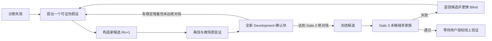

# V124 可持续蒸馏迭代协议

协议版本：`1.1`  
生效日期：`2026-09-03`  
当前状态：`R0_RETIRED / R1_DESIGN_READY / NOT_GOLD / NOT_AUTHORIZED`

## 1. 改进目标

V124-R0 在 Gate 2 失败，只能说明 **R0 候选不能晋级**，不能自动推导出“蒸馏研究结束”。新版协议把
候选生命周期和研究计划生命周期分开：

- 候选失败：冻结该候选的结果，进入归因和下一代构造；
- 研究继续：只要存在可证伪的新假设、未污染的确认数据和可执行的改进路径，就创建 R1、R2……；
- 金牌门槛不变：增量改善只能成为研究基线，不能替代 Gate 2、Gate 3 或线上 Replay；
- 证据不回收：已经看过的 Development、Blind 或线上结果永远不能重新标记为未见证据。

V124-R0 的 `STOPPED_AT_GATE2_NOT_GOLD` 保持为历史事实。项目级状态改为
`ITERATION_READY`，下一候选为 `V124-R1`。

## 2. 不可改变的底线

每一代候选都必须满足：

1. `strategy_parent=null`，拥有自己的 Router、专家、状态合同和主动作生成；
2. 不调用旧完整 agent，不用旧 agent 动作作为默认答案；
3. 不按 episode、Replay SHA、seed、教师身份或未来字段查动作；
4. 教师数据、已知开发数据、冻结 Blind、账号在线 Replay、官方每日 Replay 分开判定；
5. 每次代码、模型、合同或参数变化都产生新的候选 ID 和复合 SHA；
6. 阈值必须在结果打开前写入清单，结果接近时不得修改；
7. Kaggle 提交仍需用户单独授权。

## 3. 两级生命周期

### 3.1 研究计划生命周期



研究计划只有在以下情况下进入 `REDESIGN_REQUIRED`，而不是永久结束：

- 连续 3 个独立候选在全新确认块上都没有增量；
- 当前数据无法覆盖已确认的失败状态；
- 规则版本变化或可用证据不足；
- 失败无法通过状态变化、任务完成或资金变化定位。

解除条件是新数据、新表示、新执行机制或新的可证伪假设。不得通过放宽门槛解除。

### 3.2 候选生命周期

`DRAFT → OFFLINE_QUALIFIED → MICRO_QUALIFIED → DEV_UPLIFTED → DEV_QUALIFIED → FROZEN → GATE3 → ONLINE`

失败后的状态转换：

| 失败位置 | 当前候选 | 已打开证据 | 下一步 |
|---|---|---|---|
| Gate 0 | 作废并换 SHA | 不升级 | 修复数据或实现，完整重跑 |
| Gate 1 | 退役 | Outer 降级为已知开发 | 修改表示或训练方法，轮换 Outer |
| 微场景门 | 退役 | 场景可继续作回归 | 修复执行闭环，不进入对手评测 |
| Development 增量门 | 退役 | 该确认块转为诊断块 | 建立新假设，下一代使用新确认块 |
| Gate 2 绝对门 | 保留为研究基线或退役 | 结果只作已知开发 | 未达线则继续迭代，不打开 Gate 3 |
| Gate 3 | 退役 | 对手与 seed 全部转为已知 | 新候选、新 Blind；重大改动升 V125 |
| Gate 4/5 | 退役且非金牌 | 在线面板永久暴露 | 等未来新数据和新候选，两个面板仍不池化 |

## 4. 证据面板生命周期

所有面板只能按以下方向移动：

`UNALLOCATED → COMMITTED → OPENED → DIAGNOSTIC_ONLY → RETIRED`

禁止逆向移动。具体规则：

- `DIAGNOSTIC`：可重复查看，用来定位问题，不能提供晋级证据；
- `DEV_CONFIRM`：候选和阈值冻结后只打开一次；打开后自动降级为 `DIAGNOSTIC_ONLY`；
- `LOCAL_BLIND`：Gate 3 一次性使用；失败后整个对手/seed 组合退役；
- `OWN_ONLINE_PRIMARY`：账号在线主面板，独立判定；
- `OFFICIAL_DAILY_CONFIRMATION`：只有主面板通过后才打开，不能和主面板池化；
- 本地同一研究者无法形成真正信息不可见的 Blind，最终仍依赖冻结后新日期在线 Replay。

每个 Rn 必须分配新的 `DEV_CONFIRM` seed 块。旧块可以用于诊断和回归，但不能决定 Rn 是否具有新证据。

## 5. 每轮只解决一个主问题

每个候选最多允许一个主机制变化，例如：

- 合同表示从日级总量改为短时域 Option；
- Router 的训练目标变化；
- Executor 的任务依赖或确认机制变化；
- 数据覆盖或教师聚合方法变化。

修复明显代码错误、增加日志和不改变动作的重构不计入主变化，但必须登记。一个候选同时重写 Router、
Executor、市场和数据表示，会导致胜负无法归因，应拆成多代。

每轮必须在构造前填写：

```text
candidate_id:
parent_candidate_sha:
primary_failure:
causal_hypothesis:
single_primary_change:
expected_state_delta:
mechanism_metric:
falsification_condition:
diagnostic_panel:
fresh_confirmation_block:
```

## 6. 新增三段式 Gate 2

### Gate 2A：闭环机制门

在与强对手大量对战前，先验证策略是否兑现自己的合同。每局记录意图和下一状态确认，不把“发出订单”
当成“执行成功”。至少包括：

- `OptionCompletionRate`：Option 完成数 / 已准入 Option 数；
- `ContractRealizationRatio`：已确认产出 / 合同目标；
- `CashCycleClosureRate`：采购后完成生产、入仓并销售的闭环比例；
- `ReturnBeforeExpiryRate`：临时工到期前完成入仓的比例；
- `ConfirmedSpendRatio`：真实资金减少 / 请求采购金额；
- `InvalidOrNoEffectRate`：发出后没有合法状态变化的动作比例；
- `TerminalLiquidationRate`：终局可出售库存实际售出比例；
- 719 次调用、异常数和两个 seat 的一致性。

R1 初始预注册线：

| 指标 | 最低要求 |
|---|---:|
| 719 次调用完整率 | 100% |
| 运行异常 | 0 |
| PlantOption 完成率 | ≥90% |
| SupplyTrip 完成率 | ≥90% |
| 现金循环闭合率 | ≥80% |
| 临时工到期前入仓率 | ≥95% |
| 终局清仓率 | ≥95% |

未通过 Gate 2A 时，不运行 V120/V21 大面板；失败场景保留为永久回归用例。

### Gate 2B：父子候选增量门

新候选与上一代研究基线在同一个 **全新确认块** 上，针对每个已知对手家族、相同 seed、相同 seat
成对运行。新候选成为下一代研究基线必须全部满足：

1. 完整性不退化：零异常、全部 719 次调用；
2. 每个已知家族的配对中位 `margin` 改善严格大于 0；
3. 每个已知家族的平均负分差至少收窄 5%，或该家族纯胜率提高至少 6.25 个百分点；
4. 两个 seat 的平均分差都不能恶化；
5. 预注册的主机制指标至少改善 20%，其他硬机制指标不能恶化超过 10%；
6. 改善不能只来自一个 seed；至少 60% 的 seed-seat 配对方向为正。

通过 2B 但未通过 2C 的候选状态为 `RESEARCH_INCUMBENT_NOT_GATE3_ELIGIBLE`。它可以作为下一轮父基线，
但不得写成强策略、金牌候选或 Blind 通过者。

### Gate 2C：已知家族绝对强度门

绝对线保持原协议：V120 与 V21/V29/V76 合并家族分别计算，双席位纯胜率均不得低于 50%，并满足
完整性要求。只有 2A、2B、2C 全部通过，候选才能冻结并申请 Gate 3。

增量线让弱模型可以逐代变好；绝对线保证“逐代变好”不会被误报为“已经够强”。

## 7. R1 的单一研究假设

R0 证明日级无顺序合同可预测，但无法指导 719 回合的空间执行。R1 只改变合同表示，主假设为：

> 将教师动作压缩为带前置条件、完成条件和失败条件的短时域 Option，比单纯预测日级动作总量更容易在
> 候选自身状态分布中兑现，并能提高现金循环闭合率。

R1 不学习或查询完整动作 tape。训练标签是跨多教师聚合后的语义 Option：

```text
OptionContract
├── option_type: Plant / Water / HarvestReturn / SupplyTrip / AnimalService / Expand / Liquidate
├── preconditions: 当前库存、位置、剩余 actor-time、目标格状态
├── resource_budget: 现金、库存、actor、最大路径长度
├── completion: 可由后续真实状态确认的条件
├── abort: 超时、资金不足、格子变化、工人即将到期
└── horizon: 1..8 turns
```

R1 架构保留日级 HMoE 作为战略预算层，新增：

1. `OptionRouter`：依据当前状态选择可执行 Option；
2. `RealizationCritic`：预测 Option 在当前状态能否完成；
3. `DependencyExecutor`：只负责合法路径、任务依赖和状态确认；
4. `FailureLedger`：记录意图、确认、阻塞和放弃，不保存教师动作路线；
5. `Safety/Terminal`：不可由教师身份、Replay 或对手私有信息触发。

候选自身生成的 Replay 只用于失败分类、Critic 校准和覆盖度分析，不能伪装成教师标签。

## 8. R1 数据切分

- 教师/对手行为家族仍按闭环指纹分组；
- episode 与 SHA 是不可拆分的最小单位；
- 同一 Option 链的所有 turn 必须留在同一 split；
- Inner Dev 选择 Option 表示、horizon 和模型参数；
- Outer 留出教师家族与对手家族，并按整局清除；
- 时间轴缺失时只能标记 `TIME_BLIND_DEFERRED`；后续新日期数据进入下一轮，不回填已打开的确认块；
- R0 的两个 Gate 2 面板状态为 `DIAGNOSTIC_ONLY`，可用于归因，不可用于 R1 新证据。

## 9. 可持续迭代账本

项目用 [iteration_registry.json](iteration_registry.json) 保存：

- 每代候选 ID、父 SHA、唯一主变化和状态；
- 已打开、可诊断、已退役和未分配的面板；
- 当前研究基线与下一轮假设；
- 候选晋级、退役和项目重设计的原因；
- Kaggle 授权状态。

每次改动后运行：

```bash
/opt/anaconda3/bin/python3 validate_iteration_protocol.py
```

验证失败时不能开始下一候选训练或评测。

## 10. 防止“无限试错”退化为过拟合

可持续不等于无限调参。以下约束一直有效：

- 每代一个主假设、一个主变化、一个全新确认块；
- 同一确认块只决定一代候选，打开后立即降级；
- 先机制指标，后分数；先父子增量，后绝对强度；
- 失败必须写出可证伪原因，不能只写“换参数再试”；
- 连续 3 代无增量时必须改变表示或数据覆盖，不能继续微调同一结构；
- Blind/线上失败必须更换面板，不能重复抽样直到通过；
- Development 改善、工程 QA、离线预测和金牌证据始终分层报告。

这套循环允许策略从很弱的 R0 开始逐代积累真实闭环能力，同时不牺牲最终晋级证据的独立性。
