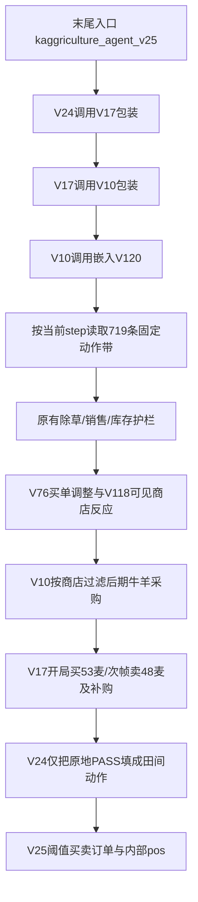

# V25：可学习市场反应，不能把现有实现称为做市成功

2026-09-05，只读源码、打包内容与既有结果。本次候选调用、官方重放、新比赛、新Replay均为0；没有改Claude工作树。

**最重要的发现：V25所谓低吸的四种商品在当前官方规则下都不能买入。代码却按发出的买单增加持仓，后续可以提前卖出本方自产商品。因此README的“低吸对手砸价货、回升卖出”因果解释不成立。** 既有胜率数字可以保留为历史记录，不能证明这项做市机制生效。

## 实际调用路径与母体

V25不是另造了一个独立经营策略。构建文件读取完整 `v24_hybrid/main.py` 再追加V25层；这次只读重建的字符串与研究 `main.py` 完全相等。[VERIFY: .claude/worktrees/kaggriculture-setup-8e6892/kaggle_Kaggriculture/model/v25_market_maker/build.py:5] [VERIFY: .claude/worktrees/kaggriculture-setup-8e6892/kaggle_Kaggriculture/model/v25_market_maker/build.py:78]

最终入口的实际路径为：

路径依据：V25调用前层2530；V24调用V17为2451/2447；V17调用V10为2346/2317；V10调用V120为2307/2274；V120在2240设置固定 `_ACTIONS`，2241调用旧动作引擎；1374–1375按step取动作。源码2234声明带来源为OceanMix公开episode104547425，719步；本次只解码数据，确认为719项、解压文本SHA `d93aa81501b0418627dbfaaae206d22e071bb0ab038183b2769085df622f5e88`，没有再次核对原Replay真伪。[VERIFY: .claude/worktrees/kaggriculture-setup-8e6892/kaggle_Kaggriculture/model/v25_market_maker/main.py:1374] [VERIFY: .claude/worktrees/kaggriculture-setup-8e6892/kaggle_Kaggriculture/model/v25_market_maker/main.py:2234] [VERIFY: .claude/worktrees/kaggriculture-setup-8e6892/kaggle_Kaggriculture/model/v25_market_maker/main.py:2240]

许多更早版本的代码仍在文件内，不代表它们所有包装入口都在最终路径上。关键是固定动作带加反应层，而非从当前资产独立生成完整经营任务。它不满足V125要求的独立Router、专家和主动作生成谱系；可迁移具体假设，不能把整包改名算独立原创。

## 四个新增层到底做什么

| 层 | 当前启用的行为 | 边界 |
|---|---|---|
| V10 | day10后无YARN不再买羊；day9后奶业商店≤1不再买牛 | 只过滤市场BUY_ANIMAL，原带的建造/投放动作仍在。[main.py:2282] |
| V17 | 开局先买53麦，step1前插卖48麦；day0将动物/雇工/种子/商品购入排序；day1–2最多4次额外补牛羊请求 | `_V17_ATTACK=True`，不是先识别对手后才攻击；`_V17_LEAD=False`，未来卖单抢跑分支未开启。[main.py:2318] [main.py:2357] [main.py:2385] |
| V24 | 仅当原动作PASS，在脚下水/收作物/收肥/收动物产物，不移动 | 不增加FEED/CARE或新的返仓；`_V24_W13=False`，第13工人实验未启用。[main.py:2401] [main.py:2407] |
| V25 | step240..648含端点，按固定基准80%触发买，93%触发卖；step649起尝试清内部仓位 | 买单追加末尾，卖单前插；最多10条命令；价格阈值不直接用未来商店或对手预测。[main.py:2470] [main.py:2490] [main.py:2512] |

表中main.py均指本目录研究源，完整逐项引用见JSON。V17的扰动是真实可达的市场动作：小麦允许买入，卖单和买单的相对位置会影响共享供给与对手成交价。但它同时占现金、仓容及订单槽；不能把“令固定带失配”直接视为自身现金提升。无市场外生变化的买卖往返按官方价格规则净额为零，收益若有必须来自保留的小麦、城镇消费、对手交易或改变后续行为。[VERIFY: .venv/lib/python3.12/site-packages/kaggle_environments/envs/kaggriculture/kaggriculture.py:598]

## 已确认的实现问题

**1. 四个低吸买单均非法，持仓账却增长。** `_MM_BASE`只有STRAWBERRY/MILK/WOOL/MELON，2520发BUY_PRODUCT；官方598只允许WHEAT/FERTILIZER，其它在607清除订单。2521立即将请求量记进pos，没有下一帧成交确认。[VERIFY: .claude/worktrees/kaggriculture-setup-8e6892/kaggle_Kaggriculture/model/v25_market_maker/main.py:2470] [VERIFY: .claude/worktrees/kaggriculture-setup-8e6892/kaggle_Kaggriculture/model/v25_market_maker/main.py:2520] [VERIFY: .venv/lib/python3.12/site-packages/kaggle_environments/envs/kaggriculture/kaggriculture.py:598]

可核静态反例：day10，草莓价60、现金10000、空仓、pos=0，且前层无草莓卖单。V25会请求买8草莓并记pos=8；官方不成交，真实草莓仍0、现金不因该单变化。以后真实自产8草莓入仓且价升至112，V25会前插SELL8并清pos。这是利用虚构买入标记改变自产销售时序，不能归类为交易利润。该反例是按源码逐条件推导，**本次未执行候选或引擎**。

**2. 清仓与售出也按请求销账。** 常规卖出2514减pos；出场2498无论是否全部成交都直接pos=0。此前层卖单、仓库存量、本帧投放、价格和成交量都没有来源追踪。多层卖同一商品还可能消耗原本属于经营带的可用商品，V25层之后也没有再次调用前层的去重卖单助手。[VERIFY: .claude/worktrees/kaggriculture-setup-8e6892/kaggle_Kaggriculture/model/v25_market_maker/main.py:2498] [VERIFY: .claude/worktrees/kaggriculture-setup-8e6892/kaggle_Kaggriculture/model/v25_market_maker/main.py:2514]

**3. V17的动物补购计数不识别当前官方在田格式。** 它只识别`tile.animal`是dict且含kind，或`tile.kind=='COW'/'SHEEP'`；官方在田动物是`kind='PASTURE', animal='COW'`字符串，故已投放牛羊会被漏计，只有仓内和背包仍被正确计入。若期望数量尚>0，day1–2可能把已投放当成缺货，再加最多4次补购请求。[VERIFY: .claude/worktrees/kaggriculture-setup-8e6892/kaggle_Kaggriculture/model/v25_market_maker/main.py:2332] [VERIFY: .claude/worktrees/kaggriculture-setup-8e6892/kaggle_Kaggriculture/model/v25_market_maker/main.py:2363] [VERIFY: .venv/lib/python3.12/site-packages/kaggle_environments/envs/kaggriculture/kaggriculture.py:229]

**4. 纸面25%预算/留10空位并非整个组合的严格预算。** `money`从实际cash起算但未扣前层全部支出；每个品种再取当前money的25%，不是合计≤最初cash25%。`shed_room`只算一次，循环后不扣新请求量，`pos<24`也没有把lot裁到`24-pos`。这些是静态约束缺口；由于当前四种买单无效，不能将其描述为本版已经造成四品种真实超仓。若将机制移植到合法品种，必须先修资源账。[VERIFY: .claude/worktrees/kaggriculture-setup-8e6892/kaggle_Kaggriculture/model/v25_market_maker/main.py:2504] [VERIFY: .claude/worktrees/kaggriculture-setup-8e6892/kaggle_Kaggriculture/model/v25_market_maker/main.py:2516]

## 根的独立官方函数控制

根另做了有界函数控制，结果为 `controlled_checks/result.json`，不是本审查再次运行候选。来源为发布dist `47218bab…` 与冻结官方规则 `bc8a5487…`：

| 检查 | 官方/原函数结果 |
|---|---|
| 四种高价农产品各请求BUY8 | 每种实际0、花费0 |
| 正控制WHEAT8 / FERTILIZER8 | 实际均8，花费216 / 807 |
| 原MM请求买8草莓 | 实际0，内部pos立即8 |
| 随后人工明确提供4份“自产库存”、可见价120 | 原MM发SELL4，官方实际回款468，内部pos仍4 |
| 一头官方格式在田牛 | 真实1，原计数函数报0 |

这组控制包含8次官方市场函数、2次提取原MM函数和1次原计数函数调用；完整候选0、官方完整step0、完整比赛0。四份库存是人工提供的来源标记，**不是运行播种/照护/采收得到的真实生产轨迹**。它确认错误路径可达，不解释历史M6利润大小；实际回款468也不能被称作一次低吸交易的利润。结果的完整字段、脚本及源SHA应随综合报告一起保留。[VERIFY: kaggle_Kaggriculture/model/v125_closed_loop_economy/research/claude_v25_v26_review/controlled_checks/result.json]

## 结果、入口与包的正确口径

研究main和发布dist不是同一SHA：

| 文件 | SHA256 |
|---|---|
| main.py | `576211de2cf41921def9c6fc1e968058896b473fdcc8bc3f0baadfbdc06b9f71` |
| dist/main.py | `47218bab7fb12c00ec40bc9bc84f8012ea449c0065f914411bb51fc464db5447` |
| build.py | `8de107d6c5798c38c422e18d20130057177630e423437c9ee541e5fcf23b6e82` |
| m6.json | `5082c1e4e4c25cc0e79c717b6d8b40a34df5a966713d4c213591a8a8e58470e0` |

差异仅在V25配置：研究main从环境`MM_PARAMS`取buy/sell/lot/budget/cap，dist固定默认常量。tar中的main与dist逐字节相同；tar另有`._main.py`元数据成员。README的byte-identical可成立于**dist与tar中的main**，不能扩成研究main与提交包一致。

`agent`最后定义仍是2305的V10层；真正V25是文件末尾新名字`kaggriculture_agent_v25`，未再回绑agent。裸`.agent`加载和“最后callable”加载会走不同层。独立证据审查发现既有临时包装可以exec文件后取末callable再回绑agent，所以不能武断说历史M6一定测错；但m6.json本身没有命令、入口、环境配置、candidate SHA或引擎SHA，绑定仍待证据闭合。[VERIFY: .claude/worktrees/kaggriculture-setup-8e6892/kaggle_Kaggriculture/model/v25_market_maker/main.py:2305] [VERIFY: .claude/worktrees/kaggriculture-setup-8e6892/kaggle_Kaggriculture/model/v25_market_maker/main.py:2529]

只读重算m6的行级数字闭合：每对手64seed×双席=128；V120为125胜3负0平、均margin18951.4766；V76为118胜10负、9534.2031；V20为118胜10负、9803.4063。所有384行margin均等于mine−theirs。它证明**结果文件内部数字一致**；不证明对应提交包、当前官方执行、独立金牌门或V25做市因果。

README的“线上43%确定性带”、V19a每日胜率和V25提交56030093均是该文档的历史自述，本次没有读取账号线上详情或重新拉取Replay，不能作为当前线上比例。根已另行用官方GitHub源确认产品购买限制，线上版本验证仍应与具体提交包和保存动作绑定。

## 对V125最有价值的迁移方式

1. **优先研究自产商品销售时序。** 持仓必须来自真实产出/实际入仓，因变量为真实SELL数量×价格。用同一独立V125底盘比较“原卖出”与“可见需求/库存阈值卖出”，不给非法买单或幽灵pos信用。再单独消融非法BUY占槽和早SELL，才能判断历史V25层实际靠什么。
2. **保留小麦扰动为独立对手压力假设。** 它合法且可能破坏确定性对手的现金顺序；要按实际购麦成本、保留库存、卖出回款、本方采购损失和对手响应一起核账。不能直接固定53/48移植，因为V125开局资金与生产队列不同。
3. **原地填充只迁移闭环条件。** PASS时脚下有成熟货不代表现在采了能卖；需确认不打断保活、任务身份和交付计划。V125已有任务生成器，不能因为V24有该层就加另一套互相争夺动作的包装。
4. **先做入口与成交收据门，再谈强度。** 精确包SHA、明确入口、下一帧资产变化、逐品种成交和现金闭合应先通过。现有V25包不应直接并入V125独立谱系，更不应因97.7%历史表格跳过正式门。

结论是“思路可提炼，现有做市解释被规则证伪”。更值得检查的真实作用是合法麦价扰动、订单优先级和自产销售时序；它们需要拆开验证，不能由同一整包高胜率代替因果证据。
