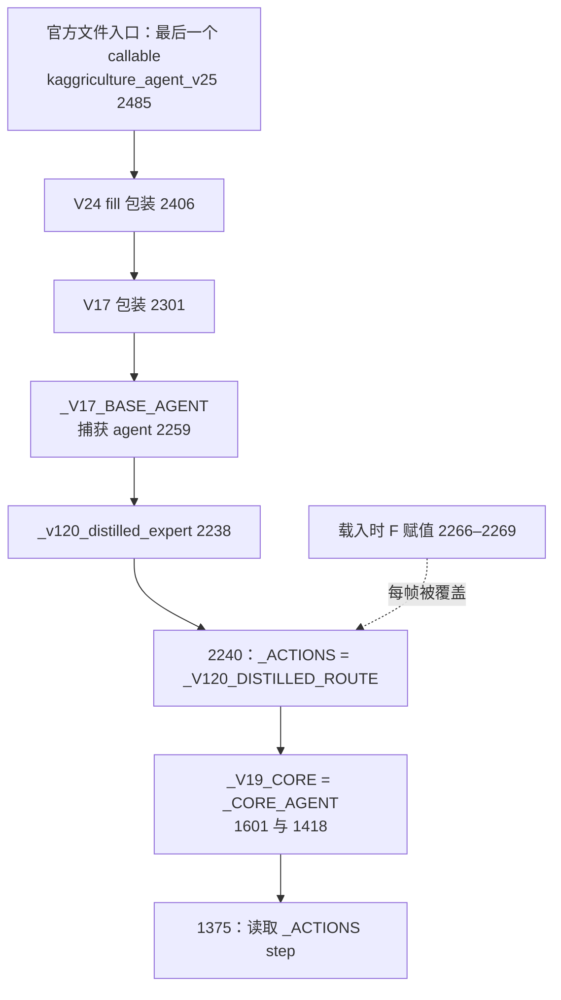

# Claude V26A30：实际入口、母带与可迁移价值

**当前本地提交包确实是 A30，但“已经换成 F 母带”与实际执行链不符；做市层的四种商品低吸也不符合当前官方规则。** 有价值的是对真实订单顺序、库存确认、空闲动作和包装一致性的具体检查，不能将 README 的高胜率直接解释为新母带或买低卖高带来的收益。

本报告审查用户点名的六份文件及其直接依赖，不改 Claude 目录。先完成静态和字节核对，随后经明确授权补了一次人工 day0 入口调用：候选调用 **1**，官方环境初始化 **1**、显式 reset **1**，引擎 step **0**，新完整比赛 **0**。完整 SHA、可复算数字和证据路径见同目录 `v26_analysis.json`；这次调用不提供性能或策略强度证据。

下文 `[VERIFY: ...]` 的 `v26_f_base/`、`v25_market_maker/` 等相对路径，均以 `.claude/worktrees/kaggriculture-setup-8e6892/kaggle_Kaggriculture/model/` 为根；`official/` 对应项目 `.venv/lib/python3.12/site-packages/kaggle_environments/`。

## 1. 当前文件与提交包不是同一个版本名

| 文件 | 实际内容 | SHA-256 |
|---|---|---|
| `main.py` | 开局额外买麦 53、次步卖麦 48 | `dcd5f38cf1abcf8dee235f0d4ebdd546fb147f795206694030f5d2b3781fd2b6` |
| `variant_a30.py` | 只将上述两数改成 30、25 | `f22026c876254285cfb2bd2f301f2b44856584ad40093c3580330e4647948c8e` |
| `variant_a0.py` | 只把上述两条插单换成 `pass` | `64deb1804c3e0fad7b88aa49a23d355cf853071a6b04f041a5d974fc21bb6e7b` |
| `dist/main.py` | 与 A30 字节完全相同 | `f22026c876254285cfb2bd2f301f2b44856584ad40093c3580330e4647948c8e` |
| `submission.tar.gz` 内 `main.py` | 与 A30 字节完全相同 | `f22026c876254285cfb2bd2f301f2b44856584ad40093c3580330e4647948c8e` |
| `submission.tar.gz` 整包 | 含 `main.py` 与 163 字节 `._main.py` 元数据旁车 | `aa3086437d1f1c44cd5255bcbd05d5ec7087187f3df5d2584de6af5e2d3fa36c` |

A30 的差异只有第 2343、2345 行；A0 没有关闭 `_V17_ATTACK`，因此仍保留该标志控制的 day0 排序等行为，不能把 A0 理解为移除整层保护。这里的 30/25、53/48 是请求量，不是保证成交量。[VERIFY: v26_f_base/variant_a30.py:2277] [VERIFY: v26_f_base/variant_a30.py:2313] [VERIFY: v26_f_base/variant_a30.py:2341] [VERIFY: v26_f_base/variant_a0.py:2341]

README 将提交 56030342 称为 A30。此次只证明本地包与 A30 的字节身份，没有单独确认该线上提交的实际上传包 SHA 或当前状态。[VERIFY: v26_f_base/README.md:1]

`build.py` 从 V120 源码、F 动作 JSON、V19 的 GUARD 字符串、V24 的 fill 字符串和 V25 的 MM 字符串拼接，只写 `main.py`；没有创建 A30、复制 `dist` 或打包的代码。按当前依赖做纯文本重构，与目录 `main.py` 字节一致，**重建得到的是 53/48，不是当前 A30 包**。此次没有执行构建器或写回源目录。[VERIFY: v26_f_base/build.py:6] [VERIFY: v26_f_base/build.py:24] [VERIFY: v26_f_base/build.py:36]

## 2. F 母带为何没有进入当前实际执行路径

V26 在载入时确实解码 `_F_ACTIONS`，并把 `_LOW_ROUTE_ACTIONS`、`_HIGH_ROUTE_ACTIONS`、`_ACTIONS` 指向它。嵌入动作与 `fam_F_new.json.actions` 一致，共 720 条；其元数据为 team `Lynxx`、episode `105163747`、seed `1744469180`，短 hash `ff71bda897`。[VERIFY: v26_f_base/variant_a30.py:2265] [VERIFY: v26_f_base/build.py:7]

但主函数每次都会覆盖这个赋值。关键链如下：

`_CORE_AGENT` 在 1418 唯一捕获原 1372 行执行核；`_V19_CORE` 在 1601 唯一指向它。2259 的 `agent` 调 `_v120_distilled_expert`，后者在 2240 强制指定 V120 路线，然后直接调用这个原执行核。当前链不经过旧 1461、1624、1978 等路线选择器，所以不存在随后又切回 F 的可达覆盖。[VERIFY: v26_f_base/variant_a30.py:1372] [VERIFY: v26_f_base/variant_a30.py:1418] [VERIFY: v26_f_base/variant_a30.py:1601] [VERIFY: v26_f_base/variant_a30.py:2238] [VERIFY: v26_f_base/variant_a30.py:2259] [VERIFY: v26_f_base/variant_a30.py:2273]

有效 `_V120_DISTILLED_ROUTE` 仍是内嵌的 719 条路线；源码元数据指向 OceanMix、episode `104547425`。前 2262 行与当前 V120 母体源码一致。`model_status()` 也仍报告 V120，没有报告 V26 或 F，属于命名与运行身份未同步的问题。[VERIFY: v26_f_base/variant_a30.py:2233] [VERIFY: v26_f_base/variant_a30.py:2234] [VERIFY: v26_f_base/variant_a30.py:2246]

**一次最小动态核验已经直接确认这条覆盖链。** 使用官方 `get_last_callable` 加载已核 A30 正式 `dist/main.py`：实际入口是 `kaggriculture_agent_v25@2485`。调用前 `_ACTIONS is _F_ACTIONS=True`；profile 观察到进入精确 `_V19_CORE` 的 1372 行 code 对象时，`is_F=False、is_V120=True`，调用结束仍为 V120。唯一返回市场请求为 `BUY_PRODUCT WHEAT 30`，没有 F 所带的额外买麦 13。没有修改函数、frame 或返回值，也没有执行该请求。[VERIFY: v26_entry_probe/result.json:/profile_events/0] [VERIFY: official/agent.py:40]

此处可确定的是当前文件的可达执行链和单次初态行为。它不自动解释历史比赛中的所有分差，历史成绩归因仍需要当时完整执行闭包。

## 3. 与 V25 和 V120 母体的真实差异

| 对照 | 源码中的变化 | 可以成立的结论 |
|---|---|---|
| V26 `main.py` 对 V120 | 加 F 赋值、V17、V24 fill、V25 MM | F 赋值被覆盖；三个包装层可由最后 callable 入口执行 |
| V26 `main.py` 对 V25 | 移除 V10 动物采购过滤，放入 F 赋值；其余包装层保留 | **过滤器移除是实际结构变化**，不能归入换母带效果 |
| A30 对 V26 `main.py` | 53/48 改为 30/25 | 只调整两步开局扰动请求，未新增生产规划 |
| A0 对 V26 `main.py` | 两条开局插单改 `pass` | 未删除排序、补购、fill、MM |

V25 的过滤器从 day10 起，在无 YARN_STORE 时删除买羊单；从 day9 起，在 PIZZA/ICE_CREAM/SMOOTHIE 总数不超过 1 时删除买牛单。V26 直接从 V120 构建，没有这段；所以即使“F 替换”无效，V26 与 V25 仍可能产生真实行为差异。[VERIFY: v25_market_maker/main.py:2274] [VERIFY: v25_market_maker/main.py:2292] [VERIFY: v26_f_base/build.py:6]

V17 层将期望采购数累积到 `_V17_EXPECT`，day1–2 在当前动物少于期望且资金/订单槽允许时补购，最多额外发 4 次；day0 进行市场排序，A30 在 t0/t1 插入买麦/卖麦并截断至 10 单。它是动作带上的修正层，不是重新求解完整投资计划。[VERIFY: v26_f_base/variant_a30.py:2307] [VERIFY: v26_f_base/variant_a30.py:2315] [VERIFY: v26_f_base/variant_a30.py:2341]

其中动物计数还存在规则数据结构不匹配：它接受 `tile.animal` 为字典，或 `tile.kind` 直接为 COW/SHEEP；官方已放动物却是 `kind=PASTURE/COOP、animal="COW"/...`。因此这些已放动物不会被该 helper 计入，可能触发额外补购；此次静态审查不宣称在历史整局触发了多少次。[VERIFY: v26_f_base/variant_a30.py:2282] [VERIFY: official/envs/kaggriculture/kaggriculture.py:229]

V24 只在原动作是 PASS 且工人已经站在目标地块时改动作：成熟条件满足则采收，否则按条件补水；动物地块优先收肥，再判断产量≥4采收。它不规划新移动路线。`_V24_W13=False`，可选第 13 名雇工分支关闭。当前 fill 本身未检查采收后随身容量，因此不能无条件复制为有效收益。[VERIFY: v26_f_base/variant_a30.py:2357] [VERIFY: v26_f_base/variant_a30.py:2363] [VERIFY: v26_f_base/variant_a30.py:2386] [VERIFY: v26_f_base/variant_a30.py:2392] [VERIFY: v26_f_base/variant_a30.py:2411]

## 4. “做市”实际在做什么，哪里不能成立

默认参数为买价≤基价 80%、卖价≥基价 93%、每批最多 8、现金比例 25%、内部品种头寸上限 24。品种为草莓、奶、羊毛、瓜；允许 `MM_PARAMS` 环境 JSON 改参数。运行窗口精确为 t240–648，即 day10/h0 到 day27/h0；更晚只清理内部头寸。[VERIFY: v26_f_base/variant_a30.py:2426] [VERIFY: v26_f_base/variant_a30.py:2430] [VERIFY: v26_f_base/variant_a30.py:2446]

问题不是阈值选得好不好，而是**当前官方 `BUY_PRODUCT` 只接受 WHEAT 和 FERTILIZER**。这四种买入请求不会形成官方成交。但 `_mm_layer` 发单时立即执行 `pos += lot`，没有等下一帧确认，形成“账上持仓有 8、实际没买到”的状态。[VERIFY: official/envs/kaggriculture/kaggriculture.py:598] [VERIFY: official/envs/kaggriculture/kaggriculture.py:607] [VERIFY: v26_f_base/variant_a30.py:2472]

这不意味着整个 MM 层完全没有行为影响：之后若价格达到阈值且本方仓库有该商品，它会按 `min(pos, shed)` 插入 SELL，可能出售本来自产的库存。所谓“做市增益”可能来自销售时点/订单次序改变，不能记为低价采购后转售套利。[VERIFY: v26_f_base/variant_a30.py:2468]

还有三个静态边界：买入只检查 `pos<cap`，没有用 `cap-pos` 截断这一批；同帧多品种买单未逐笔扣减 `shed_room`；晚期清仓发单后直接将该品种内部头寸置 0，即便实际只卖出部分。修复首先应是合法品类与真实成交账本，而不是继续调 0.80/0.93。[VERIFY: v26_f_base/variant_a30.py:2453] [VERIFY: v26_f_base/variant_a30.py:2462] [VERIFY: v26_f_base/variant_a30.py:2474]

## 5. 保存成绩能证明到哪一步

重新读取 `m6_a30.json`，每个对手都有 64 个 seed × 双席位，共 128 个唯一 seed-seat；行内 `mine−theirs=margin` 全部闭合。可复算结果如下。

| 对手标签 | W / L / T | 纯胜率 | 平均本方现金 | 平均分差 |
|---|---:|---:|---:|---:|
| V120 | 125 / 3 / 0 | 97.65625% | 82,100.8 | +4,848.5 |
| V76 | 114 / 14 / 0 | 89.0625% | 84,542.1 | +9,008.8 |
| V20 | 116 / 12 / 0 | 90.625% | 84,559.5 | +9,257.3 |

这证明保存 JSON 的算术一致，**不是对当前包重跑认证**。记录只有 seed、seat、mine、theirs、margin；缺候选/对手源码 SHA、包装器 SHA、入口、命令、引擎 SHA、逐帧动作、719 调用完整性、异常与逐状态 parity。README 的外部家族表、官方镜像、单人 197,884 等也不能仅凭文字补齐这些字段。[VERIFY: v26_f_base/m6_a30.json:/v120/rows] [VERIFY: v26_f_base/README.md:8] [VERIFY: v26_f_base/README.md:10]

入口尤其要分清：官方源文件适配器取执行环境中最后一个 callable；本地 `fidelity.py` 的 `sub:` 同样如此，`mod:` 则直接取 `module.agent`，`rawtape:` 取载入时 `_ACTIONS`。对于此文件，三者分别可能得到完整包装栈、V120 主函数、F 原动作带。[VERIFY: official/agent.py:64] [VERIFY: v16_online_fidelity/fidelity.py:26]

当前 `arena.py` 默认调用 `cand.agent`，**但已找到可解释正确入口的临时包装器**：`/tmp/v25_cand.py`、`/tmp/v26_cand.py`、`/tmp/v26a30.py` 都是四行，动态读取目标文件，取最后 callable 后回绑 `agent`。它们没有修改母带变量。因此不能断言历史 M6 必然测错入口；仍需当时运行命令及 wrapper→source SHA 绑定才能认定历史结果具体评测了哪个闭包。[VERIFY: v4_demand_race/harness/arena.py:22] [VERIFY: /tmp/v26a30.py:1]

三份包装器 SHA 分别为 `e25fa89741255557d48226ebce8bfceeff1c6a3f35a5425307f853461aaab159`、`51ac090fe6668adc0842ae591091f6ad3db6669845201d80ae5d1aaacf0d125c`、`dda83146887cf85cf2991e65c140324607a707eb8cf09e1f436f9992ee28a642`，原文已保存到分析 JSON。

现有 harness 还提供自然随机引擎与强制商店两条路径，异常会转 PASS；输出没有保存采用哪条路径或异常计数。仅有胜负现金记录无法补证这部分工程资格。[VERIFY: v4_demand_race/harness/engine.py:68] [VERIFY: v4_demand_race/harness/engine.py:92]

README 同时列出 pert_1 为 4/8、平均分差 −165，V19a 为 4/8、−92。“全绿”“对每个家族都赢”“30 全局最优”超出了这组有限比较能支持的范围。47/56 的汇总即使算术无误，也不能覆盖单对手不足、相关家族重复、已打开样本或执行身份缺失。[VERIFY: v26_f_base/README.md:16] [VERIFY: v26_f_base/README.md:21] [VERIFY: v26_f_base/README.md:26]

## 6. 对 V125 有帮助的最小假设

1. **已有工人就地补服务。** 先检查 V125 是否还有“站在可服务目标上却 PASS”的真实样本；仅在物料、随身容量和当天必要照护均核清后，独立测试就地补水/采收。V24 提供这个局部想法，没有提供全日路线合并或未来劳动容量算法。[VERIFY: v26_f_base/variant_a30.py:2363]
2. **将自产现货销售时点作为独立实验。** V25 的有用可检验部分是报价变化时调整现有仓库产品销售，而不是四高价商品低吸。必须以官方真实 SELL 和库存闭合计收益，不用当前 `pos` 作为购买证明。若未来另加外购，先声明对“首次自产非麦销售”工具唯一来源前提的影响。[VERIFY: v26_f_base/variant_a30.py:2468] [VERIFY: v26_f_base/variant_a30.py:2477]
3. **将开局市场扰动作为压力轴。** A0/A30/A53 是具体可复算的请求差异；应同时看自己现金损失、对手现金变化和 margin，按对手分层，不能把 30 固化成通用最优值。[VERIFY: v26_f_base/variant_a30.py:2341] [VERIFY: v26_f_base/README.md:23]
4. **需求影响动物投资，应进入剩余期现金模型。** V25→V26 的真实变化提示要单独检验商店需求对买牛/买羊的边际收益；可以研究这个机制，但不能直接照抄 day9/day10 禁买阈值，也不能用“F 母带升级”替代归因。[VERIFY: v25_market_maker/main.py:2292]

这些都是下一候选的可证伪假设，尚不是通过门的改进。V26 当前仍以固定动作带为主要行动来源，没有给 V125 提供独立 Router、完整新专家或未来服务表示。V125 的冻结 G0 明确禁止候选读取动作带，G3 也不把固定动作代理视为独立动态强对手，因此不能把 V26 包整体接入当作原创金牌候选。[VERIFY: kaggle_Kaggriculture/model/v125_closed_loop_economy/GATE_PROTOCOL.md:20] [VERIFY: kaggle_Kaggriculture/model/v125_closed_loop_economy/GATE_PROTOCOL.md:57]

F 派生文件只有 team、短 hash、episode、seed 和动作；缺实际对局日期、来源完整 Replay SHA、seat、规则配置注册链。此次只分析已嵌入代码/构建依赖，没有新开官方 Replay 或 Blind；其“198k”也不能直接成为当前规则资格证明。

## 7. 核对入口

完整输入 SHA、动作带摘要、A30 精确差异、原始包装器文本、逐对手重算结果和引用行号均在 `v26_analysis.json`。一次动态入口证据在 `v26_entry_probe/result.json`，其脚本、初始观测、冻结清单和输出清单同目录保存。当前审查没有修改任何候选，也没有替用户提交或切换线上 active。
