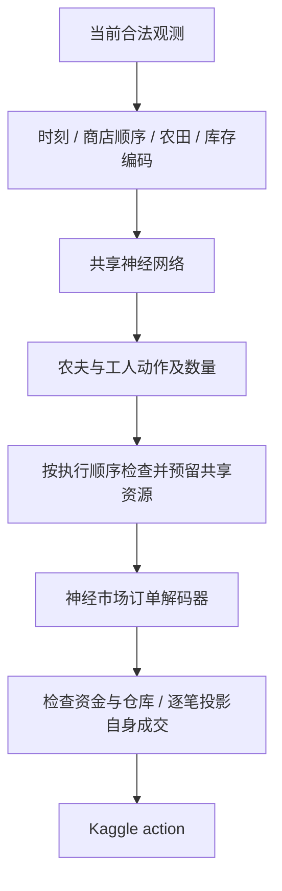

# V126：Majkel replay 神经网络模仿策略

独立的深度行为克隆（Behavior Cloning）实验。网络直接生成农夫、工人与市场动作；没有调用任何旧 agent，没有把 replay 动作表用作运行时查表，也没有将旧策略包一层后称为新模型。它不是对 Majkel 源码的还原。

## 模型

- 307,726 个可训练参数，JAX/Flax 训练，NumPy 部署。
- 公共状态：本人/对手农田概况、现金、工人数、土地、市场库存/价格、本人种子/仓库/背包、按出现顺序编码的最多 8 家商店。
- 空间信息：本人 10×10×21 农田张量，以及每个单位所在格和四邻格、坐标与背包。
- 可学习的 720 步时间嵌入和 16 个单位槽位嵌入，表达生产节奏与分工；不读取 EpisodeId、用户名、seed、未来商店或对手私有背包。
- 共享状态网络 + 单位动作/数量头；市场按最多 10 个订单槽生成，后面的订单以已生成的前缀为条件。
- 状态完整可观测部分直接输入，本轮没有跨回合 RNN、PPO 或在线权重更新。



资源层仅约束网络动作，不内置“毛线店就买羊”的策略规则。单位执行先于市场：先按官方确定性函数投影单位动作，再生成市场订单，避免同一份种子被多人重复预留，以及漏算当步入库。市场价格投影只考虑自己的已发订单；对手同时发出的订单不可见，真实成交仍以官方引擎为准。

## 数据与信息边界

来源为 `../leader_style_20260915/` 的冻结公开回放：

| 用途 | 提交版本 | 局数 | 决策帧 |
|---|---|---:|---:|
| 训练 | 56156662 | 271 | 194,849 |
| 选模型 | 56156662 | 57 | 40,983 |
| 测试 | 56156662 | 53 | 38,107 |
| 版本变化测试 | 56216119 | 193 | 138,767 |

按 seed 的稳定哈希划分，整局隔离，相同 seed 不跨训练/验证/测试。新版不参与训练或选 checkpoint。此前风格研究已看过整个回放面板，因此这里的“留出”指未参与参数优化，不是研究过程完全未接触的数据。

标签为 `observation[i] -> action[i+1]` 的教师请求动作，包含教师本身可能执行无效的申请，不冒充最优动作标签。某些 replay 的 acting-seat observation 缺少 step 时，使用可见的回合序号恢复。原始文件 SHA256 在编码前核验。

历史同名 246 局缺少可靠提交版本归属，未混入训练。

## 评估设计

1. 用验证集损失选择 checkpoint，测试集不用于选择。
2. 分别报告教师前缀已知、市场前缀自行生成的动作预测准确率。
3. 与只从训练集统计的“时间×槽位众数”控制比较，避免把记住固定日程误认为状态建模收益。
4. 在事先固定的 4 个新 seed、双席位、2 个真实运行的对手上完成 16 局闭环试验。
5. 一名对手是官方 starter；另一名是冻结的本地 BL-V17-R1-RC2 文件，来源和 SHA 见 `evaluation_plan.json`。它只用于评估，运行时策略不导入它。

动作准确率不等于收益；719 步内的小误差会改变资产和未来状态。16 局是试验，不是线上 Rating 或金牌资格证明。

## 复现

从本目录执行，使用仓库 `.venv` 的 Python 3.12：

```bash
../../../.venv/bin/python build_dataset.py
../../../.venv/bin/python test_contract.py
OPENBLAS_NUM_THREADS=1 OMP_NUM_THREADS=4 ../../../.venv/bin/python train.py --epochs 12 --batch-size 256
OPENBLAS_NUM_THREADS=1 ../../../.venv/bin/python evaluate_offline.py
OPENBLAS_NUM_THREADS=1 OMP_NUM_THREADS=1 ../../../.venv/bin/python evaluate.py
```

`main.py` 提供 `agent(obs, configuration=None)` 和 `NumpyPolicy().act(obs)`。部署仅需要 NumPy 和本目录的 `main.py`、`contract.py`、`features.py`、`action_space.py`、`rules.py`、`weights.npz`，不需要 JAX/Flax、训练数据或评估对手。首次调用加载权重，后续复用；不人为模拟榜首的 20 秒启动。

## 来源与结果

`features.py`、`action_space.py` 复用 V113 的无策略编码工具，`rules.py` 从官方 1.32.7 提取确定性原语；完整来源哈希见 `provenance.json`。网络、训练流程、权重与部署器属于本次实验。

结果文件：`training_history.json`、`selected_checkpoint.json`、`offline_metrics.json`、`closed_loop_games.json`、`closed_loop_summary.json`，最终解释见 `RESULTS.md`。

本次没有向 Kaggle 提交或上传任何文件。
