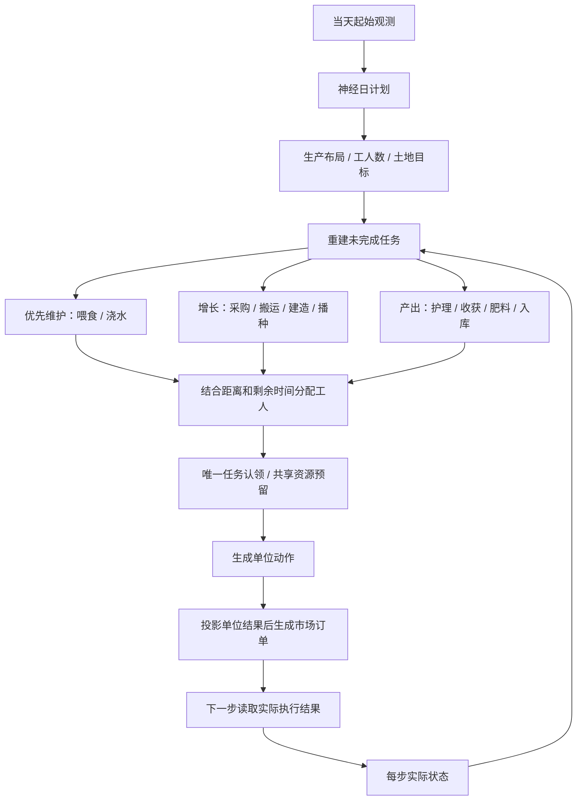

# V127：神经日计划与任务执行器

命名更新（2026-09-15）：本实现的代码和权重原样冻结为 [V127a](../v127a_neural_daily_tasks/README.md)。后续神经网络谱系使用 V127b、V127c 等名称；本目录保留原实验记录。

已实现用户采纳的“网络决定今天要完成的生产任务，执行器根据实际状态完成任务”。最新验证结论见 [RESULTS.md](RESULTS.md)。V126 保留不变。

## 两层职责

### 神经规划层：每天运行一次

输入当前可见状态：时刻、商店出现顺序、双方公开农田、市场库存/价格、本人现金、种子及仓库。输出：

- 100 格的目标作物/牲畜类型，形成生产数量目标及位置偏好；
- 当日工人数；
- 土地规模。

模型为两层 192 维隐藏层的多头网络，带可学习的日序嵌入，658,905 个参数。训练用 JAX/Flax，部署用 NumPy。没有 EpisodeId、用户名、随机种子、未来商店或对手私有背包输入。

### 执行层：每步检查状态



执行器不会因为发出了 WATER/FEED 就认定成功，而是检查真实 `watered_today` / `fed_today`。已有资产抵扣新增目标；不会为了追逐神经网络的位置偏好而挖掉仍在生产的资产。不可负担、路程不足或来不及产生收益的新增任务会延期。

喂食、浇水、成熟条件、采购预算、仓库容量和收尾变现是显式执行规则，不声称它们由网络学会。网络控制生产结构和规模。市场预算投影不包含不可见的对手当步订单，最终成交由官方引擎决定。

## 数据与验证

- 沿用原先按 seed 隔离的 271 / 57 / 53 局划分；新版 193 局独立做分布变化测试。
- 日起始状态是输入，同一天末段的真实资产布局仅作为监督标签；每局 30 条记录，训练 8,130 条。
- 40 个训练 epoch，按验证损失选择第 26 轮；测试数据不用于选择权重。
- 先使用 2 个开发 seed 检查执行器，再冻结关键代码与权重，在 4 个新 seed、双席位上确认。
- 确认对照包括任务版、固定日计划配同一执行器、V126 原始动作网络；对手为官方 starter 和冻结本地 BL-V17-R1-RC2，共 48 局。
- 前序研究已观察整个 replay 面板，所以回放留出只指不参与参数优化；新确认 seed 与这些 replay 以及 V126 的旧评估 seed 均不同。

本次确认任务版 16 局零牲畜逃逸、零缺水损失，但对本地强对手仍 0 胜 8 负。没有 Kaggle 提交或 Rating 结论。

## 文件

| 文件 | 职责 |
|---|---|
| `main.py` | 日计划推理、缓存和 agent 入口 |
| `executor.py` | 状态反馈、任务编译、工人分配、资源与订单执行 |
| `plan_features.py` | 日状态编码与目标类型表 |
| `network.py` / `train.py` | 网络定义与训练 |
| `build_data.py` | 整局隔离数据构建 |
| `weights.npz` | 第 26 轮训练权重 |
| `time_plan.npz` | 仅用训练集构建的固定日计划对照 |
| `test_tasks.py` | 维护优先、共享资源、任务认领等回归 |
| `evaluate.py` | 开发和确认比赛驱动 |
| `confirmation_games.json` | 48 局结果、每日资产、日计划、逃逸及缺水事件 |
| `paired_comparisons.json` | 同 seed/席位配对差值，按 seed 分块的探索性区间 |
| `daily_task_policy_bundle.zip` | 仅含运行文件和神经权重的本地部署包 |
| `deployment_manifest.json` | 部署文件哈希及 NumPy 数值一致性 |

`features.py`、`action_space.py`、`rules.py` 复用 V126 的无策略工具和官方 1.32.7 确定性规则原语。`evaluation_baseline.py` 仅为冻结评估对手，部署包不包含它。策略不调用 V126 或该对手生成主动作。

## 复现

从本目录执行：

```bash
../../../.venv/bin/python build_data.py
OPENBLAS_NUM_THREADS=1 ../../../.venv/bin/python train.py
../../../.venv/bin/python test_tasks.py
OPENBLAS_NUM_THREADS=1 ../../../.venv/bin/python evaluate_plan.py
OPENBLAS_NUM_THREADS=1 OMP_NUM_THREADS=1 ../../../.venv/bin/python evaluate.py --panel development
OPENBLAS_NUM_THREADS=1 OMP_NUM_THREADS=1 ../../../.venv/bin/python evaluate.py --panel confirmation
OPENBLAS_NUM_THREADS=1 ../../../.venv/bin/python verify.py
../../../.venv/bin/python summarize.py
```

历史确认 seed 已被使用。重跑命令属于复现；修改代码后再跑同一批，不能称为新的未见确认。继续研发应另行冻结新 seed。

在部署目录中 `from main import agent`，或 `Agent().act(obs)`。同一个实例只服务一名玩家；step 0 自动重置，日变化时更新计划。运行文件无需训练数据、JAX、Flax或评估对手。
