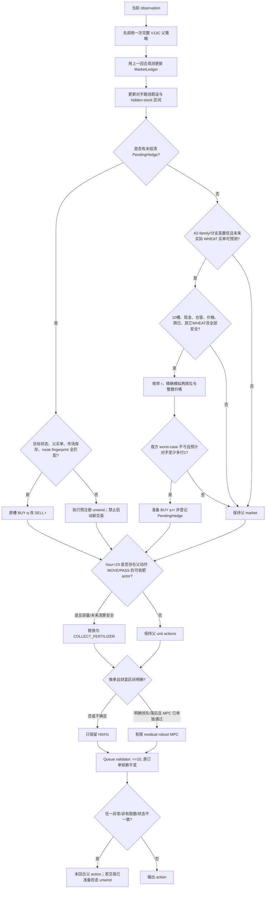

# V14 第一性原理博弈设计：从同源平局中制造真实胜局

> 状态：策略设计稿，2026-08-24。本文只做引擎、现有代码与既有结果的只读推导；没有修改 Agent、没有运行新的正式 panel、没有提交 Kaggle。所有新机制均为待证伪假设，不能写成已达到 65% 纯胜率。

## 结论先行

下一版最值得做的不是再换一个完整生产路线，也不是再加一个全局出售倍率，而是把 V13C 当成父策略，增加两个范围很窄的残差：

1. **跨回合库存中性的小麦买侧挤压**：利用市场逐 slot、逐单位、双方先报价再成交的规则，把我方原本与 A2 同时发生的 `BUY_PRODUCT WHEAT q`，改写成前一安全时点买 `q+r`、目标时点卖 `r`。在严格条件成立时，我方最终仍净买 `q`，目标时点后的市场库存与父策略相同，我方净成本不高于父策略，而 A2 的买入成本不低于父策略。它专门打 A2/C 同源路线的大量平局。
2. **日末状态重置套利**：`hour=23` 时，如果某个工人的父动作只是移动或 `PASS`，且脚下动物有肥料可收，则改为 `COLLECT_FERTILIZER`。当日结束后位置会重置，动物的 `fertilizer_available` 也会重新设为 `True`，所以次日公开农场状态不变，我方私有仓库多 1 肥料。它不依赖对手识别，是最安全的独立消融项。

推荐的第一轮候选不是“大一统 V14”，而是：

- `V14-S0 = V13C + 日末肥料拾取`，验证状态边界套利覆盖率；
- `V14-S1 = V13C + 小麦库存中性挤压`，主攻 A2 纯胜率；
- 两者分别通过后才组成 `V14-S2`。

当前 V13C 对 A2 的既有确认结果是 `95/55/50`，纯胜率 47.5%、Kaggle 得分率 61.25%。200 场达到 65% 需要至少 130 胜；在不反转任何现有胜局的理想条件下，恰好需要把 55 场平局中的 35 场变成胜局。这个算术说明“同源平局破局”是最短路径，也说明任何方案在实际覆盖不到 35 个有效状态时，不可能单靠一个机制达到目标。

## 1. 先纠正一个容易误判的方向

既有 V13C/A2 结果按双方最终分支重分组后，表面上会看到 `V8 对 V5 = 11/0/6`。这不能推出“对手选 V5 时我方强制 V8”，因为分支选择与 shop、seat 强相关，观察到的异分支对局不是同一上下文下的反事实。

对既有 V10 完整专家 grid 做只读条件审计：

- V8 对 V5 全部 400 个上下文是 `252/0/148`；
- 但只看 learned Router 会选择 V5 的 65 个上下文，V8 对 V5 是 `14/0/51`；
- 同一批上下文反向用 V5 对 V8 是 `50/0/15`。

所以 learned Router 的 V5 选择虽然模型简单，却捕获了真实的上下文条件。**不能把观察到的 branch-pair 胜率当作可交换因果效应，不能直接 always-V8 或 opposite-branch。**如果以后做 branch-pair Best Response，必须在完全相同的 seed/shop/seat 上生成真正反事实，而不是重分组现有结果。

另一个已核验事实是，当前 61 维 learned Router 的非零系数实际上只落在 seat 与 8 个 shop 计数上；市场、双方现金和公开农场系数为零。因此也不能用市场库存或我方现金去“毒化” A2 的 step-72 Router。市场干预只能通过成交价格和后续现金/库存路径产生作用。

## 2. 信息边界：什么能知道，什么不能假装知道

### 2.1 当前可观测

- 双方公开现金、地块、作物/动物结构与状态、农民和工人位置、已解锁土地；
- 共享市场每个商品的库存与价格；
- 已解锁 shop 及其重复实例；
- 自己的 shed、seeds、各工人携带物；
- 当前 step/day/hour 和自己的 seat。

### 2.2 当前不可观测

- 对手 shed、seeds、携带库存；
- 对手本回合正在提交的 action；双方动作是同时产生的；
- 对手在价格地板 `$1` 时卖出的数量，因为这类出售不会增加市场库存；
- DROP、PICKUP、日末 overflow 的确切私有数量；
- 未解锁的未来 shop；没有公开 seed 时不能假装能预测下一次 shop 抽样。

因此任何“看见对手本回合买多少/卖多少再反应”的写法都是错误的。合法做法只有两种：

1. 从上一回合公开状态变化恢复**滞后一回合**的净流量；
2. 根据已识别的完整路线和当前公开状态，对本回合动作做概率/区间预测。

## 3. 引擎中真正有博弈价值的顺序

官方本地引擎的单回合顺序是：

```text
双方单位动作
    -> market slot 0..9
       每个 slot 内逐单位：双方基于同一 commit 前库存报价，再依 seat 顺序提交
    -> shop/town center drain
    -> 作物衰减
    -> 若日末：动植物刷新、杂草、携带物落仓、位置/工人重置、可能解锁 shop
```

对应源码为安装包 `kaggriculture.py` 中的：

- `market_price`：约 192–208 行；
- `_process_market`：约 544–628 行；
- `_commit_unit`：约 643–681 行；
- `_town_consume`：约 728–749 行；
- `_daily_refresh_animals`：约 805–833 行；
- `_end_of_day` 与 `interpreter`：约 857–955 行。

由此得到六个硬约束：

1. 每回合市场最多 10 个订单；第 11 个会被截断，不能把 residual 盲目 append；
2. slot 顺序有价值；同一 slot 中双方每个单位使用同一个 commit 前市场状态报价；
3. `BUY_PRODUCT` 只允许 WHEAT/FERTILIZER，且买价用买后库存 `P(I-1)`；
4. SELL 用当前库存 `P(I)`，价格大于 1 才增加市场库存；
5. town drain 在市场之后发生，已解锁 shop 的下一次 drain 是确定的；
6. 胜负只看终局现金，未出售库存没有终局价值。

这意味着优化目标不应是“自己的期望收入最大”，而应是：

```text
最终现金差 = 自己现金变化 - 对手现金变化
```

并同时约束现金义务、饲料、仓容和终局清仓。一个让我多赚 100、但让对手多赚 500 的动作，对胜率是负贡献。

## 4. 对手公开行为分类与隐库存区间

### 4.1 先做有限状态识别，不做黑箱身份猜测

只保留以下有限假设：

- `A2/C-family + same branch`：与我方同源，最适合库存中性挤压；
- `V5-family`：冠军多路线、含自己的 town-demand WHEAT prebuy；
- `V8-family`：Kawa 路线与既有 slot/counter 规则；
- `V1/V2-family`：旧规则路线；
- `premium dumper`：可辨认的大批量高价商品供给；
- `unknown/reactive`：任何证据不够或已出现结构性偏差的对手。

识别特征只能来自公开转移：

- 地块结构、作物种类/年龄、动物种类/放置日、土地/工人扩张时点；
- 公开现金跳变；
- 扣除我方成交与 town drain 后的市场净流量；
- shop + seat 推出的 A2 Router 分支；
- 连续多个 checkpoint 与已知路线的匹配，而不是单步相似。

建议的 fail-closed 门：前 72 步公共开局匹配后，再要求至少 8 个连续公开 checkpoint 匹配，并至少观察到一次可恢复的预测 WHEAT 净买流；第一次农场结构硬偏差或连续两次市场流偏差，就永久降级为 `unknown`，本局不再做进攻型修改。

### 4.2 市场流量账本

对商品 `x`，上一回合的公开库存变化满足：

```text
delta_market(x)
  = own_sell(x) + opp_sell(x)
  - own_buy(x)  - opp_buy(x)
  - town_drain(x)
```

因此：

```text
opp_net_supply(x)
  = delta_market(x) + town_drain(x)
  - own_sell(x) + own_buy(x)
```

- CARROT/TOMATO/STRAWBERRY/MELON/EGG/MILK/WOOL 不能从市场买回；非地板区的对手出售量通常可精确恢复；
- WHEAT/FERTILIZER 只能恢复净买卖，需要路线假设才能分解；
- `$1` 地板、DROP/PICKUP、overflow 或不确定的 HARVEST 出现时，必须把点估计扩成区间。

对手 hidden stock 不应保存一个伪精确数字，而应保存 `[lower, upper]`。公开作物/动物给出未来生产上界，已观测收获与非地板出售缩小区间，地板出售和 overflow 扩大区间。区间宽度超过阈值时，市场 MPC 禁用，父策略原样执行。

## 5. 核心机制 H1：跨回合库存中性 WHEAT 挤压

### 5.1 动作定义

假设父策略在目标回合 `tau` 的 slot `s` 会买 WHEAT `q`，且高置信 A2 也会在同一 slot 买 `q`。

选择 `1 <= r <= q`：

```text
安全准备回合 sigma：在所有其它 WHEAT 流之后，额外 BUY_PRODUCT WHEAT (q+r)
目标回合 tau：把我方原 BUY_PRODUCT WHEAT q 原槽替换为 SELL WHEAT r
```

两回合合计，我方 WHEAT 变化仍是：

```text
+(q+r) - r = +q
```

目标回合后，共享市场相对父策略仍是双方合计净买 `2q`，所以市场库存、价格和后续确定性 town drain 也恢复到父策略路径。改变的主要是双方现金：我方把净买成本前移并对冲，A2 在更深的稀缺库存处买入。

`r` 不是越大越好：

- `r=1` 临时现金和仓容最小，但整数价格可能没有跨档，无法破平；
- `r=q` 干扰最强，但准备回合需买 `2q`，更容易触发现金/仓容或后续义务风险；
- 实现时应枚举小集合，例如 `{1, 2, 4, min(8,q), q}`，用精确整数价格模拟选择“保证不伤自己且预计至少制造 1 元终局差”的最小 `r`。

### 5.2 为什么在严格条件下成立

设准备订单执行前市场库存为 `J`，定义：

```text
f(k) = P(J-k)
```

当前 WHEAT 价格曲线随库存下降单调不减，所以 `f(k)` 单调不减。准备回合到目标回合之间只有确定性 town drain `D >= 0`，没有其它 WHEAT 供给流。

父策略中双方同 slot 各买 `q`，我方依次支付的库存深度为 `D+1, D+3, ..., D+2q-1`：

```text
B = sum(k=1..q) f(D + 2k - 1)
```

库存中性方案先买 `q+r`，目标回合卖 `r`。在我卖、A2 买的前 `r` 个 lockstep 单位中，市场库存每轮 `+1-1` 保持不变，因此我的净成本是：

```text
C = sum(k=1..q+r) f(k) - r * f(q+r+D)
```

由于最后 `r` 个买价都不高于目标卖价：

```text
C <= sum(k=1..q) f(k)
  <= sum(k=1..q) f(D + 2k - 1)
  = B
```

所以我方完成同样净买 `q` 的成本不高于父策略。

A2 在新方案中的买价库存深度，排序后为：

```text
前 r 个：q+r+D+1
其余 q-r 个：从 q+r+D+1 继续逐单位加深
```

逐项都不浅于父策略的 `D+1, D+3, ..., D+2q-1`，因此 A2 成本不低于父策略。若期间存在额外 town drain，它只会提高目标卖价和 A2 买价，反而强化不等式。

这不是全局博弈论意义上的永久支配：A2 现金降低后可能跳过一笔原本亏损的后续购买，或者改变 affordability 分支。因此第一版应优先选择**靠近终局、后续现金依赖少**的机会，不能把局部不等式夸大成整季必胜证明。

### 5.3 与 V5 已有 prebuy 的关系

V5 的 `base_agent.py::_wheat_demand_prebuy` 已经会在当前 queue 为空、当前存在 WHEAT town demand、下一基础回合是 singleton WHEAT buy 时，把数量 `q` 前移一回合，再在下一回合数量中扣回 `q`。这是自身成本优化，不是对手挤压。

因此 H1 不能只读压缩 route 的原始 `BUY WHEAT` 时点。它必须预测**完全组合后的 A2 实际发单时点**：

- 对 V8 分支，通常在原买单前一个安全回合准备；
- 对 V5 分支，A2 可能已把原买单提前一回合，H1 必须再提前到该实际 prebuy 之前，并在 A2 真正买入的回合卖出；
- 不能与父策略自己的 prebuy 状态机重复记账；必须在父 action 生成之后做单一 residual，并保存独立 pending 状态。

静态路线本身提供了足够多的潜在机会：V5 各路线在 step 72 后有约 51–92 个 WHEAT 买入回合、总量约 372–823；V8 静态路线也有数十个回合、数百单位。但“存在买单”不等于“存在可安全挤压的机会”，真正覆盖率还要扣除 queue、现金、仓容、跨日、现有 prebuy 和分类置信门。

### 5.4 必须同时满足的安全门

只有以下条件全部成立才允许准备单：

1. 已在 step 72 之后，且 A2-family 与具体分支/路线置信度达标；
2. 预测的是完全组合后 action，不是原始 route payload；
3. 目标回合、目标 slot、商品、`q` 均确定，且我方父 action 在同槽确实是 `BUY WHEAT q`；
4. 准备订单能放进 10-slot queue，且放在该回合所有预测 WHEAT 流之后；
5. 准备点到目标 slot 之间没有不确定的 WHEAT SELL；确定性 town drain 可以存在；
6. 目标卖价严格大于 1，避免 `$1` 出售不回补市场库存；
7. 精确模拟两种 seat 提交顺序，所有原父订单的成功/失败状态都不改变；
8. 准备成本不会使本回合或目标回合的 HIRE、BUY_LAND、BUY_ANIMAL、BUY_SEED、其它 BUY_PRODUCT 失去资金；
9. 当前 shed、所有 carried inventory、目标回合单位动作和日末 drop 后均有 `q+r` 临时仓容；
10. 准备额外 WHEAT 不会把父策略原本失败的 FEED/PICKUP 变成成功，除非完整模拟证明后续仍等价；
11. 不跨越未知 shop 解锁边界；若跨日，必须证明新 shop 不会改变目标 action；
12. 选择的 `r` 在精确整数价格模拟中，对我方 worst-case 现金差不小于 0，预计对手现金差至少为 1；
13. 已有 pending 尚未结清时不启动第二个；
14. 任一异常都 fail closed；如果准备单已经成交，必须走预定义 unwind，不能简单清状态。

### 5.5 Pending 与 unwind

最小状态：

```text
PendingHedge {
  prepared_step,
  target_step,
  target_slot,
  q,
  r,
  expected_opponent_branch,
  expected_market_inventory,
  prepared_quantity=q+r,
  status
}
```

目标回合首先验证：公开市场库存、对手公开农场、父 action 的 WHEAT 买单和 route fingerprint 是否仍匹配。

- 全部匹配：原槽 `BUY q -> SELL r`；
- 父 action 不再买 `q`，但期间市场流仍在安全区间：尝试在最后安全 slot 卖回全部 `q+r`，恢复父策略库存；
- 出现不确定供给、价格地板、queue 满或现金路径偏差：不要临时猜动作，记录 `pending_fault`，采用预注册的保守清算路径；该情形在单元测试和 smoke 中必须为零才允许正式评测。

严格说，只有“准备之后必有可执行恢复动作”时，准备单才应被允许。这是最容易在实现中漏掉的事务性约束。

## 6. 核心机制 H0：日末状态重置套利

在 `hour=23`：

```text
for each actor:
    if parent action in {PASS, NORTH, SOUTH, EAST, WEST}
       and actor currently stands on a live animal
       and animal.fertilizer_available == True
       and projected EOD shed + all carried + 1 <= 100
       and future capacity/liquidation guard passes:
           replace with COLLECT_FERTILIZER
```

成立原因：

- 父动作若只是移动/PASS，本回合没有其它 tile 操作；
- 同回合结束时，所有位置都会回到默认 shed access，移动的次日价值为零；
- 动物若存活，日刷新无条件把 `fertilizer_available=True`；
- 动物若因连续未喂养逃跑，父策略与修改策略都会留下同一个空结构；
- 携带的肥料在日末自动落 shed。

所以次日公开农场状态与父策略相同，我方多一个私有肥料。真正的风险不是当回合，而是它以后占用一个 shed 槽位。实现必须给 bonus fertilizer 单独记账，并满足以下至少一个条件：

1. 在下一次可能的容量压力前有确定的安全出售槽；或
2. 对父路线做保守前瞻，证明剩余季节 shed 峰值仍小于 100；或
3. 容量不再安全时，优先卖出 bonus fertilizer，且不挤掉父策略必需订单。

同一动物同回合只能被第一个 actor 收一次；多 actor 重叠时必须去重。第一版不要顺手加入 HARVEST/CARE 等其它“看起来免费”的动作，因为它们会改变公开 yield/pending bonus，不再是公开状态中性的干预。

## 7. 第二阶段：市场预测、干扰与反干扰

H0/H1 通过后，再考虑一个 2–4 回合的有限动作 robust MPC；不要一开始就做大模型。

### 7.1 候选动作只允许窄 residual

- 父 action 原样；
- H1 的若干 `r`；
- 不改出售总量，只重排可交换 SELL slot；
- 对一个 premium 商品把少量出售前移一回合；
- 延后一回合，等待已确定的 town drain；
- 在估计对手将出售远多于我方时，做小额 supply attack。

模拟器必须逐 slot、逐单位复现官方整数价格、双方 quote/commit、`$1` 特例与 town drain。对手动作不是单点，而是来自 route hypotheses 与 hidden-stock interval 的情景集合。优化目标是：

```text
max_action min_scenario projected_final_margin_delta
```

不是最大化自己的平均现金。

### 7.2 对手产能识别

公开 tiles 可以形成未来供给日历：

- 作物：种类、planted_day、watered_today、yield_units、寿命；
- 动物：种类、placed_day、interval、yield_units、fed/cared 状态；
- 单位位置：能否在目标回合前完成 HARVEST/DROP；
- hidden shed：只用区间，不用中点冒充真值。

对每个商品生成：

```text
next_4_turn_supply_interval
next_24_turn_supply_interval
predicted_sell_slot_distribution
confidence
```

同商品 slot 先手价值可近似为：

```text
opponent_volume * local_price_slope * confidence
```

但最终必须用精确反事实 margin 验证。V1/V5/V8 已有通用价格排序、preempt、slot sniper 和若干公开签名 counter；新版本只有在显式加入“对手商品 + 对手量区间 + 对手 slot”后才算新机制，不能把旧排序换个名字。

### 7.3 领先/落后不能只看公开 bank

V13D 已证明 raw bank lead gate 很危险。正确状态应是可清算财富区间：

```text
self_value
  = self_public_money
  + exact_liquidation_value(self_private_stock)
  + conservative_future_public_production
  - mandatory_route_costs

opp_value_interval
  = opp_public_money
  + liquidation_value(opp_hidden_stock_interval)
  + opponent_future_production_interval
  - opponent_mandatory_cost_interval
```

策略只分三档：

- `sure-ahead`：margin 下界大于安全垫；减少高方差 premium 赌注，只做 H0/H1 和能限制对手上行的稳健动作；
- `uncertain`：区间跨 0；只做局部支配/状态中性 residual；
- `sure-behind`：margin 上界仍小于负安全垫；允许在 CARROT/TOMATO/EGG 等 hinge 需求窗口增加方差，但动作仍需有明确的对手暴露不对称，不能盲目 dump。

该模式第一版只允许在晚季启用，避免早期 mark-to-market 误差控制整条生产路线。

### 7.4 主动干扰与反干扰

主动干扰的必要条件：

```text
对手因价格变化损失的现金下界
    > 我方机会成本上界 + 容量/流动性风险缓冲
```

典型场景：

- 对手即将大量买 WHEAT：H1 制造稀缺买价；
- 对手即将大量卖 premium，而我方未来暴露很小：提前小额供给压低其成交区间；
- 对手将在相同商品同一回合出售：把我方已有 SELL 放在更有利 slot，但不改变数量。

反干扰依赖私有库存优势：对手看不到我方 shed。未来可以把固定 WHEAT 买单改成“私有饲料 reserve 阈值 + 多个兼容时点”，降低被反向 H1 的可预测性；检测到计划出售前一回合市场突然增供时，判定可能被 front-run，临时切到安全 slot/确定 town drain 后。这个方向必须作为独立版本评测，不能与第一轮 H1 同时加入，否则因果不可识别。

## 8. 总机制决策树



## 9. 最小实现边界

第一阶段只需要四个小组件，不需要神经网络：

```text
OpponentBelief
  - family hypotheses / route label / branch / confidence
  - public checkpoint matcher
  - hidden inventory intervals

MarketLedger
  - previous public inventory
  - exact own committed market flow
  - deterministic town drain
  - lagged opponent net-flow interval

PendingHedge
  - one active transaction maximum
  - prepare / execute / unwind state machine

ResidualController
  - call parent once
  - H1 action transform
  - H0 EOD transform
  - queue/cash/capacity invariant checks
```

实现顺序必须是：

1. 父 C 产生 action，并保持其所有内部 state 正常推进；
2. 用当前 obs 结算上一回合账本；
3. 先处理 pending，再考虑新 hedge；
4. 最后处理日末 actor 的状态中性动作；
5. 对最终 action 做深拷贝、10-slot、数量、现金、仓容和非有限数验证；
6. diagnostics 记录每一次机会、拒绝原因、`r/q`、预测/实际市场变化、unwind 和父动作 hash。

不要让 residual 重新调用父 Agent 或“偷看下一回合”推进父状态。未来动作只能从静态完整路线、纯函数 shadow predictor 或独立复制的预测状态得到。

## 10. 候选排序

| 排名 | 候选 | 改动 | 主要目标 | 风险/判断 |
|---:|---|---|---|---|
| 1 | `V14-S1` | V13C + adjacent WHEAT inventory-neutral squeeze | 转化 A2 同分支平局，直接提高纯胜率 | 最有机会接近 65%，但对 action forecast、事务 unwind 要求最高 |
| 2 | `V14-S2` | S1 + EOD fertilizer scavenger | 在 H1 之外再增加隐蔽的一元优势 | 预期最终候选；必须由两个独立消融先证明 |
| 3 | `V14-S0` | V13C + EOD fertilizer scavenger | 最低风险的同源破平 | 工程最小，但机会覆盖率未知，单独达到 65% 概率低 |
| 4 | `V14-S3` | V13C + supply interval decoder + product/slot robust MPC | 市场预测、对手产能与出售干扰 | 第二阶段；先验证 flow 可识别性和 coverage |
| 5 | `V14-S4` | S3 + late liquidation-adjusted risk mode | 在确定落后时增加胜局而非均值金币 | 校准风险高，只允许晚季窄动作 |

建议先实现 S0 和 S1 两个真正不同的版本；不要一开始把 S0/S1/S3/S4 混成一个无法归因的 V14。

## 11. 潜在失败反例

| 反例 | 为什么会失败 | 必要防线 |
|---|---|---|
| 把现有异分支胜率当反事实，强制 V8 打 V5 | shop/seat 上下文混杂；条件 grid 已出现方向反转 | 同 seed/shop/seat 真正反事实；第一轮不改 Router |
| 对手不按预测时点买 WHEAT | H1 无法压低其现金，且准备交易可能占用流动性 | 多 checkpoint + 已验证实际 prebuy predictor + 单 pending + unwind |
| 对手在准备与目标之间卖 WHEAT | 价格下降会破坏“只有 drain”的成本不等式 | 禁止存在不确定 WHEAT supply；用区间 worst-case 模拟 |
| V5 内部已提前买 WHEAT | 读原 route 会错一回合，卖不到对手买单 | 预测完全组合后的 A2 action，显式建模 `_wheat_demand_prebuy` |
| 额外准备单成为第 11 个 order | 被引擎静默截断，但 pending 仍以为成交 | append 前硬检查；只用安全空 slot；成交后从 obs 复核 |
| 临时买入占满 shed | BUY 失败或后续 drop 丢失高价产品 | 模拟 shed + carried + unit action + EOD 峰值，不只看当前 shed |
| 临时花钱使 HIRE/土地/动物失败 | 生产路线从此分叉，局部价差得不偿失 | 逐 slot 现金模拟，保护所有固定与动态义务 |
| SELL 发生在 `$1` | 卖出不增加 market inventory，库存中性证明失效 | 目标价必须 >1，且对全部单位模拟 |
| 跨日后新 shop 改变 A2 action | 未知 RNG 使预测失效 | 第一版不跨未知 shop unlock 边界 |
| A2 被多收钱后反而跳过亏损买单 | 局部现金支配不等于全局策略支配 | 优先终局附近、后续现金依赖少的机会；闭环验证 |
| 整数价格未跨档 | 理论弱不等式成立，但现金差仍是 0，无法破平 | 枚举 `r`，要求精确模拟至少产生 1 元预计差 |
| 日末多出的肥料导致未来 overflow | 当天无害，后面可能挤掉高价值库存 | bonus 独立记账、未来容量 guard、最早安全清算 |
| 行为 classifier 把共享开局的陌生 Agent 当 A2 | 顶级 Agent 大量同源固定开局，72 步匹配不等于身份相同 | step72 后持续验证；第一次硬偏差即永久回退父 C |
| 公开 bank 领先就锁仓 | 私有库存与未来义务缺失，复现 V13D 的失败 | 只用 liquidation-adjusted interval，且只在晚季启用 |
| 提前 dump premium 想伤害对手 | 我方可能先损失更多，并把后来 town demand 红利让给对手 | 只有 opponent exposure 下界显著大于 own upper bound 才允许 |

## 12. 明确拒绝或降级的方向

- **always-V8 / opposite-branch**：条件反事实证据反对；
- **用市场或现金攻击当前 Router**：当前对应权重为零，没有作用通道；
- **盲目 premium dump**：很容易双输；
- **raw public-money lead gate**：已有 V13D 负例；
- **固定延迟 1–2 回合**：已有 V9 说明机制量级不足；
- **操纵空地数量改变 shop RNG**：没有可观测 seed，期望收益不明确，却会改变生产与 RNG 路径；
- **端到端 PPO**：当前缺口是低维、可写出精确交易不等式的博弈结构，不需要先承担长信用分配与 OOD 风险。

## 13. 验证口径建议

65% 是最终确认门，不是反复查看同一 200 场后调参的训练目标。建议：

1. 单元测试先证明 H1 的市场库存恢复、我方净 WHEAT 相同、两 seat 报价一致、`$1` fail-closed、10-slot、现金/仓容和 unwind；
2. 在已暴露数据上只做 coverage/机制诊断：多少次满足门、`r` 分布、预计现金差、H0 机会数，不据此宣布胜率；
3. 在新的 screen source 上预注册比较 S0、S1，最多选一个；
4. finalist 再与 A2 双席位至少 200 场闭环确认；报告 W/T/L、纯胜率、Kaggle 得分率、平均/中位金币差和 source-cluster bootstrap 95% CI；
5. 最终目标：纯胜率点估计 `>=65%`，同时不靠增加平局得分伪装；必须报告“原平局转胜数、原胜局反转数、原负局转胜数”；
6. 继续保留 r002、V13C 与谱系外 unknown sentinel guard；A2 专用 exploit 即使达到 65%，若 unknown fallback 失效，也不应直接视为 Kaggle 金牌方案；
7. 719 次调用、720 回合 `DONE/DONE`、双席位、零 stderr、零 pending fault/unwind failure 后，才有资格打包。

## 14. 证据位置

- V13C 对 A2/r002 的既有确认结果：`model/v13_dual_anchor_search/runs/confirmatory/v13c_a2_v8_no_wool_throttle/audit.json`；
- V10 反事实完整专家 grid：`model/v10_replay_lolo_router/router_grid_train_val.jsonl`；
- learned Router：`model/v10_replay_lolo_router/router.py` 与 `learned_router_weights.npz`；
- V5 现有 WHEAT demand prebuy：`model/v5_rule_hybrid/base_agent.py::_wheat_demand_prebuy`；
- V1/V5/V8 已有市场排序与 counter：各自 `main.py/base_agent.py` 的 `_rank_sell_slots`、`_preempt_shift`、`_slot_sniper_premium`、route-specific counter；
- 官方本地引擎：`.venv/lib/python3.12/site-packages/kaggle_environments/envs/kaggriculture/kaggriculture.py`；
- 社区机制审计：同目录 `community_frontier.md`。

最终判断：**H1 是本轮最值得实现的原创方向，因为它同时满足“自身净库存不变、市场终态恢复、对手买价不降、直接针对 55 个平局”四个条件；H0 是最干净的安全增量。**但 65% 仍取决于机会覆盖、整数价格跨档与闭环 continuation，必须由新的未暴露 panel 证明。
