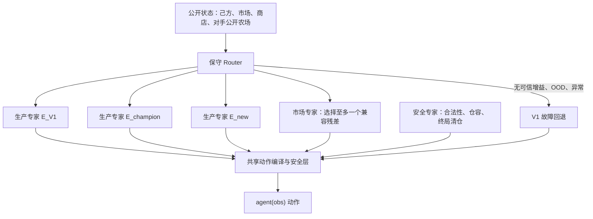

# Kaggriculture PPO v3：Mixture of Verified Experts（MoVE）

## 状态与裁决

状态：**实现与小规模真实闭环已完成；尚未通过 D1/D2/D4 正式门槛，未构建或上传
Kaggle challenger。**

2026-08-19 实现记录：`v6_ppo_v3_moe_router/` 已完成平铺专家目录、97 维公开特征、
seed/agent-state 保真的 D2 分叉、分片合并校验、JAX Router、纯 NumPy 推理、D3
采集、PPO 微调和干净归档冒烟。真实小样本 D2 为 12 个去重状态：`E_HIGH` 4 个有效
生产干预，`M_ANIMAL_HALF/M_PREMIUM_FIRST/M_WHEAT_RESERVE` 分别为 2/4/4 个有效市场
干预；JAX/NumPy 最大误差 `2.38e-7`。随后跑通 2 seed、双席位 D3（120 日级 token，
实际动作变化率 42.5%）与 2 epoch PPO，但该样本远小于正式 D2/D4 规模，**只能证明
管道闭环，不能用于模型选择或上线**。`E_LOW` 已由代码比较证明为 V1 冻结动作表的
精确别名，保留作对手族、不再作为 Router 动作。

PPO v3 不复用旧 V3 / PPO v2 的 BC 标签或 checkpoint 作为训练起点。原因不是
PPO 超参数不足，而是旧数据和部署闭环已经被证伪：旧 BC 20,000 条记录中有
19,998 条重复动作行、完整动作序列仅两种；PPO 随机采样能出现非默认宏动作，
但确定性 `argmax` 提交路径仍几乎始终输出默认宏。详见
[`../v5_ppo_v2_league/PPO_V2_PLAN.md`](../v5_ppo_v2_league/PPO_V2_PLAN.md) 的 G4 诊断。

本版的第一性目标是：

> 在未知对手分布下，提高最终金币严格高于对手的概率；所有通过资格测试的
> 策略专家在选择层平等竞争，V1 只是比较锚点、一个候选专家和异常回退，
> 而不是具有默认特权的策略。

## 1. 架构边界



### 1.1 不变部分

- `v1_adaptive_market` 是主比较基线、一个生产专家和故障回退；它不是 Router
  的默认特权策略。
- 生产专家在选择层完全平铺：V1、公开强路线的可执行模板和新生产模板都先通过
  同一资格测试，再由 Router 在当前状态下比较。
- 所有专家通过统一的“动作计划 → 动作编译 → 安全校验”接口接入；共享的是
  合法性、仓容、终局清仓与状态管理，不是 V1 的整条路线。
- 前 72 个可行动回合冻结；最后 5 个可行动回合由已验证的终局清仓逻辑接管。
- 不开放逐工人移动、坐标、种植或喂养等原子动作给学习器。
- 任何特征、权重、mask、专家输出或执行动作异常，都在本局余下时间回退 V1。
- V2 仅作为安全回归对照，不作为教师、默认回退或主效果基线。

### 1.2 专家层

专家不是彼此加权平均的神经网络输出，而是可解释、可验证、可单独回退的策略
选项。因为两个冲突的市场订单不能安全地按 0.5 / 0.5 混合。

| 层 | Router 选择方式 | 初始候选 | 约束 |
| --- | --- | --- | --- |
| 生产层 | 平等比较，互斥，恰选一个 | V1、已验证开局段、公开强路线的可执行模板、已验证整季生产模板 | 同一资格门槛；不得因来源不同获得先验优待 |
| 市场层 | 默认或至多一个 | 默认出售、动物产品延迟出售、库存压力提前出售、小麦储备调整 | 必须与所选生产专家兼容，且真的改变可执行订单 |
| 安全层 | 永远启用 | 合法性、仓容、终局清仓、异常回退 | 不由 Router 关闭 |

`top-days` 动物产品出售残差可以作为**候选市场专家**，但其历史筛选收益不能
自动外推到所有状态，更不能被标记为“PPO 学会”。

### 1.3 统一专家接口

每个生产专家都必须提供可独立执行的完整计划，或提供与明确基准计划绑定的
可验证模板；每个市场专家只提供与生产计划兼容的订单修改。统一接口为：

```text
expert.propose(state) -> {
  production_plan_or_template,
  market_delta_or_none,
  preconditions,
  expected_action_footprint
}
```

共享动作编译器负责把计划落实为 `farmer / hands / market`，并执行合法性和安全
校验。若某专家只能依赖 V1 的隐含内部状态、却无法在统一接口下独立复现，则不能
作为平铺生产专家，只能作为 V1 兼容的残差专家。

## 2. 数据重新构造

### 2.1 五类数据，禁止混用

| 数据集 | 内容 | 用途 | 能否训练 Router |
| --- | --- | --- | --- |
| D0 安全轨迹 | V1 原子动作与执行回归 | 验证低层执行器 | 否 |
| D1 专家资格集 | 单专家相对 V1 的完整配对对局 | 决定专家能否入库 | 否，只有通过者可进入 D2 |
| D2 反事实 Router 集 | 同一状态下多个专家分叉后的相对结果 | Router 的核心监督数据 | 是 |
| D3 on-policy 集 | 当前 Router 的实际完整对局 | Router 通过门槛后供 PPO 使用 | 是，仅后期 |
| D4 留出集 | 未见来源、策略族群、seed 与公开 Replay | 最终泛化与回归 | 绝不允许 |

旧 BC 数据只属于 D0，不得再把它当作“状态应选择何种宏动作”的 D2 标签。

### 2.2 状态快照

在每日 `hour=0` 保存状态快照；一局约产生 30 个候选决策点。每条状态必须至少
记录：

```text
state_id, source, code_hash, episode_id, seed, seat, opponent_id,
strategy_family, day, step,
self economy / shed / carried inventory / crops / animals / workers,
market inventory / price / change, unlocked shops / demand,
opponent public farm and 1/3/7-day deltas,
eligible experts, action masks, V1 default action, safety preconditions
```

不记录用户名、Team ID、Submission ID、私有库存、私有现金或任何线上不可获得
字段。

### 2.3 同状态反事实分叉

对于每个选中的状态 `s`，冻结同一 seed、席位、对手代码和环境状态，分叉继续至
终局：

```text
E_V1：V1 专家（固定比较锚点）
E1..Ek：所有在 s 下合法且兼容的候选专家
```

每个分叉保存：

```text
candidate_expert, effective_action_change, final_win_draw_loss,
final_gold, gold_margin, score_delta_vs_V1, margin_delta_vs_V1,
safety_delta, terminal_liquidation_ok, error
```

标签以 V1 为固定比较锚点，同时保留所有专家两两比较结果；它不是“V1 当时做了
什么”的模仿标签。若候选未改变实际可执行动作，该行只可用于安全审计，不可作为
正向干预样本。

### 2.4 采样与数据量

先做小而高信息量的 pilot，不从一开始生成大量同质轨迹：

1. 每个新专家先做 500 个未见 seed、双席位、多个对手族群的 D1 资格测试。
2. D2 第一批目标为 20,000–50,000 个**去重后的日级状态**，而不是 20,000 局。
3. 每个状态至少分叉 E_V1 与 2–5 个合法候选，避免无意义的全排列。
4. 对市场低库存、仓容压力、临界胜负、陌生对手结构等稀有状态分层过采样；
   训练时保存采样概率并做重要性加权。
5. 对同一高频固定开局、相同宏动作和近似市场轨迹做精确哈希与近邻去重。

质量门槛：必须报告状态去重率、候选动作熵、每个专家的有效状态数、正/负 uplift
数量及各策略族群覆盖。任何单一动作序列占比超过 20%，或单一专家占训练标签超过
80%，都要停止并重做采样设计。

### 2.5 对手分布与切分

- 初始活跃池 24–32 个可执行对手，至少 12 个有效策略族群；同源小改动不重复计数。
- 固定锚点、生产型、市场型、漏洞攻击型、历史快照和参数扰动策略都要存在。
- 训练/验证/最终测试按 `source + strategy_family + lineage + episode_id + seed`
  做 group split；同一 seed 双席位不能跨分区。
- 公开 Replay 用于 D4 回归和对手结构分层；没有可执行对手代码的 Replay 不进入 D2
  因果标签生成。

## 3. Router：先做保守的上下文策略选择

第一版 Router 不直接做 PPO，也不以 V1 动作为监督标签。它对所有生产/市场专家
平等学习：

```text
Q(s, E) = 在状态 s 选择专家 E，相对 V1 锚点的预期配对 uplift
U(s, E) = 上述估计的不确定性
```

部署规则：

```text
若没有合法候选，或 max_E [Q(s,E) - uncertainty_penalty × U(s,E)] <= 0：
    选择 E_V1（保守回退）
否则：
    选择保守下界最高的专家
```

初始模型采用 MLP 即可；只有 MLP 不能解释跨日状态时，才在独立消融中加入 GRU。
每一个 Router 决策必须写入审计日志：输入分桶、可选专家、分数、不确定性、最终
选择、实际订单变化及终局结果。

当前实现使用 5 个仅对 D2 训练组 bootstrap 的 MLP 成员；部署目标是
`mean_uplift - 1.0 * member_std`。成员标准差不是置信区间，不能替代 D4 配对 CI，
它只用于让未覆盖状态更保守地回退默认专家。

## 4. PPO：只优化通过 Router 门槛后的跨天组合

Router 先在 D4 的配对验证中优于或不劣于 V1，才开启 PPO。PPO 的动作仍是：

```text
平铺生产专家之一 + 零或一个兼容市场专家 + 固定安全层
```

PPO 不得回到逐工人原子动作，也不得以 stochastic sampling 的结果替代线上
deterministic 部署评估。

初始超参数保留 PPO v2 的合理起点：

- 日级约 30 个宏 token；`gamma=0.995`、GAE `lambda=0.95`、`clip=0.2`。
- 终局奖励：胜 `+1`、负 `-1`、平 `0`，加 `0.02 * tanh(gold_margin / 25000)`。
- 势函数只能使用严格形式 `gamma * Phi(next) - Phi(current)`，终局 `Phi=0`。
- PPO 对 Router 保持 KL 锚定；验证与提交均使用同一种 deterministic 决策规则。

## 5. 门槛与停止条件

### G0：数据与专家资格

- D1 每位专家对 V1 的独立配对结果、安全指标和适用条件完整可复现。
- D2 有效状态、动作熵、正负样本、族群覆盖均通过第 2.4 节门槛。
- 所有 split 无 group leakage，D4 未用于专家筛选、模型选择或超参数调节。

### G1：Router 本身

- `E_V1` 在 1,000 seed、双席位下逐步复现 V1；其它生产专家也必须各自完成
  独立的完整执行与安全验收。
- 非默认选择必须带来真实底层动作变化；变化率目标为 5%–20%，不以高变化率为目标。
- 只统计发生实际干预的状态，其相对 V1 的 uplift 95% CI 下界不得低于 0。
- V1 主基线的 2,000 场双席位配对中，综合得分率差的 95% CI 下界高于 `+2pp`。
- 任一主要对手族群相对 V1 的下界不得低于 `-2pp`，并做预注册多重比较校正。

### G2：PPO 增益

- PPO 必须相对冻结 Router 而非只相对 V1 额外提高；否则不增加系统复杂度。
- 每个 checkpoint 先在 validation 选，最终 D4 test 只运行一次。
- 训练采样、deterministic 推理、实际 market/hands/farmer 动作的闭环审计必须一致。
- 无错误、无安全回归、推理小于 5ms、干净解包 719 次调用和 720 回合 `DONE/DONE`。

### 线上规则

仅当本地 G0–G2 全通过时构建独立 challenger；Kaggle 上传仍需单独授权。线上后按
实验总账固定口径观察前 80 场：1–40 场爬坡期、41–80 场稳定期。Rating 仅作辅助，
不替代同期配对或稳定期胜率。

## 6. 目录与交付物

实现目录：`model/v6_ppo_v3_moe_router/`。可构建本地验证归档，但在 G0–G2 通过前
不得将其视为 challenger 或上传。

```text
v6_ppo_v3_moe_router/
├── experts.py               # 平铺专家接口和动作 footprint
├── catalog.py               # 隔离的生产/市场专家目录
├── action_compiler.py        # 共享动作计划编译与安全校验，不绑定 V1 路线
├── data/
│   ├── d0_safety/
│   ├── d1_qualification/
│   ├── d2_counterfactual/
│   ├── d3_on_policy/
│   └── d4_holdout_manifest.json
├── manifests/               # source / lineage / split / opponent manifest
├── collect_states.py
├── fork_counterfactuals.py
├── merge_d2_shards.py
├── train_router.py
├── train_ppo_router.py
├── collect_on_policy.py
├── evaluate_paired.py
└── build_submission.py
```

## 7. 第一轮最小闭环

PPO v3 的首轮工作不是训练，而是完成以下可证伪闭环：

1. 选取 4 个候选市场专家和 2 个候选生产专家；V1 仅作为其中一个生产专家。
2. 完成 D1 单专家资格测试，淘汰没有正向条件收益或存在安全回归的候选。
3. 收集至少 2,000 个去重状态并做同状态分叉，生成 D2 pilot。
4. 训练保守 Router，并用未见 seed / 双席位 / 多族群对 V1 验证。
5. 若 Router 没有可靠增益，停止，不启动 PPO；若有增益，才准备 D3 和 PPO。

这条停止条件是设计的一部分：PPO v3 的成功不以“训练完成”定义，而以“Router
先证明能够在正确状态选择正确专家”定义。
