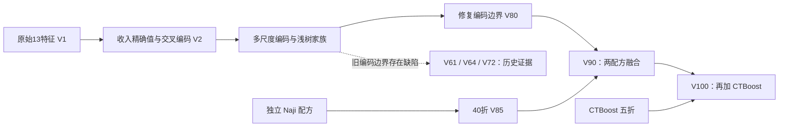

**S6E9 实验复盘与下一步判断｜2026-09-05**

比赛目录：`/Users/a1-6/Desktop/PycharmProjects/DS_completation/.claude/worktrees/strange-gates-ca18fe/kaggle_Predicting_Electric_Vehicle_Purchases`。本次读取现有代码、结果与实验台账，通过 Kaggle CLI/API 核验提交和公榜，并对现有 V100 OOF 做只读错序统计。未重启训练、修改研究门槛或提交预测。

**当前位置**

- 截至本次查询，20 次提交全部 COMPLETE；V100 是账号最高 Public：0.94635，ref 56023943。V85 单模 0.94634，V90 0.94632，V95 0.94631。V100 的本地 OOF 数值为 0.9463981465241269，相对其同口径 V90 基准增加 0.0000271597585，5/5 元折为正；研究晋级仍未通过，allowed_for_fusion=false。 [VERIFY: model/v100_v90_ctboost_nested_cv_blend/cv_results.json:17-31](/Users/a1-6/Desktop/PycharmProjects/DS_completation/.claude/worktrees/strange-gates-ca18fe/kaggle_Predicting_Electric_Vehicle_Purchases/model/v100_v90_ctboost_nested_cv_blend/cv_results.json:17) [VERIFY: model/v100_v90_ctboost_nested_cv_blend/online_submission.json:4-12](/Users/a1-6/Desktop/PycharmProjects/DS_completation/.claude/worktrees/strange-gates-ca18fe/kaggle_Predicting_Electric_Vehicle_Purchases/model/v100_v90_ctboost_nested_cv_blend/online_submission.json:4)
- 已晋级小融合是 V90；V100 是“数值最高且已获用户条件授权提交”，二者地位不同。 [VERIFY: model/experiments.md:205-214](/Users/a1-6/Desktop/PycharmProjects/DS_completation/.claude/worktrees/strange-gates-ca18fe/kaggle_Predicting_Electric_Vehicle_Purchases/model/experiments.md:205)
- 当前公榜前三为 Chris Deotte 0.94672、Don Mani 0.94650、Yusuke Hayashi 0.94648。与公榜第一差 0.00037。这不是最终私榜所需的固定提升量；比赛尚未结束，公榜使用约 20% 测试集，私榜约 80%，截止 2026-09-30 23:59 UTC。[官方排行榜](https://www.kaggle.com/competitions/playground-series-s6e9/leaderboard)
- 目录有 99 个 vN_ 子目录和 13 个 diagnostics 子目录，不能解释为 100 次独立尝试。当前正式周期 C01 为 17/20；重试不重复计数。最新指示是完成 GOSS 后暂停。 [VERIFY: model/NEXT_RESEARCH_PLAN.md:4](/Users/a1-6/Desktop/PycharmProjects/DS_completation/.claude/worktrees/strange-gates-ca18fe/kaggle_Predicting_Electric_Vehicle_Purchases/model/NEXT_RESEARCH_PLAN.md:4) [VERIFY: model/NEXT_RESEARCH_PLAN.md:76-83](/Users/a1-6/Desktop/PycharmProjects/DS_completation/.claude/worktrees/strange-gates-ca18fe/kaggle_Predicting_Electric_Vehicle_Purchases/model/NEXT_RESEARCH_PLAN.md:76)

**已做尝试，按机制归并**

| 路线 | 代表实验 | 结果与判断 |
| --- | --- | --- |
| 原始基线、收入精确值信号 | V1→V2；收入精确值、收入×环保/补贴、分箱 TE | OOF 0.941844→0.945601，约 +0.003758；Public +0.00408。这是最大突破。 |
| 模型双表示 | V3 CatBoost；数值同时保留连续值与精确类别 | 单模 OOF 0.945339，Public 0.94559；V2+V3 融合再增加 0.000227。 |
| 编码细修 | 多尺度平滑、bin10/100、联合键、层级先验、残差/伪标签、邻域、未见值回退 | 已研究很深；后续大多低于 0.0001。严格 V93 回退仅 +0.000000436。 |
| 折数、种子、树容量 | 5→10→20→40 折，多种子、浅树、特征子采样；V80/V81/V82/V96 | 历史上有递减收益。V83 三切分 bag +0.000081585，未过门槛；额外切分副本融合也已 NO_GO。 |
| 不同模型家族 | CatBoost、MLP、XGB、HistGB、RealMLP、TabM、稀疏加性、CTBoost | 早期 CatBoost/MLP 有互补；多数新探针未达门槛。最新 CTBoost 五折 OOF 0.945961721，进入 V100 后 Public 增加 0.00003。 |
| 原始数据与生成器 | 原始数据查表/扩样/频率，生成器 margin，GAM 与残差 LGBM | 整行复制假设不成立。V97 有小幅增益但 STOP；V98 正式失败且产物禁用。更强 GAM 先验没有提高最终残差模型。 |
| 业务交互特征 | 充电与通勤负担、每车收入/通勤、购车能力 | V87 约 -0.00000485；V92 约 +0.00000737；V99 加 5% V92 仅 +0.00000507。 |
| 集成与验证重建 | rank、非负权重、浅层 stacking、公开预测，后续 strict TE + fit-only ECDF | V90 的 V80+V85 组合增加 0.000101847，5/5。V95/V99/V100 只有小幅增益。未经核验的公开 OOF 和仅有 test 的 Smart 已排除。 |
| 9月5日补充诊断 | 频率痕迹、收入局部曲面、MLP mask、GAM 联合块、Extra-Trees、GOSS | 这些都已做，不能再列为新建议；Extra-Trees/GOSS 在与 V100 的五折融合中均选择零权重。 |

表格证据：[VERIFY: model/experiments.md:12-23](/Users/a1-6/Desktop/PycharmProjects/DS_completation/.claude/worktrees/strange-gates-ca18fe/kaggle_Predicting_Electric_Vehicle_Purchases/model/experiments.md:12) [VERIFY: model/phase2_validation_plan.md:49-84](/Users/a1-6/Desktop/PycharmProjects/DS_completation/.claude/worktrees/strange-gates-ca18fe/kaggle_Predicting_Electric_Vehicle_Purchases/model/phase2_validation_plan.md:49) [VERIFY: model/experiments.md:149-170](/Users/a1-6/Desktop/PycharmProjects/DS_completation/.claude/worktrees/strange-gates-ca18fe/kaggle_Predicting_Electric_Vehicle_Purchases/model/experiments.md:149) [VERIFY: model/experiments.md:174-245](/Users/a1-6/Desktop/PycharmProjects/DS_completation/.claude/worktrees/strange-gates-ca18fe/kaggle_Predicting_Electric_Vehicle_Purchases/model/experiments.md:174) [VERIFY: model/diagnostics/v90_split_replica_bag_probe_20260905/README.md:21-25](/Users/a1-6/Desktop/PycharmProjects/DS_completation/.claude/worktrees/strange-gates-ca18fe/kaggle_Predicting_Electric_Vehicle_Purchases/model/diagnostics/v90_split_replica_bag_probe_20260905/README.md:21)

当前主线可以压缩为：

源码映射：[VERIFY: model/v90_v89_member_verify_budget_retry/v90_v89_member_verify_budget_retry.py:209-225](/Users/a1-6/Desktop/PycharmProjects/DS_completation/.claude/worktrees/strange-gates-ca18fe/kaggle_Predicting_Electric_Vehicle_Purchases/model/v90_v89_member_verify_budget_retry/v90_v89_member_verify_budget_retry.py:209) [VERIFY: model/v100_v90_ctboost_nested_cv_blend/v100_v90_ctboost_nested_cv_blend.py:283-297](/Users/a1-6/Desktop/PycharmProjects/DS_completation/.claude/worktrees/strange-gates-ca18fe/kaggle_Predicting_Electric_Vehicle_Purchases/model/v100_v90_ctboost_nested_cv_blend/v100_v90_ctboost_nested_cv_blend.py:283) [VERIFY: model/NEXT_RESEARCH_PLAN.md:50-55](/Users/a1-6/Desktop/PycharmProjects/DS_completation/.claude/worktrees/strange-gates-ca18fe/kaggle_Predicting_Electric_Vehicle_Purchases/model/NEXT_RESEARCH_PLAN.md:50)

**哪些结论需要保留边界**

1. V6 的 inner smoothing prior 包含 inner-hold 标签信息，V28/V59–V64/V72 等继承谱系已降级。外层验证标签没有直接进入该 prior，因此旧值仍是历史 outer-OOF。V80 同切分修复只降低约 0.000002956，不能把全部平台期都归因于这项缺陷。 [VERIFY: model/NEXT_RESEARCH_PLAN.md:50-55](/Users/a1-6/Desktop/PycharmProjects/DS_completation/.claude/worktrees/strange-gates-ca18fe/kaggle_Predicting_Electric_Vehicle_Purchases/model/NEXT_RESEARCH_PLAN.md:50)
2. V100 的“nested”覆盖本层 ECDF 和权重；它直接读取既有 V90 OOF，未在每个最外层训练块内重建全部底层模型和上一层融合。某元训练行的 V90 预测可能由见过当前元验证块标签的权重生成。应称为本层交叉拟合开发结果，不能等同整条堆叠流程的独立确认；目前没有量化其偏差，线上提升也没有因此失效。 [VERIFY: model/v100_v90_ctboost_nested_cv_blend/v100_v90_ctboost_nested_cv_blend.py:215-237](/Users/a1-6/Desktop/PycharmProjects/DS_completation/.claude/worktrees/strange-gates-ca18fe/kaggle_Predicting_Electric_Vehicle_Purchases/model/v100_v90_ctboost_nested_cv_blend/v100_v90_ctboost_nested_cv_blend.py:215) [VERIFY: model/v100_v90_ctboost_nested_cv_blend/v100_v90_ctboost_nested_cv_blend.py:283-297](/Users/a1-6/Desktop/PycharmProjects/DS_completation/.claude/worktrees/strange-gates-ca18fe/kaggle_Predicting_Electric_Vehicle_Purchases/model/v100_v90_ctboost_nested_cv_blend/v100_v90_ctboost_nested_cv_blend.py:283) [VERIFY: model/v90_v89_member_verify_budget_retry/v90_v89_member_verify_budget_retry.py:807-850](/Users/a1-6/Desktop/PycharmProjects/DS_completation/.claude/worktrees/strange-gates-ca18fe/kaggle_Predicting_Electric_Vehicle_Purchases/model/v90_v89_member_verify_budget_retry/v90_v89_member_verify_budget_retry.py:807)
3. V80 外层验证集还用于早停；新的 meta seed 仍然重切已反复使用的数据。最终应冻结配方后做端到端复核，将早停内移。新切分不能恢复真正未见过的盲集。 [VERIFY: model/v80_strict_v61_outer104395303_40f/v80_strict_v61_outer104395303_40f.py:1277-1296](/Users/a1-6/Desktop/PycharmProjects/DS_completation/.claude/worktrees/strange-gates-ca18fe/kaggle_Predicting_Electric_Vehicle_Purchases/model/v80_strict_v61_outer104395303_40f/v80_strict_v61_outer104395303_40f.py:1277) [VERIFY: model/NEXT_RESEARCH_PLAN.md:175-184](/Users/a1-6/Desktop/PycharmProjects/DS_completation/.claude/worktrees/strange-gates-ca18fe/kaggle_Predicting_Electric_Vehicle_Purchases/model/NEXT_RESEARCH_PLAN.md:175)
4. V98 即使科学重算有 0.946336507，正式失败和产物禁用状态仍保留。部分旧表格还把 V95 写成最高数值，已被 V100 超过。 [VERIFY: model/NEXT_RESEARCH_PLAN.md:4-21](/Users/a1-6/Desktop/PycharmProjects/DS_completation/.claude/worktrees/strange-gates-ca18fe/kaggle_Predicting_Electric_Vehicle_Purchases/model/NEXT_RESEARCH_PLAN.md:4) [VERIFY: model/NEXT_RESEARCH_PLAN.md:104-105](/Users/a1-6/Desktop/PycharmProjects/DS_completation/.claude/worktrees/strange-gates-ca18fe/kaggle_Predicting_Electric_Vehicle_Purchases/model/NEXT_RESEARCH_PLAN.md:104)

**本轮新增的错误定位**

见同目录 `error_accounting.json` 与可复算脚本 `audit_existing_oof.py`。只读取 train 与现有 V100 OOF，按原始 ID 顺序核验，重新得到 AUC 0.9463981465241268，与结果文件一致。OOF SHA-256 为 `8ad4a6a026eb579036911aa7010a39cbfa7ceefb4976b39d95bc60a87cb41fda`。

这里“错序”指一对正负样本中，正样本分数更低；并列计半个错误。该定义与 1-AUC 对齐，不用 0.5 分类阈值统计错误。

- 环保等级 4/5、有补贴、低里程焦虑的人群共 162,533 行，占 24.3071%；包含 95,479 正例和 67,054 负例。
- 仅该人群内部的正负样本对，就贡献全部错序的 39.4194%，组内 AUC 为 0.787297883。
- 收入值出现不超过 5 次的样本只占 1.5981%；按正、负样本分别归因，约各占全部错序的 1.70%、1.74%。极稀有收入回退不是目前主要错误来源。
- 这些是开发数据上的误差定位，不代表该人群一定有可学习的新信号；也不能把剩余错误全当作可消除误差。

**下一步建议，按收益与成本排序**

| 优先级 | 建议 | 为什么值得做 | 验证和限制 |
| --- | --- | --- | --- |
| 1 | 用已有 V80/V85/CTBoost OOF 做分段“谁修正谁”的分析 | 不重训即可确认主导错误人群中是否有稳定互补；已有统计显示错误集中 | 同时看组内与跨组错序，不按 Public 选切片；分段证据成立后才预注册专家修正或新表示。不能重新做已失败的收入频次四组调权。 |
| 2 | 单独试线性叶子 LightGBM | 本地未发现同等实验；叶内线性可表达现有常数叶难拟合的平滑关系，仍保留树的交互 | 保留 strict-v96 数据/TE/损失，两臂采用同样折内缩放，只改变叶子机制。先设五折诊断及时间/内存预算，达到既定门槛再考虑正式版。增益尚未验证。 |
| 3 | 审计 OOF 到 test 的融合差异 | V90 测试侧平均五个元折状态，V100 用完整 OOF 重拟合；CTBoost 五折 OOF 对应全量单模型 test，训练量和平均方式不同 | 先只读比较分布与方差，不用标签；有机制证据再冻结一项推断合同消融。预期只补小缺口，不应据此直接升级 CTBoost 40 折。 |
| 4 | 冻结 2–3 个最终候选做端到端确认 | 当前差异已小至几万分之一，验证偏差足以改变排序；V85 Public 仅比 V100 低 0.00001 | 基础 OOF、早停和融合都位于外层训练块内；配对报告增量及不确定性。属于可靠性改进，不承诺涨分，也不称新盲集。 |

线性叶子依据：官方说明为叶内线性模型，需注意缩放和显著增加的内存。[LightGBM 参数文档](https://lightgbm.readthedocs.io/en/stable/Parameters.html#linear_tree)。今日公开 notebook 确实启用该选项，但同时改了 TE 和损失，不能把其标题成绩归因为线性叶子；本地只应移植这一机制。[公开源码](https://www.kaggle.com/code/sergeyqt2024/simple-21-feature-lfbm-0-9456)

推断差异源码：[VERIFY: model/v90_v89_member_verify_budget_retry/v90_v89_member_verify_budget_retry.py:816-850](/Users/a1-6/Desktop/PycharmProjects/DS_completation/.claude/worktrees/strange-gates-ca18fe/kaggle_Predicting_Electric_Vehicle_Purchases/model/v90_v89_member_verify_budget_retry/v90_v89_member_verify_budget_retry.py:816) [VERIFY: model/v100_v90_ctboost_nested_cv_blend/v100_v90_ctboost_nested_cv_blend.py:252-265](/Users/a1-6/Desktop/PycharmProjects/DS_completation/.claude/worktrees/strange-gates-ca18fe/kaggle_Predicting_Electric_Vehicle_Purchases/model/v100_v90_ctboost_nested_cv_blend/v100_v90_ctboost_nested_cv_blend.py:252) [VERIFY: model/diagnostics/ctboost_remote_probe_20260905/README.md:19-26](/Users/a1-6/Desktop/PycharmProjects/DS_completation/.claude/worktrees/strange-gates-ca18fe/kaggle_Predicting_Electric_Vehicle_Purchases/model/diagnostics/ctboost_remote_probe_20260905/README.md:19)

以上是未来研究建议，不改变历史拒绝决定、候选准入或暂停状态。条件融合需要新的预注册及适用协议。现有 +0.0001 最终门槛不因本次复盘降低；也不应把低于门槛直接解释为“完全没有信号”，V100 的微小线上增量已经是反例。

**公开调研带来的判断**

Naji 的双平滑 TE、原始统计与高分辨率 LGBM，本地已覆盖；Chris Deotte 的生成器 margin 也已配对复现，只有微小增益。作者当前公榜第一不证明其公开 starter 就是领先配方。来源：[Naji 单模](https://www.kaggle.com/code/najiama/pure-lgbm-model-cv-0-94587-lb-0-94612)、[Chris Deotte XGB starter](https://www.kaggle.com/code/cdeotte/fable-5-1-xgb-starter)、[本地社区复现记录](/Users/a1-6/Desktop/PycharmProjects/DS_completation/.claude/worktrees/strange-gates-ca18fe/kaggle_Predicting_Electric_Vehicle_Purchases/model/diagnostics/community_research_closeout_20260905.md)。

目前没有公开证据支持“一项方便改动便能拿第一”。继续追加收入 TE、seed、全量平均、GOSS/Extra-Trees 或普通 pairwise loss，不是优先方向。最有价值的路线是用错误定位约束下一次研究，找到强基线尚未表达的条件关系，再用最终复核确认它是否真的减少排序错误。0.947 OOF 只是本地研究目标，并不是夺冠充分条件。

