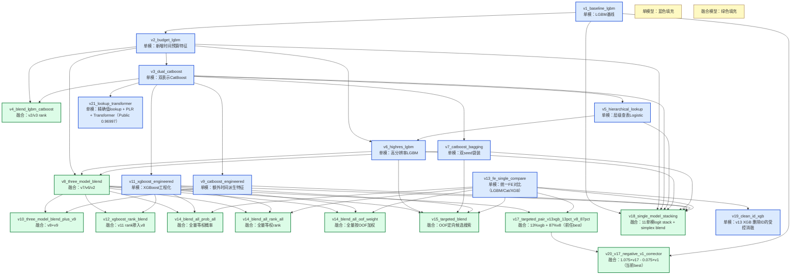

# 实验记录 — Predicting Smartphone Addiction (S6E8)

- **指标**：ROC AUC，越高越好。
- **每日提交上限**：10 次。
- **截止时间**：2026-08-31 23:59 UTC / 2026-09-01 07:59 台北时间。
- **当前状态**：已完成 15 次 COMPLETE 提交（其中 v10 与 v8 预测重复）；当前最佳仍为 v20（负向残差校正），Public LB `0.96998`，ref `55719089`；V21 Lookup-Transformer 单模为 `0.96997`，仅低 `0.00001`。

## 实验台账

| # | 方案 | 特征 | 模型/关键参数 | 本地 OOF AUC | 线上 Public | 提交 ref | 备注 |
| --- | --- | --- | --- | ---: | ---: | --- | --- |
| 1 | v1_baseline_lgbm | 原始 12 特征；类别 one-hot | LightGBM 31 leaves × 1500 trees；5 折 StratifiedKFold | 0.962633 | 0.96383 | 55575008 | 首个端到端基线；状态 COMPLETE |
| 2 | v2_budget_lgbm | v1 + 组成时长总和、剩余屏幕时长、组成观察数 | 同 v1，严格同折配对 | **0.963559** | **0.96467** | 55575810 | OOF `+0.000926`；5/5 折提升；Public `+0.00084` |
| 3 | v3_dual_catboost | 连续数值 + 12 个精确值字符串类别 + v2 时间预算 | CatBoost depth 8，最多 3000 轮，5 折早停 | **0.967965** | **0.96946** | 55576614 | OOF `+0.004407`；5/5 折提升；Public `+0.00479` |
| 4 | v4_blend_lgbm_catboost | v2/v3 percentile rank | 留一折选权重；最终 0.12/0.88 | 0.968055 | — | 未提交 | 相对 v3 `+0.000089`，低于预注册 `+0.0001` 门槛 |
| 5 | v5_hierarchical_lookup | 精确值 → 分位区间 → 全局先验；严格内层 OOF | 经验贝叶斯平滑 + Logistic Regression | 0.958196 | — | 未提交 | 纯加性模型不足；v8 五折均给零权重 |
| 6 | v6_highres_lgbm | v2 + v5 折外层级编码 | LightGBM 63 leaves，`max_bin=1023`，5 折早停 | 0.967373 | — | 未单独提交 | 单模低于 v3 `0.000593`，但为融合提供互补性 |
| 7 | v7_catboost_bagging | v3 双表示 | CatBoost seed 42/2026 概率平均 | 0.968132 | — | 未单独提交 | 相对 v3 `+0.000167`；种子秩相关 `0.998242` |
| 8 | v8_three_model_blend | v7/v6/v2 percentile rank | 交叉拟合贪心三模型；权重 0.6608/0.2832/0.0560 | **0.968358** | **0.96954** | 55577566 | 五折全部提升；相对 v7 `+0.000226`；Public 相对 v3 `+0.00008` |
| 9 | v9_catboost_engineered | 在 v3 的基础上加入时间预算比例与 log 特征 | CatBoost 深度 8，2200 轮，5 折 | 0.963478 | — | 未单独提交 | OOF 明显低于 v3，未进入融合候选 |
| 10 | v10_three_model_blend_plus_v9 | 在 v8 基础上加入 v9 候选的交叉拟合 | rank 融合（门槛 1e-4），5 折重采样 | 0.968358 (fixed) | 0.96954 | 55578920 | 与 v8 完全等价（预测文件哈希一致），无增益 |
| 11 | v11_xgboost_engineered | 数值特征 + OHE 类别 + 预算/比率/幂次特征，XGBoost 1600 轮单模（Hist） | `objective=binary:logistic`，5 折 OOF | **0.964863** | — | 未提交 | 与 v7 相比显著下降（-0.00327），主要用于验证融合可行性 |
| 12 | v12_xgboost_rank_blend | 将 v11 以 rank 方式 14% 融入 v8 | rank 加权融合（v8 86% + v11 14%） | **0.968457** | **0.96959** | 55583477 | OOF +0.000099，首个实测线上提升 |
| 13 | v13_fe_single_compare | 统一 FE（126/118 列）+ LGBM/CatBoost/XGBoost 单模对比 | LGBM 1000、CatBoost 1200、XGB 2600（含 early stop） | **0.964841 / 0.962842 / 0.966431** | **0.96778**（xgb） | 55585090（xgb） | FE 优化版本；XGB 单模领先，可用于下一轮融合候选 |
| 14 | v14_blend_all_prob_all | v1/v2/v3/v5/v6/v7/v8/v9/v10/v11/v12/v13 全量 14 份预测（含 blend + 新单模）等权概率融合 | 等权概率平均，测试侧线性融合（无再次训练） | N/A | **0.96861** | 55585206 | 结果不如当前 best，但明显高于 v13 单模 |
| 15 | v14_blend_all_rank_all | 同上 14 模型等权 rank 融合 | 等权 rank 平均（转分位后平均） | N/A | **0.96872** | 55585209 | 全量 rank 融合是三套融合中最好者 |
| 16 | v14_blend_all_oof_weight | 按历史 OOF 质量加权（v1-v13 全量）概率融合 | 权重=归一化 oof AUC，测试侧融合 | N/A | **0.96862** | 55585210 | 未显著优于 prob/rank；与 best 存在回退 |
| 17 | v15_targeted_blend | OOF 导向目标性候选融合（v13_xgb 与 v8、v7 与 v8、v8+v3+v13_xgb） | 小范围 2/3 模型搜索 + 备选候选生成 | 0.968657 / 0.968359 / 0.968635 | — | 未以 v15 名义提交 | pair 候选超过 v12 rank；随后归档并以 v17 提交 |
| 18 | v17_targeted_pair_v13xgb_13pct_v8_87pct | 定向融合：`0.13*v13_xgb + 0.87*v8`，直接测试侧提交 | 2 模型线性权重（候选中 OOF 最优） | 0.968657 | 0.96977 | 55588591 | 超过当时历史最佳，曾为 best |
| 19 | v18_single_model_stacking | 11 个单模型（v1/v2/v3/v5/v6/v7/v9/v11/v13 x3）二层堆叠 + OOF 权重优化融合 | Stacking: Logistic meta；Blending: 11 模型非负 simplex 优化 | Stack OOF `0.968336`；Blend OOF `0.968117` | 0.96938 | 55589311 | Stack 表现更好，最终提交该文件；Blend / rank / 均值仅作参考 |
| 20 | v19_clean_id_xgb | 修复 v13 误纳入 `id`；保持其余 FE、XGB 参数和 seed42 五折不变 | clean-ID v13 XGB + 固定 13%/87% v17 替换消融 | clean XGB `0.966471`；clean pair `0.968658` | **0.96981** | **55719364** | 用户授权后提交 clean pair；相对 v17 Public `+0.00004`，但低于 v20 `0.00017` |
| 21 | v20_v17_negative_v1_corrector | deploy-aligned v17 加低容量 v1 的固定负向残差校正 | `1.075*v17 - 0.075*v1`，测试侧 percentile rank | **0.968793** | **0.96998** | **55719089** | 相对 v17 OOF `+0.000135`、5/5 折；缺失模式重加权仍约 `+0.00013`；新 best |
| 22 | v21_lookup_transformer | 12 字段精确值 lookup + rank-gauss 数值支路 + 6 个时间预算 token；永久删除 `id` | Lookup-Transformer：d=128、PLR k=24、4 layers、8 heads、EMA；seed42 五折 | **0.968560** | **0.96997** | **55721780** | 状态 COMPLETE；单模 Public 新高，距 v20 当前 best 仅 `0.00001` |

## 实验迭代流程图

## 初始化计划

- [x] 在 Kaggle 接受比赛规则并下载 `train.csv`、`test.csv`、`sample_submission.csv`。
- [x] 核验数据哈希、shape、字段类型、缺失率、目标分布和唯一 ID。
- [x] 建立 LightGBM 首个端到端基线并完成 Kaggle 提交。
- [ ] 补充常数概率和 Logistic Regression 作为低容量 sanity check。
- [x] 固定 5 折 StratifiedKFold 与随机种子，保存每折 AUC 和 OOF 预测。
- [ ] 比较原生缺失处理、折内插补、缺失指示三种策略。
- [x] 做 train/test adversarial validation：missing-only Logistic `0.565237`，漂移主要来自缺失注入；显式 missing flags 不进入下一主模型。
- [x] 对时间预算结构残差做同折消融，并确认 5/5 折提升。
- [x] 对浮点精度与精确值查表特征做独立消融。
- [x] 用 CatBoost 连续值/精确值双重表示验证 value-level 信号。
- [x] 评估 v2/v3 的 cross-fitted rank blend，并按预注册门槛决定不提交。
- [x] 用严格内层 OOF 验证层级查表，并排除 leave-one-out + 频次的隐蔽泄漏。
- [x] 训练高分辨率 LightGBM 与 CatBoost 双种子袋装。
- [x] 交叉拟合三模型权重，并仅在五折一致增益后提交 v8。
- [x] 只有在 OOF 稳定增益后才生成线上提交。

## 验证与防泄漏约定

1. `id` 默认不入模；任何 ID/行序特征都必须先证明不是生成顺序泄漏。
2. 编码器、插补器、缩放器和目标统计只能在训练折拟合。
3. 以概率计算 ROC AUC，不用 `accuracy` 代替比赛指标。
4. 每次提交必须能追溯到同目录的代码、参数和本地 OOF 结果。
5. 公开榜只用于外部校验，不以多次试探替代交叉验证。
