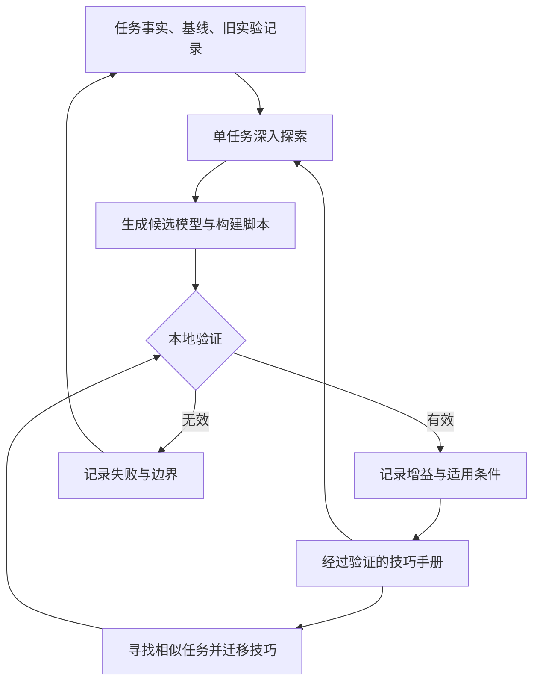
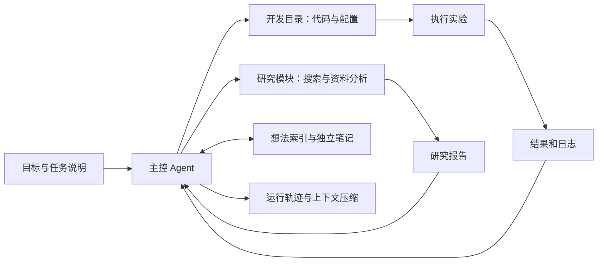
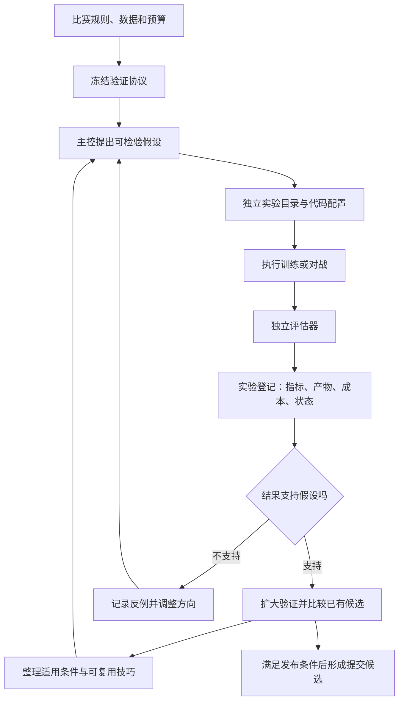

# 用于建模与竞赛的 Agents：实战、开源系统与构建方案

**核心判断：这一方向已经有真实比赛成绩，也有可以拆解复用的代码。** Chris Deotte 的价值在于公开了持续实验、多人协作和人工指导的过程；Geremie Yeo 的 Qgentic-AI 更接近可以研究源码的完整建模系统；NVIDIA Kaggle Plugin 则提供比赛资料、Notebook 和提交等基础工具。三者解决的问题不同，组合价值大于简单比较谁的“agent 更强”。

证据截至 2026 年 9 月 13 日。本文关注能够提出实验、生成代码、执行训练、读取结果并决定下一步的机器学习工程 agent。文中的比赛成绩属于具体参赛方案；论文中的奖牌率属于特定历史评测；公开复盘中的自动化程度按实际人工参与描述。人物等级只在有明确依据时标注，讨论区或代码等级不视为竞赛等级。

## 1. 什么才算建模 Agent

这类系统通常有两层模型：**上层大语言模型负责研究和编程，下层任务模型负责预测或行动。** 上层会选择特征、训练方法与实验；下层可能是 XGBoost、CatBoost、RealMLP、视觉网络，或者用于游戏的规则策略与强化学习策略。

因此，“用 agent 做比赛”并不意味着“提交到 Kaggle 的模型就是一个 LLM”，也不意味着必须训练一个强化学习系统来管理实验。AIDE 把工作组织为代码空间中的搜索；Qgentic-AI 通过主控、研究模块与工具调用循环推进；Chris 的公开方法还包括提示词和上下文的筛选。这些都可以在不更新上层 LLM 权重的情况下工作。[^1][^2][^3]

| 系统形态 | 下一步由谁决定 | 是否读取真实实验反馈 | 能证明什么 |
|---|---|---|---|
| 一次性生成 Notebook | 人继续决定 | 未必 | 能辅助写代码 |
| 固定 AutoML / 参数搜索 | 预设搜索程序 | 是 | 能搜索给定模型和参数空间 |
| 建模 Agent | LLM 与搜索程序共同决定 | 应当是 | 能改变特征、代码、模型和实验方向 |
| 多 Agent 实验系统 | 调度器与多个研究分支 | 应当是 | 可能扩大探索范围，收益仍需对照 |
| Kaggle 工具插件 | 外部 agent 决定 | 取决于调用者 | 能可靠取得资料、运行平台工作流 |

一个系统是不是 agent，关键是有没有“结果改变下一步行动”的闭环；一个 agent 是否有研究价值，关键是它能否在可靠验证下、以可接受成本获得增益。持续运行很久、生成很多代码或启动很多子任务，都不能单独回答第二个问题。

## 2. Chris Deotte：从辅助编程到持续实验

Chris 已经公开了多次真实竞赛案例。其过程呈现出逐步提高自动化程度的轨迹，但始终存在人类的任务设定、知识输入、阶段指导或最终选择。不能把标题中的 Autonomous、Swarm Intelligence 直接理解为比赛全程无人参与。

| 比赛与时间 | 公开结果 | Agent 的主要工作 | 人的关键作用 |
|---|---|---|---|
| 2026 年 3 月 Playground：客户流失 | 第 1 名 | 生成并训练大量候选，特征工程和多层集成 | 提供建模方法、指导研究流程 |
| 2026 年 5 月 Playground：F1 进站 | 第 2 名；Private 0.95502 | 从指定基线出发，持续优化 CV、记录本地榜 | 指定基线、资源和目标，选择最终提交 |
| 2026 年 7 月 NeuroGolf | Kaggle Agent 团队第 1 名 | 搜索 ONNX 表示、优化、迁移技巧 | 设计任务包、指导、维护团队知识 |
| 2026 年 8 月 ROGII 地质预测 | 第 36 名；最终融合 Private 约 6.8 | 两周实验、资料研究、建模 | 作者每晚提供建议 |
| 2026 年 8 月 Playground：手机成瘾 | 第 1 名；最终集成 Private 0.97176 | 独立探索、竞争、分享发现、集成 | 传递领域经验、阶段复核与跨工具协作 |

来源分别为本人技术博客、对应比赛复盘与补充评论。不同比赛的分数不可横向比较。[^4][^5][^6][^7][^8]

**三月的方法基础。** Chris 在 NVIDIA 技术博客中描述了三个 LLM 与 GPU 工具协作的过程，遵循 EDA、基线、特征工程、模型选择与集成的竞赛流程。其报告的 850 个模型候选和最终四层、150 模型组合说明实验规模很大；这些数字没有同时给出统一成本下的对照，不能据此推导单位算力效率。更有迁移价值的是把成熟建模方法变成 agent 能执行的步骤。[^4]

**五月的持续实验。** 作者指定一个公开单模型基线，让 Codex 改进 CV，并维护前十候选的 `local_leaderboard.md`；开放 4 张 A100 支持实验。最终采用 218 个模型预测的逻辑回归组合。作者明确说自己在赛末改变了最终提交选择，因此这是一例自动实验能力很强、最终决策仍有人参与的系统。[^5]

**八月的协作实验。** 最初一个 agent 运行，随后让多个 agent 分别优化神经网络和 XGBoost，并阶段性分享经验。作者补充：最终集成的 CV/Public/Private 为 **0.97098/0.97207/0.97176**，最佳单 RealMLP 为 **0.97070/0.97174/0.97145**；还明确承认定期指导研究方向。其 RealMLP 使用现成的 `RealMLP_TD_Classifier`，不能描述成 agent 发明了全新网络。当前公开信息足以研究工作流，尚不足以完整复现冠军特征与全部模型。[^8]

**能力边界。** 地质预测案例说明，持续运行和较强模型不会保证冠军。这个案例不能证明该工作流无效；它只能限制“任意竞赛都能无人拿金”的推断。需要进一步控制数据难度、资源、领域知识和人工时间，才能比较不同 agent 的研究能力。[^7]

## 3. NeuroGolf 冠军团队：知识如何跨实验积累

Kaggle Agent 团队包括 Jiwei Liu、Max Jeblick、Eduardo Rocha de Andrade、Chris Deotte 和 Giba。公开材料既有冠军介绍，也有流水线说明、提示词方法和早期运行轨迹。Jiwei 的公开资料明确标注 Competitions Grandmaster；Eduardo、Giba 也有明确竞赛 Grandmaster 记录。成员不能仅因共同署名就被视为负责了同一部分代码。[^6][^9][^10][^11]

团队流程中最值得借鉴的是两种工作交替进行：**在单个任务上深入找新方法；把已验证的新方法迁移到相似任务。** 单任务输入包括目标、基线、任务事实、前次实验笔记和技巧手册；输出保留生成模型的脚本、模型与新笔记。横向迁移则参考任务聚类和共享手册。公开说明承认尝试过很多结构，并未通过严格对照确定唯一最优架构。[^9]



流程图按团队复盘归纳；不代表一套已经完整公开、可以直接部署的统一框架。[^9]

这里的知识库需要保存“什么情况下有效”，而不仅是一个技巧名称。例如，同样是减少中间张量，一个方法可能只对固定形状有效；同样是缺失值特征，一个方法可能只对某类数据生成机制有效。把这些前提和反例一起保存，才能减少错误迁移。这是从上述流程得到的工程建议，而非团队公开实现的逐项声明。

**Chris 的 Self Evolving Prompts。** 他让多个 agent 在限定时间内竞争，根据成绩选择表现好的上下文，再让优胜者指导其他 agent 或整理 cookbook。过程中包含人类指导和自我复盘。作者用遗传进化来描述这种筛选，但公开材料没有证明对 LLM 参数做了强化学习训练。准确理解应是对提示词、经历和工作方式进行外部筛选。[^3]

这种筛选也需要防止“某一组任务上的幸运赢家”被提升成通用管理者。实际构建时，应把提示词选择任务与最终评估任务分开，并比较相同预算下的有效改进量。这个检查直接关系到能否复制收益。

## 4. 其他 Kaggle 高等级选手的相关工作

### 4.1 Geremie Yeo：Qgentic-AI

**这是本次最值得进一步读代码的个人项目。** Geremie 的 Kaggle 页面区分了竞赛 Master 与讨论等级；Qgentic-AI 有公开仓库、实验产物结构和运行轨迹示例，不只是一个项目介绍。[^12][^2]

它的主循环取得目标和想法索引，选择研究、开发、运行或更新想法等操作，再接收工具结果。源码还包含上下文压缩、逐步日志和每次开发独立目录。`ideas/INDEX.md` 提供入口，每个想法另存文件；它没有把所有经验都放在一段不断变长的对话里。[^13][^14]



图中描述来自公开主控和想法库源码，省略了具体模型接口及日志展示细节。它是一种能持续进行实验的工程组织方式，不提供天然正确的验证设计。[^13][^14]

**真实参赛证据。** Deep Past 翻译比赛的第 24 名复盘明确提到 Qgentic-AI：人类决定数据处理与方案方向，整理成 Markdown，由系统持续实验和调参。作者同时指出验证仍存在泄漏，不能完全依赖该 CV 选模型。因此，这个案例支持“能显著承担实验执行”，也暴露“正确验证仍需专门设计”。[^15]

仓库另列 CSIRO Biomass 第 32 名、分数 0.63772；这一项在本文中仅作为仓库自报记录，不赋予与已阅读完整比赛复盘相同的证据强度。项目早期宣传曾报告 MLE-bench 的高分表现，同时作者自行注明结果尚不具统计显著性；不能把这个宣传转写成已稳定超越其他系统。[^2][^16]

**适用判断。** Qgentic-AI 适合参考实验目录、研究与实现分工、想法库和轨迹记录。如果用于自己的竞赛，还需要补齐统一评估、预算截止、产物完整性和提交状态。源码存在并不代表在当前机器或当前比赛上已经跑通，本报告没有进行训练复现。

### 4.2 NeuroGolf 亚军：五个独立工作流

亚军团队由 Jacek、Chan Kha Vu、Geremie Yeo、Jin Niu 和 Yuichiro Hirano 组成。团队让不同成员保留自己的流程，统一管理候选和验证结果。Geremie 公开的仓库包含浏览器驱动的会话、产物下载、分数核验及结果归档脚本；这是可检查的比赛专用工程。[^17][^18]

复盘也明确披露部分任务使用了隐藏评测样本相关的记忆方案，作者称曾得到主办方允许。这会限制其名次对未知样本泛化能力的证明力。另一个可复用经验是单独记录候选是否经过线上验证，因为本地通过、单独提交通过和整包提交通过，可能并不一致。[^17]

对其他竞赛，更值得复用的是“候选产物由独立评估结果决定去留”，以及将本地与线上状态分别保存。特定比赛的样本记忆方法、评分漏洞或评测顺序依赖，都不应被默认带入一个通用建模系统。

### 4.3 Jiwei Liu、Max Jeblick：Data Explorer

Jiwei Liu、Maximilian Jeblick 和 Jack Yu 发表的 NVIDIA Data Explorer 文章采用“学习阶段构造可复用工具—推理阶段调用—离线反思”的结构，报告在当时 DABStep 上取得第一。其所谓学习，包含利用示例任务与答案构建工具，不应直接理解为训练底层模型权重。[^19]

DABStep 主要检验多步数据分析与问答，和训练预测模型、提交未知测试集是不同目标。文章中的推理加速也不能直接视作包含前期工具构建成本的端到端加速。它对本项目的价值是：把重复的数据理解与分析沉淀成可执行工具，减少每次实验重新摸索。

## 5. 周远哲：方向明确，公开实现尚不足以评估

周远哲的 Kaggle 主页明确写有“2026-xx-xx start building agents/claws for modeling/competitions”。这说明他公开表达了投入该方向的意图，但日期本身是占位写法，不能据此推断准确开始时间。[^20]

与该身份关联的 `zhouyuanzhe` GitHub 账户公开仓库列表中，可以看到过去竞赛方案、数值计算和其他项目；截至本报告日期，没有从该列表识别出能够明确对应上述方向的完整建模 agent 框架。这个结论只针对可见仓库和公开材料，不能推断他没有私有实现、没有使用其他账号，或没有内部研究。[^21]

因此，目前宜将他列为**值得继续关注的实践者**，不宜编造框架名称、架构、训练方法或“agent 赢得了哪些比赛”。他已有的个人竞赛成绩也不能自动归因于 agent。若出现项目链接、完整运行轨迹、比赛提交映射或方法复盘，才能提升证据等级。

## 6. 哪些代码值得复用

| 项目 | 真实定位 | 公开材料 | 对当前工作最有价值的部分 | 主要缺口 |
|---|---|---|---|---|
| NVIDIA/nvidia-kaggle | Kaggle 工作流工具与 skill | 公开源码、任务评测 | 资料获取、讨论与 Notebook 整理、平台接口 | 不提供完整的科学实验决策策略 |
| Qgentic-AI | 端到端建模实验循环 | 主控、研究、工具、记忆与日志源码 | 实验组织、想法库、可追溯产物 | 验证设计、预算和复现仍需自己验收 |
| AIDE / aideml | 代码候选的搜索与改进 | 论文、公开参考实现 | 基线搜索策略、候选树、修复与改进操作 | 不等于最新真实比赛完整夺冠系统 |
| NeuroGolf 亚军公开仓库 | 比赛专用自动化 | skills、驱动及归档脚本 | 分离生成、获取、验证、归档 | 与特定比赛和外部服务耦合较强 |
| MLE-STAR | 搜索知识与定向改进方法 | 论文、官方文章；旧代码入口失效 | 消融定位后集中改进某个模块 | 本次未确认当前官方可运行入口 |
| NVIDIA Data Explorer | 数据分析与工具生成 | 作者方法文章与榜单声明 | 重复分析变成可复用工具 | 本次未确认与文中结果等价的完整实现 |

### 6.1 NVIDIA Kaggle Plugin：先解决资料与接口

公开仓库支持比赛背景、规则、解法、讨论、Notebook 研究、拉取复现和提交等工作流。其 `BENCHMARK.md` 有 18 个任务，评估技能使用、工具效率、目标达成等；这些成绩并不测量 Kaggle Private LB 或拿奖能力。它值得作为工具层参考，不能作为“官方开源冠军 agent”的证明。[^22][^23]

对已经有比赛脚本的项目，优先比较哪些接口重复、哪些数据字段缺失，再决定借用哪些模块。直接增加第二套同功能缓存、提交状态与实验索引，可能反而导致来源和分数对不上。

### 6.2 AIDE：适合作为简单、可解释的基线

AIDE 将机器学习工程表述为代码空间中的搜索。其参考实现先生成候选，在一定概率下修复失败叶节点，否则优先改进当前好候选；没有有效候选时重新生成。公开代码中的这一搜索策略可以直接检查，不需要依靠“多 agent 更聪明”这样的假设。[^1][^24]

它提醒我们区分两种树：**候选程序的搜索树**记录代码版本与实验分支；**决策树预测模型**根据输入特征给出预测。AIDE 属于前者，不能因为出现 tree search 就说它本质上是浅决策树模型。

建议把这种简单策略作为对照：如果复杂调度、更多角色或共享记忆，在同样预算下都不能超过它，就缺少继续增加复杂度的依据。

### 6.3 MLE-STAR：值得借鉴方法，部署入口需重新确认

Google 的方法先检索合适的模型形成初始方案，再通过消融判断哪些代码模块影响较大，集中改进特定模块，并搜索集成方式。官方博客报告 MLE-bench Lite 约 63.6% 的奖牌达标率，摘要中也有取整为 64% 的表述；这些属于历史基准成绩。[^25][^26]

官方博客给出的 `google/adk-samples/python/agents/machine-learning-engineering` 入口，在本报告日期无法取得 README，当前仓库树也未列出该目录。本文保留方法与原始出处，但不将旧安装路径标为可用，也不将第三方复刻视作官方实现。[^27]

## 7. 研究指标：怎样避免被“金牌级”误导

MLE-bench 使用 75 个历史 Kaggle 任务，原始论文中的最佳配置在 16.9% 的比赛达到至少铜牌门槛。这个数字用于解释评测设计与历史基线，不代表 2026 年前沿模型的当前水平。达到某次历史榜单分数，也不等于在今天的新比赛拿到同等级正式奖牌。[^28]

2026 年的 FML-bench 更直接讨论了归因问题：把搜索策略与执行基础设施分开，控制实验条件，并观察搜索过程。其结果显示策略复杂度不保证更强，简单贪心方法可以接近表现最好的树搜索；这为“先建立简单对照，再增加角色”提供了研究依据，但不是对所有任务的普遍定律。[^29]

建议用下表判断一个 agent 的实质水平：

| 评价维度 | 应记录的证据 | 容易误读的替代指标 |
|---|---|---|
| 实验有效性 | 可复跑产物、指标、数据与代码指纹 | 生成了多少行代码 |
| 建模增益 | 固定验证协议下相对基线的提升 | 某次 Public LB 刷新 |
| 泛化 | 未参与选择的数据或新比赛表现 | 反复优化同一个验证集 |
| 自主性 | 人工干预的时间、次数和内容 | 是否使用了 autonomous 标题 |
| 效率 | 达标用时、GPU 小时、推理消耗 | 子 agent 数、对话长度 |
| 多样性 | 不同表示、误差结构与可验证机制 | 不同提示词生成的相似代码 |
| 稳定性 | 多次独立运行的分布和失败率 | 一次最成功的运行 |
| 可复现性 | 冻结配置、依赖、数据版本、完整日志 | 只有一个最高分截图 |

比赛结果和 benchmark 均有价值，但回答的问题不同。真实比赛有及时性和竞争压力，却很难控制人工投入；离线基准便于公平比较，但可能受到历史解法、任务选择和数据污染影响。两类证据应同时保留。

## 8. 对本项目的构建建议

以下是根据公开材料提出的设计方案，不是现有系统已经具备的能力。首个版本宜围绕**一个主控研究者、固定执行器、独立评估器和实验登记库**构建。先让一次实验从假设到可复核结果完整通过，再考虑并行研究分支。

### 8.1 主控负责假设，评估器负责事实

主控每次输出结构化实验计划：为什么可能有效、相对哪个父版本、只改变什么、预期改善哪些样本、怎样判定失败。执行器根据冻结的代码和配置运行；评估器计算指标并检查产物；主控读取结果后继续研究。

评估器应由确定性程序控制指标计算、数据切分和产物一致性。LLM 可以解释失败或检查可疑代码，但它不能只根据训练日志中的一句“提升了”就改变候选排名。对数据使用是否符合比赛规则的判断，还需要使用对应比赛的明确规则，而不是一套凭空推断的通用禁令。



### 8.2 表格比赛与 Kaggriculture 共用管理层，分开评价层

| 部分 | 表格建模 | Kaggriculture 策略研究 |
|---|---|---|
| 研究对象 | 特征、模型、训练与融合 | 行动规则、状态表示、搜索与策略参数 |
| 一次实验产物 | 模型、OOF、测试预测 | 策略代码、对战结果、Replay |
| 主要验证 | 固定切分、逐折表现、独立保留集 | 固定对手、配对种子、交换席位、未见场景 |
| 独立性检查 | 特征机制、残差相关性、模型谱系 | 决策机制、状态与主要动作是否独立 |
| 线上反馈 | Public 与最终 Private 分开记录 | Validation、公开对局与线上评分分开记录 |

这里建的研究 agent 在外层：它生成和评估策略。真正进入 Kaggriculture 环境采取行动的策略在内层，可能是规则、搜索或强化学习模型。外层使用多 agent，并不会自动使内层模型成为 Hierarchical MoE；给同一父策略加不同补丁，也不会自动得到多个独立候选。

具体对战种子数、对手集合、淘汰条件和线上候选阈值，应读取项目当期协议，写入每次实验配置。不要把一次调研报告中的示例值固化成永久规则。

### 8.3 记忆应当可以检索、更新和否证

建议将原始日志、实验记录与研究知识分开。原始日志保留发生过什么；实验表回答哪个候选在什么条件下得到什么成绩；研究笔记说明某个方法为什么值得再试、在哪些条件下失败。

每条知识至少关联来源实验、适用任务、证据强度和反例。未经实验验证的猜想只能进入假设区。失败也要分类：语法错误不代表建模思想无效，单个种子失败不代表整体失效，验证泄漏则会使原来“高分”的证据需要重算。

推荐最小实验字段：

```text
experiment_id / parent_id / hypothesis / change_scope
data_hash / code_hash / evaluator_version / split_or_panel_id
model_and_prompt_version / random_seeds / artifact_paths
local_metrics / online_submission_id / online_status
gpu_time / llm_usage / wall_time / human_intervention
decision / failure_type / evidence_links
```

字段可以存 SQLite 或结构化文件，不必一开始建设复杂平台。重要的是同一个结果能追到同一份代码、数据和评价条件，且线上的分数能对应到真正提交的产物。

### 8.4 多 Agent 的进入条件

在单主控闭环稳定后，可以比较三个独立研究方向，例如数据表示、模型结构、误差归因。先独立工作一段预算，再分享经过验证的发现；避免一开始就给所有分支同一份完整答案，导致它们收敛到同一种思路。

并行任务应使用独立目录与资源配额，共享的应是登记表和已验证知识。一次只把确认的产物加入候选池；每个 worker 都能修改最终模型、评估器和总榜，会使归因失效。管理角色也应按相同预算下的研究收益评估，而不是按写总结的流畅程度选择。

## 9. 最值得做的验证实验

最先验证的问题应当是：**在同等资源下，结构化实验系统能否比当前通用 coding agent 工作方式得到更可靠、成本更低的改进。** 不宜把“自主拿到金牌”当首个验收条件，因为比赛难度和样本量都难以控制。

建议选择一个表格任务和一个游戏策略任务作为试点。表格任务保留一份 agent 无法接触标签的最终评价集；游戏任务把开发对手与最终评价对手或种子分开。历史公开比赛可以测试工程能力，但不能因此声称是完全未知任务上的研究能力。

| 对照组 | 唯一主要差异 | 要回答的问题 |
|---|---|---|
| A：现有 coding agent + 明确目标 | 基线 | 当前方式能做到什么 |
| B：A + 实验登记和独立评估 | 反馈质量 | 可靠反馈能带来多少收益 |
| C：B + 候选搜索与可检索记忆 | 搜索组织 | 能否减少重复实验和平台期 |
| D：C + 多个独立研究分支 | 并行研究 | 增加协调与成本后是否仍更划算 |

各组使用相同底层模型版本、数据权限、GPU 总时数、LLM 消耗上限与人工指导预算。建议先完成每组至少三次独立运行；这是小规模工程试验的建议起点，不保证统计结论充分。记录最终评价、达到目标用时、无效实验比例、重复率与人工分钟数，给出分布而非只取最好一次。

如果 B 已经取得大部分收益，优先把它打磨稳定；如果 C 改善重复实验和平台期，再扩展记忆；只有 D 的额外收益覆盖成本，才值得进一步增加角色。这比预先决定要多少 agent 更容易判断系统是否有效。

## 10. 尚未解决的问题

目前没有充分公开材料支持以下判断：周远哲具体框架的架构与成绩归因；Chris 八月冠军特征与所有模型的完整复现；NVIDIA 冠军团队所有内部工具都已经开源；DABStep 推理加速等于端到端研究成本下降；某个多 agent 架构在相同资源下普遍优于单 agent。

此外，Qgentic-AI 的比赛表现仍有人类设计参与，NeuroGolf 的成绩受比赛专用评测机制影响，MLE-bench 的不同论文使用不同模型、预算和子集。这些限制应进入项目选择与验收标准，而不是被冠军标题或单次最高分掩盖。

**优先选择：研究 Qgentic-AI 的实验组织，使用 AIDE 的简单搜索作为对照，按需复用 NVIDIA 的 Kaggle 接口，再借鉴 Chris 的独立探索与阶段分享。** 首个可交付结果应是一条能产生真实增益、能追溯、能中断恢复、成本可计算的实验闭环。

## Sources

[^1]: Zhengyao Jiang 等，*AIDE: AI-Driven Exploration in the Space of Code*，2025-02-18。[论文](https://arxiv.org/abs/2502.13138)。
[^2]: Geremie Yeo，*Qgentic-AI*，持续更新，访问于 2026-09-13。[项目与结果说明](https://github.com/bogoconic1/Qgentic-AI)。
[^3]: Chris Deotte，*1st Place - Kaggle Agent - Self Evolving Prompts*，2026-07-16。[原帖](https://www.kaggle.com/competitions/neurogolf-2026/discussion/726883)。
[^4]: Chris Deotte / NVIDIA，*Winning a Kaggle Competition with Generative AI–Assisted Coding*，2026-04-23。[技术博客](https://developer.nvidia.com/blog/winning-a-kaggle-competition-with-generative-ai-assisted-coding/)。
[^5]: Chris Deotte，*2nd Place - Autonomous Codex Yolo!*，2026-06-01。[五月比赛复盘](https://www.kaggle.com/competitions/playground-series-s6e5/writeups/2nd-place-autonomous-codex-yolo)。
[^6]: Jiwei Liu、Max Jeblick、Eduardo Rocha de Andrade、Chris Deotte、Giba，*1st Place - Kaggle Agent - Introduction*，2026-07-15 页面日期。[冠军介绍](https://www.kaggle.com/competitions/neurogolf-2026/writeups/1st-place-kaggle-agent)。
[^7]: Chris Deotte，*36th Place - GPT5.6 Sol - Yolo*，2026-08-05。[ROGII 复盘](https://www.kaggle.com/competitions/rogii-wellbore-geology-prediction/writeups/36th-place-gpt5-6-sol-yolo)。
[^8]: Chris Deotte，*1st Place - Distributed Intelligence - NVIDIA Inference Hub*，2026-08-31 及后续评论，访问于 2026-09-13。[原帖](https://www.kaggle.com/competitions/playground-series-s6e8/discussion/738592)。最终分数见 message 3519084；现成 RealMLP 说明见 3520054；人工知识输入见 3520072。
[^9]: Eduardo Rocha de Andrade，*1st Place - Kaggle Agent - Pipeline overview*，2026-07-16。[完整流程](https://www.kaggle.com/competitions/neurogolf-2026/discussion/726799)。
[^10]: Jiwei Liu，Kaggle 竞赛资料，动态页面。[个人主页](https://www.kaggle.com/jiweiliu/competitions)。等级用于人物背景，未采用页面缓存的实时排名。
[^11]: Kaggle，排名与等级记录，动态页面。[排名表](https://www.kaggle.com/rankings)；[Grandmaster 等级公告](https://www.kaggle.com/product-announcements/588704)。仅支持 Eduardo 与 Giba 的竞赛资历。
[^12]: Geremie Yeo，Kaggle 个人资料，动态页面。[个人主页](https://www.kaggle.com/yeoyunsianggeremie)。竞赛 Master 与讨论等级分别列示。
[^13]: Geremie Yeo，Qgentic-AI `agents/main_agent.py`，访问于 2026-09-13。[主控源码](https://github.com/bogoconic1/Qgentic-AI/blob/main/agents/main_agent.py)。重点为主循环、开发/研究分发和日志；本地保留 `sources/qgentic_main.py`。
[^14]: Geremie Yeo，Qgentic-AI `utils/idea_pool.py`、`utils/compact.py`，访问于 2026-09-13。[想法库](https://github.com/bogoconic1/Qgentic-AI/blob/main/utils/idea_pool.py)；[上下文压缩](https://github.com/bogoconic1/Qgentic-AI/blob/main/utils/compact.py)。
[^15]: Michael Andrev、Geremie Yeo，*[24th] Post-training Qwen2.5 32B and 72B with Gemini OCR/published texts pairs*，2026 年 3 月，页面日期与个人聚合页存在差异。[比赛复盘](https://www.kaggle.com/competitions/deep-past-initiative-machine-translation/writeups/25th-post-training-qwen2-5-32b-and-72b-with-gemi)。URL 的旧标题包含 25th，正文与当前标题为 24th。
[^16]: Geremie Yeo，Qgentic-AI 项目发布说明，2025 年，页面无精确日期，访问于 2026-09-13。[本人发布帖](https://www.linkedin.com/posts/geremie-yeo_github-bogoconic1qgentic-ai-agentic-ai-activity-7380989710833389569-3i3m)。作者明确注明初步结果尚无统计显著性。
[^17]: Jacek、Chan Kha Vu、Geremie Yeo、Jin Niu、Yuichiro Hirano，*2nd Place - neurogolf team (5 independent pipelines)*，2026-07-23 及后续更新。[完整复盘](https://www.kaggle.com/competitions/neurogolf-2026/discussion/728549)。
[^18]: Geremie Yeo，*NeuroGolf 2026 — 2nd place solution*，2026 年，访问于 2026-09-13。[公开代码](https://github.com/bogoconic1/neurogolf-2026-2nd-place-solution)。仅将其视作公开的比赛专用流水线。
[^19]: Jiwei Liu、Maximilian Jeblick、Jack Yu / NVIDIA，*Build an Agent That Thinks Like a Data Scientist: How We Hit #1 on DABStep with Reusable Tool Generation*，2026-03-13。[作者文章](https://huggingface.co/blog/nvidia/nemo-agent-toolkit-data-explorer-dabstep-1st-place)。排名与加速属于文章发布时的作者报告。
[^20]: 周远哲，Kaggle Bio，动态页面，访问于 2026-09-13。[主页](https://www.kaggle.com/yuanzhezhou)。只引用公开研究方向，不据缓存声称当前世界排名。
[^21]: `zhouyuanzhe`，GitHub 公开仓库列表，2026-09-13 快照。[账户仓库](https://github.com/zhouyuanzhe?tab=repositories)；[公开 API](https://api.github.com/users/zhouyuanzhe/repos?per_page=100&sort=updated)。本次返回 31 个仓库。
[^22]: NVIDIA，*NVIDIA Kaggle Plugin*，访问于 2026-09-13。[公开项目](https://github.com/NVIDIA/nvidia-kaggle)。
[^23]: NVIDIA，*Evaluation Report*，访问于 2026-09-13。[18 任务评测](https://github.com/NVIDIA/nvidia-kaggle/blob/main/BENCHMARK.md)。
[^24]: WecoAI，AIDE `aide/agent.py`，访问于 2026-09-13。[搜索策略源码](https://github.com/WecoAI/aideml/blob/main/aide/agent.py#L162)。本地源码快照的 162–193 行为搜索策略。
[^25]: Jinsung Yoon、Jaehyun Nam / Google Research，*MLE-STAR: A state-of-the-art machine learning engineering agent*，2025-08-01。[官方文章](https://research.google/blog/mle-star-a-state-of-the-art-machine-learning-engineering-agents/)。
[^26]: Google Research，*MLE-STAR: Machine Learning Engineering Agent via Search and Targeted Refinement*，2025 年。[论文资料页](https://research.google/pubs/mle-star-machine-learning-engineering-agent-via-search-and-targeted-refinement/)；[论文](https://arxiv.org/abs/2506.15692)。
[^27]: Google，`adk-samples` 当前主分支树，2026-09-13 快照。[官方仓库](https://github.com/google/adk-samples)。原文指向的目录本次未出现在完整树中；证据保存于 `sources/adk_samples_tree.json`。
[^28]: Jun Shern Chan 等，*MLE-bench: Evaluating Machine Learning Agents on Machine Learning Engineering*，2024-10-09。[论文](https://arxiv.org/abs/2410.07095)；[评测代码](https://github.com/openai/mle-bench)。
[^29]: Qiran Zou 等，*FML-bench: A Controlled Study of AI Research Agent Strategies from the Perspective of Search Dynamics*，2026-05-17，v2 更新于 2026-05-29。[论文](https://arxiv.org/abs/2605.17373v2)。
